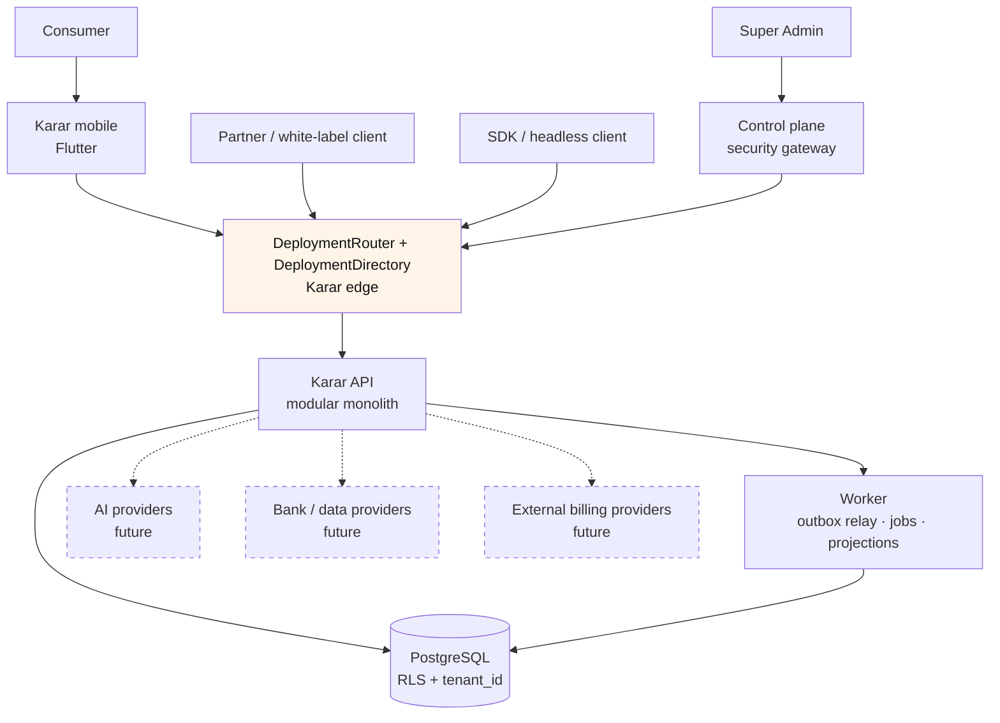
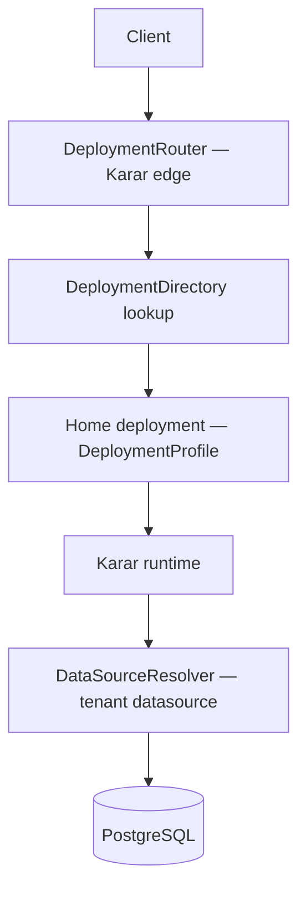

# Karar

Karar is a **Qatar-first personal-finance platform**: an API-first, extensible capability platform for personal financial wellbeing, serving consumers directly and — by design, not yet by implementation — partner banks through white-label and embedded channels. It operates across multiple jurisdictions through multiple legal entities, with a Flutter client and a TypeScript backend. Qatar is the launch market; KSA, UAE, and Oman are planned expansion markets with no launch commitment.

Karar is a platform whose unit of extension is a **capability** — a bounded context with an owner, its own vocabulary, permissions, data classification, and jurisdictional availability — not a budgeting app that will later grow features. It is a **greenfield rebuild**: the legacy system (Qarar) is a requirements, evidence, and test-case source, never a code source ([greenfield rule](docs/architecture/greenfield-rule.md)).

**What Karar is not** (stated plainly so nothing is inferred from silence):

- Karar does not custody customer funds and is not a payment processor. Billing may be orchestrated through approved external providers, which execute settlement; Karar records subscription and entitlement state and verified billing events.
- Karar makes no credit decision and gives no investment advice.
- Karar's AI never computes a financial result — it explains figures the deterministic engine produced, and it never writes a number.
- Karar claims no compliance certification, no regulatory approval, no production readiness, and no Sharia review, anywhere in this repository.

The full list with rationale is in [`docs/architecture/overview.md` §2](docs/architecture/overview.md).

## Status

| | |
|---|---|
| Current phase | **4 — IN PROGRESS** ([phase report](docs/phases/phase-04.md)); Phase 5 **NOT STARTED** |
| Last completed phase | 3.5 (jurisdiction and capability foundation, [report](docs/phases/phase-03-5.md)) |
| Branch model | `main` + phase branches (current: `claude/karar-v2-phase-4-flutter-foundation`) |
| Application implementation | Platform foundation, identity/tenancy/access control, the jurisdiction and capability foundation, and a Flutter client covering account, identity and platform state — **no consumer product capability is implemented or reachable** |
| Mobile | Builds and tests for Android and iOS. **No signed build, no store submission, no deployed endpoint** — a build for any environment other than `LOCAL` is refused because no endpoint exists |
| Cloud | None provisioned; local development is cloud-free |
| Compliance | Readiness framework in place; **no certification is claimed** |

"COMPLETE" means a phase's deliverables exist and its own gates passed. It does not mean deployed, production ready, store ready, or certified — the distinction is kept in [`docs/phases/README.md`](docs/phases/README.md).

## Start here

| If you want to… | Read |
|---|---|
| Understand the system | [`docs/architecture/overview.md`](docs/architecture/overview.md) |
| Know why something is the way it is | [`docs/adr/`](docs/adr/README.md) — 26 decision records |
| Onboard as an engineer | [`docs/onboarding/developer.md`](docs/onboarding/developer.md) |
| Work on the Flutter client | [`docs/onboarding/flutter.md`](docs/onboarding/flutter.md) |
| Run it locally | [Developer quick start](#developer-quick-start) below |
| See how it extends | [`docs/architecture/extension-pattern.md`](docs/architecture/extension-pattern.md) |
| See it worked end to end | [`docs/scenarios/`](docs/scenarios/a-new-country.md) — four scenarios |
| Understand the legacy system | [`docs/legacy/qarar-audit.md`](docs/legacy/qarar-audit.md) |
| Look up a term | [`docs/glossary.md`](docs/glossary.md) |

## The decisions everything follows from

1. **Clean Architecture, compiler-enforced.** `domain/` and the pure packages declare zero framework dependencies, so a forbidden import does not resolve. ([ADR-0001](docs/adr/0001-clean-architecture.md))
2. **Modular monolith with real seams.** One deployable; `sealed-vault` designed from day one to be extracted. ([ADR-0002](docs/adr/0002-modular-monolith.md))
3. **One authoritative financial engine.** Money is BIGINT minor units with a `Currency` carrying its ISO 4217 exponent; the client computes nothing authoritative. ([ADR-0006](docs/adr/0006-monetary-representation.md), [ADR-0007](docs/adr/0007-one-financial-engine.md))
4. **Policy is typed code; availability is audited configuration** — and settings may only restrict what code permits, never expand it. ([ADR-0015](docs/adr/0015-policy-packs.md))
5. **Deny by default.** A capability with no availability row is `DISABLED`; code existing is never sufficient for exposure. ([ADR-0016](docs/adr/0016-capability-registry.md))
6. **Greenfield, and cloud-portable.** The legacy is knowledge, never code; deployments bind to providers through `DeploymentProfile`s; the database commitment is PostgreSQL-the-engine. ([greenfield rule](docs/architecture/greenfield-rule.md), [ADR-0023](docs/adr/0023-deployment-topology-ladder.md))

## System context

Dashed elements are future integrations — designed as ports, not yet implemented.



## Containers

| Container | What it is |
|---|---|
| `apps/mobile` | Flutter client (consumer; white-label flavors are Phase 11). Renders values; computes nothing authoritative. Ten feature folders, all of them account, identity or platform state — see [`flutter.md`](docs/architecture/flutter.md) |
| `apps/api` | NestJS modular monolith — the only public API surface |
| `apps/worker` | Second entrypoint over the same modules: outbox relay, projections, scheduled jobs |
| `apps/admin` | Super Admin SPA; talks to the control plane only, carries no database driver |
| `packages/` | Seven shared packages; five are framework-free pure. `platform` is the backend platform library shared by api and worker — typed config, the PostgreSQL foundation (including the Prisma runtime and the RLS principal context), errors, observability, events/outbox/jobs |
| `modules/` | 24 module directories, each behind a `public-api.ts`; 12 have code, the rest are skeletons awaiting their phase |
| PostgreSQL | The one authoritative store — RLS-enforced tenant isolation |
| Local infra | Docker Compose ([`docker-compose.yml`](docker-compose.yml)): `postgres`, `redis`, `minio`, `otel-collector` — zero cloud dependency |
| Provider adapters | Every external dependency (AI, storage, keys, messaging, identity, billing) behind a port in `infrastructure/` |

## Request and deployment routing

Routing solves two problems with two mechanisms, both invisible to domain code ([`infrastructure-portability.md` §3](docs/architecture/infrastructure-portability.md)):



Four clarifications, one line each:

1. Routing to the correct deployment happens **before any business-data access**.
2. Portability does not mean cross-cloud credential sprawl — a runtime holds credentials for its own deployment's resources only.
3. Each deployment prefers its own resources; cross-deployment access requires an explicitly reviewed architecture.
4. Provider assignments are configuration, recorded in the [country deployment matrix](docs/architecture/country-deployment-matrix.md) — never code, never assumption.

## Clean architecture

Dependencies point inward, and the compiler enforces it: `domain/` and the pure packages declare zero framework dependencies, so a forbidden import does not resolve.

```
presentation/    HTTP controllers, DTOs           → may use application/
application/     use cases, ports                 → may use domain/
domain/          entities, rules, no I/O          → may use shared-kernel only
infrastructure/  adapters, persistence, providers → implements application/ ports
```

Cross-module imports resolve to the target module's `public-api.ts` and nothing else. Five packages (`shared-kernel`, `financial-engine`, `jurisdiction-policy`, `capability-registry`, `state-machine`) are pure — no framework, no I/O. Forbidden imports fail the architecture tests in CI, not a code review's memory. See [`clean-architecture.md`](docs/architecture/clean-architecture.md) and [`architecture-tests.md`](docs/testing/architecture-tests.md).

## Repository structure

```
apps/        mobile · api · worker · admin — entrypoints, no business logic
packages/    shared-kernel · financial-engine · jurisdiction-policy · capability-registry · state-machine · api-contracts · platform
modules/     24 module directories, each with public-api.ts and MODULE.md; 12 have code
infra/       Terraform — contracts · providers · per-deployment compositions
docs/        architecture · adr · security · compliance · phases · legacy · onboarding
scripts/     verification, checks, helpers
docker-compose.yml   local infrastructure (LOCAL environment)
```

Every significant directory has a `README.md` stating what it owns and what may import it.

## Domain and capability map

Full detail, including availability, gates, and external providers: [`capability-map.md`](docs/architecture/capability-map.md).

| Capability / context | In one phrase |
|---|---|
| `financial-accounts` | Institutions, connectors, account records |
| `transactions` | Ingestion, normalization, dedup, categorization |
| `budgets` | Budget definition and tracking |
| `goals` | Savings plans and goals |
| `insights` | Derived financial insight from engine facts |
| `zakat` | Deterministic Zakat calculation and tracking — never payment, never a fatwa |
| `ai` | AI orchestration over verified facts |
| `amanat` | Sealed after-death information handover — declares no jurisdiction, hidden from clients |
| `identity` | Authentication, sessions, MFA, session tenant binding |
| `users` | Profile and preferences |
| `tenancy` | Tenant model, isolation, membership resolution and tenant switching |
| `authorization` | Deny-by-default RBAC — permission catalogue, roles, the central `PolicyService` |
| `operating-entity` | Legal person, controller/processor roles, entity migration |
| `consent` | Consent triple, legal documents, re-consent |
| `audit` | Append-only audit records |
| `jurisdiction` | Country and jurisdiction registers, assignments, restrict-only settings, the pack-activation ledger |
| `capability` | Availability resolution over eight gates, availability rows, tenant entitlements, the client-safe view |
| `subject-policy` | `SubjectPolicySelection` — immutable, version-pinned subject elections |
| `bootstrap` | The authenticated client bootstrap surface and tenant binding |
| `documents` | Evidence files behind the object-storage port |
| `sealed-vault` | Grant-gated `SEALED` storage |
| `notifications` | Delivery behind channel ports |
| `projections` | Rebuildable read models for admin/ops |
| `control-plane` | Security gateway and scoped token minting |

## Country and jurisdiction model

Seven separated dimensions, deliberately never conflated:

- **Country** — geography (ISO 3166-1); keys currency defaults, languages, formatting. An attribute, not the policy key, and carrying no business rule.
- **Jurisdiction** — the legal regime governing a person or record. The policy key. Not assumed one per country: a financial free zone is a distinct regime inside its country's borders.
- **OperatingEntity** — the legal person providing the service and bearing responsibility; determines controller/processor roles.
- **SubjectPolicySelection** — the elective option-set a subject chose, versioned and pinned, within what the jurisdiction permits.
- **DeploymentProfile** — where and on what infrastructure a deployment runs; an infrastructure concept, never a business one.
- **Tenant** — the brand and product boundary a user belongs to; the isolation key.
- **Brand** — presentation identity (tokens, name, app identity); configuration on top of a tenant.

See [`jurisdiction-policy.md`](docs/architecture/jurisdiction-policy.md) and [`operating-entity.md`](docs/architecture/operating-entity.md).

## Infrastructure and database portability

Karar is multi-cloud capable by structure: no business capability knows which cloud hosts it. GCP is one provider profile — the Qatar candidate, **UNVERIFIED**, no account exists. The UAE may use a locally-available provider; a partner bank may mandate its own.

The database commitment is **PostgreSQL the engine**, portable across managed providers: one `PostgresPersistenceAdapter` serves them all, and provider differences live in connection profiles and Terraform. Replacing PostgreSQL itself would be a deliberate migration project, not a configuration change — that limit is stated, not hidden.

See [`infrastructure-portability.md`](docs/architecture/infrastructure-portability.md) and [`database-portability.md`](docs/architecture/database-portability.md).

## Environments

`LOCAL → DEV → STAGING → PRODUCTION`. Local development has zero cloud dependency. **Production must not be introduced before a separate staging environment exists** — a hard Phase 20 gate, and the changes that must pass staging first are enumerated in [`environments.md`](docs/architecture/environments.md).

## Security architecture

Summary only — canonical documents under [`docs/security/`](docs/README.md#security):

- **Tenant isolation:** RBAC, tenant-scoped repositories, PostgreSQL RLS (enabled and FORCEd), adversarial tests asserting on non-empty data.
- **Least privilege:** migrations run as a restricted role; the admin SPA never holds an environment credential; the control plane mints short-lived scoped tokens.
- **Audit:** append-only records; every sealed access, disclosure, and entity migration is audited.
- **Sealed data:** `SEALED` is inaccessible to Karar itself without a typed `SealAccessGrant`; key custody is provider-neutral with an integrity canary.
- **Secrets:** never in the repository, logs, or error messages; per-environment keys, never reused.
- **Data classification:** six classes, declared per data element, with lifecycle declarations per dataset.
- **Incident response and secure SDLC:** documented procedures, CI security scans, SBOM, and supply-chain controls.

## Compliance readiness

Karar maintains a **SOC 2 and ISO/IEC 27001 readiness** approach: a control matrix mapping platform controls to both frameworks, and an evidence register that phases feed. Honest current status: the framework exists, most controls are DESIGNED rather than operating, and **no certification of any kind is claimed**. See [`docs/compliance/`](docs/compliance/README.md).

## AI architecture

The AI layer is model-independent behind an `AIProvider` port with an orchestrator, and it consumes `VerifiedFinancialFacts` — typed values the financial engine computed — never raw transactions. AI is never authoritative for financial results; responses carry fact placeholders that Karar substitutes with locale-formatted values. AI routing is independent of the hosting provider, and `SEALED` data never reaches an AI context. See [`docs/architecture/ai.md`](docs/architecture/ai.md).

## White label, SDK, and embedded

White label distinguishes the **control plane** (configuring a partner tenant) from the **data plane** (that configuration changing what a customer sees) — both are budgeted, and no partner ever requires a code fork. Brand configuration, capability entitlements, and the partner's own operating entity are configuration. Partner integration is OpenAPI-first with generated SDKs; embedding the Flutter client add-to-app is a Phase 15 boundary. See [`white-label.md`](docs/architecture/white-label.md) and [`sdk-strategy.md`](docs/architecture/sdk-strategy.md).

## Developer quick start

Prerequisites are pinned in [`.tool-versions`](.tool-versions) (Node, pnpm, Flutter); Docker is required. Then:

```bash
make doctor           # verify your toolchain matches the pins
make bootstrap        # install workspace and Flutter dependencies
make dev              # bring up local infra; prints how to start each entrypoint
make prisma-generate  # generate the Prisma client (git-ignored; needed before compiling)
pnpm build            # compile once — the db CLI runs from dist
make db-create        # bootstrap database roles and grants (first run)
make db-migrate       # apply migrations as the restricted migrator role
make verify           # run the full local check suite
```

`make help` lists the remaining targets (`prisma-drift` verifies the Prisma mapping against the live database). `make dev` starts the Compose services and tells you how to run the API, worker, admin, and mobile entrypoints; the API always serves the health endpoints (`/readyz` answers 503 until the database is created and migrated — a real check, not a constant). If a host-level PostgreSQL already occupies 5432, set `POSTGRES_PORT=5433` in `.env` first. A clean-machine walkthrough of these commands is part of phase verification.

Tenant-scoped endpoints additionally need a tenant to bind a session to. `node scripts/db/seed-local-first-party.mjs` creates the local first-party tenant that `KARAR_FIRST_PARTY_TENANT_ID` names — required outside `local`, defaulted to a documented synthetic id locally ([onboarding Q59](docs/onboarding/developer.md)).

The client runs against that local API with `cd apps/mobile && flutter run`. `LOCAL` is the only profile that needs no explicit endpoint; a build for `DEV`, `STAGING` or `PRODUCTION` **fails at configuration time** unless it is given an HTTPS endpoint that is not a developer-machine address, which is why no deployed-environment package can currently be produced. Client-specific commands and rules are in [`docs/onboarding/flutter.md`](docs/onboarding/flutter.md).

No cloud account, API key, or shared database is required for any of it — that is a design rule, not a convenience ([`environments.md` §3](docs/architecture/environments.md)).

## Testing and CI

- **Unit tests** for `domain/` and the pure packages — no mocks, no container. `jurisdiction-policy` and `capability-registry` need nothing running at all.
- **Integration tests** against real PostgreSQL in Docker — since Phase 2 the workspace suite includes live-PostgreSQL runs of the migration, audit-immutability, outbox, and jobs suites, with concurrency proofs (two relays over 200 events; two workers over 100 jobs). `make dev` first; see the quick-start port note for machines with a host PostgreSQL.
- **Adversarial security tests** — since Phase 3, per-module isolation suites plus the cross-cutting [`tests/security/`](tests/security) suite: two tenants seeded with real rows, own-tenant data proven non-empty first, then cross-tenant SELECT/INSERT/UPDATE/DELETE denial, pooled-connection context hygiene, and privilege-escalation probes ([`tenancy.md`](docs/architecture/tenancy.md)).
- **Property tests** — since Phase 3.5, the capability resolver's restrict-only invariant is proven rather than asserted: the ceiling core is exercised exhaustively over generated configurations, then swept with randomized grant-like inputs, asserting that no entitlement, consent, licence, or provider status can widen what code and policy have not permitted ([`capability-registry.md` §4](docs/architecture/capability-registry.md)).
- **Leak-regression tests** — since Phase 3.5, suites that drive fakes trying to leak through every port and assert the serialized output carries exactly the declared fields: the bootstrap surface's closed field set, and the subject-policy audit trail's reference-only metadata.
- **Contract tests** per repository port against the PostgreSQL contract, per [`database-portability.md` §7](docs/architecture/database-portability.md) — platform DB/outbox/jobs contracts run locally and in CI today, module repository ports since Phase 3; cloud provider legs are future.
- **Architecture tests** — 26 CI-blocking structural tests plus a canary-purity check, kept in a registry with per-test activation phases; a test activates when the structure it guards exists, and the registry fails the run if an activation phase arrives without an implementation.
- **Client tests** — since Phase 4, the Flutter suite runs on every PR: unit, widget and source-scanning tests, every component and screen exercised in **both locales** with direction derived from the locale rather than passed in, tap targets and overflow checked at 1.0x and 2.0x text scale, and WCAG contrast computed over both palettes. Golden baselines exist but are **deliberately excluded from CI** ([`flutter.md` §5](docs/architecture/flutter.md)).
- **Artifact tests** — since Phase 4, assertions that read a real build rather than its source: the merged Android manifest's permission set compared exactly, the built APK's network policy and absence of credential material, and the packaged iOS bundle's transport posture across three environments. They run on the lanes that produce an artifact, and a missing artifact fails them rather than skipping them.
- **Security scans and SBOM** — dependency and secret scanning, software bill of materials, supply-chain checks.

Required PR checks must pass before merge — CI blocks the merge, not merely the workflow run. The workflows are [`ci.yml`](.github/workflows/ci.yml) (lint, type-check, build, tests, architecture tests, the mobile lanes) and [`security.yml`](.github/workflows/security.yml) (scans, SBOM). Not every job is a required check; the current list is in [`repository-security-settings.md`](docs/operations/repository-security-settings.md). See [`architecture-tests.md`](docs/testing/architecture-tests.md).

Security concerns are reported privately per [`SECURITY.md`](SECURITY.md), never as public issues.

## Roadmap and phase discipline

Completed: 0, 0.5, 1, 2, 3, 3.5, and 4 — Phase 3 delivered identity, users, tenancy, operating entities, RBAC, consent with re-consent evaluation, sessions, kill switches, PostgreSQL RLS, and adversarial cross-tenant tests; Phase 3.5 added Country and Jurisdiction, typed versioned PolicyPacks with the `qa/v1` draft, resolution strategies and `EffectivePolicy`, `SubjectPolicySelection`, the compile-time capability registry with deny-by-default availability and tenant entitlements, session tenant binding, and the authenticated client bootstrap surface; Phase 4 added the Flutter client — the startup state machine, a generated Dart API client with contract drift detection, authentication and session flows, secure token storage with single-flight refresh, application lock, tenant selection, capability-aware navigation, the consent surface, a design system with Arabic and RTL first-class, and Android and iOS build guards that refuse a deployed-environment package without a usable endpoint. Next: 5 (financial data platform — institutions, connectors, accounts, transactions, normalization, provenance, categorization), **not started**.

Every phase ends with the same documented update set — README status block, roadmap, phase report, onboarding if commands changed, evidence register — specified in [`docs/phases/README.md`](docs/phases/README.md). Full phase table and gates: [`docs/roadmap.md`](docs/roadmap.md).

## Documentation index

| | |
|---|---|
| Architecture | [`docs/architecture/`](docs/architecture/overview.md) — start at the overview |
| Decisions | [`docs/adr/`](docs/adr/README.md) — 26 records |
| Security | [`docs/security/`](docs/README.md#security) |
| Compliance | [`docs/compliance/`](docs/compliance/README.md) · policies in [`docs/policies/`](docs/policies/README.md) |
| Onboarding | [`docs/onboarding/developer.md`](docs/onboarding/developer.md) · client: [`docs/onboarding/flutter.md`](docs/onboarding/flutter.md) |
| Roadmap | [`docs/roadmap.md`](docs/roadmap.md) |
| Capability map | [`docs/architecture/capability-map.md`](docs/architecture/capability-map.md) |
| Deployment matrix | [`docs/architecture/country-deployment-matrix.md`](docs/architecture/country-deployment-matrix.md) |
| Phase reports | [`docs/phases/`](docs/phases/README.md) |
| Glossary | [`docs/glossary.md`](docs/glossary.md) |
| Documentation rules | [`docs/documentation-style-guide.md`](docs/documentation-style-guide.md) |

## Licence

Proprietary. All rights reserved.
