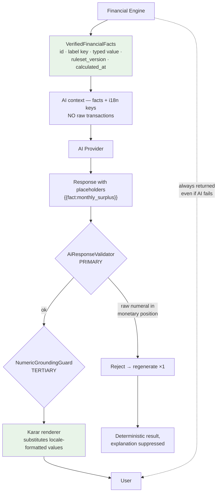

# AI Architecture

**ADRs:** 0010, 0019 · **Phase:** 7

---

## 1. The three rules

> **AI asks. Karar calculates. AI explains.**

1. **AI is never the source of financial truth.**
2. **The model never writes a number.**
3. **The deterministic result is always returned, regardless of AI outcome.**

Rule 3 is the one that makes the other two affordable: if the model fails, times out, or is disabled, the user still gets their figures. Only the explanation is suppressed. The AI layer is never on the critical path for correctness.

## 2. The pipeline



## 3. Four layers of numeric safety

| Layer | Mechanism | Role |
|---|---|---|
| **1** | Facts + placeholders — the model receives typed facts and emits `{{fact:key}}` | **Primary** |
| **2** | `AiResponseValidator` rejects a raw numeral in a monetary position | Secondary |
| **3** | `NumericGroundingGuard` checks surviving prose numerals against facts | **Tertiary** |
| **4** | Deterministic result returned regardless | Always |

### Why the grounding guard is demoted

Plan v1 made the guard primary. The legacy shows why that fails: its numeric guard *"ignores any number the model does not mark with a currency or percent token, so bare counts are unchecked"* (finding AI-7).

A guard inspects output and must decide what is a number worth checking. That decision is where the leak lives — and every guard has one. **The facts-and-placeholders approach removes the class of problem instead of guarding it**: there is no number in the model's output to check, because the model was never asked to produce one.

The guard stays, as a third net. It just is not the thing being relied on.

## 4. This also solves localization

Because **Karar's formatter renders every value**, the platform controls:

- Arabic-Indic versus Western digits
- U+066B decimal and U+066C thousands separators
- Currency placement under RTL
- Three-decimal currencies — KWD, BHD, OMR

> A model asked to emit `١٢٬٣٤٥٫٦٧٨ ر.ع.` correctly in every locale will eventually get it wrong. A formatter will not.

One mechanism, two problems: numeric safety and correct bilingual rendering.

## 5. Context construction

**The AI context contains facts and i18n label keys. Not raw transactions.**

```ts
interface AiContext {
  facts: VerifiedFinancialFact[]
  locale: Locale
  capability: CapabilityId
  jurisdiction: JurisdictionId
  // structurally cannot hold SEALED data — the input types exclude it
}
```

### Sealed data is excluded structurally, not by policy

`AiContext` cannot hold sealed data because **its input types do not admit it**. There is no redaction step to forget, no filter to misconfigure, and no code path where an Amanat record could reach a prompt. Architecture test 13 asserts it.

### Redaction for what does pass through

Machine identifiers — IBAN, card, phone, email, national ID — are redacted unconditionally.

**Person names are redacted only where surrounding text marks a transfer rail.** This is inherited from the legacy along with its reasoning, which is subtle and correct: a naive name detector would fill a Qatari spending breakdown with placeholders, because merchant names and personal names overlap heavily in Arabic. Over-redaction destroys the feature; targeted redaction preserves it.

## 6. The consent lesson — the most important finding in the legacy audit

Legacy finding **P1**, a HIGH:

> The published AI notice states that merchant names and free-text notes are redacted before anything leaves Qatar. They are not… **The code is defensible; the consent text is wrong, and that text is the legal basis for a cross-border transfer of customer financial data.**

**The failure was not a wrong number. It was a document describing behaviour the code did not implement.**

Karar's rules:

| Rule | Mechanism |
|---|---|
| `AIProcessingPolicy` is a **typed PolicyPack clause**, not prose | [`jurisdiction-policy.md`](jurisdiction-policy.md) |
| The consent gate **fails closed** — no published disclosure ⇒ capability unavailable | Capability resolver gate 8 |
| Republishing a notice triggers **re-consent evaluation** | Material / non-material, neither defaulted |
| A capability's declared behaviour is reconciled with its legal documents | Architecture test 26 |

Test 26 cannot verify prose against code and does not claim to. It asserts the **link** exists and that a declared promise has a named owner — which is exactly what was missing when the legacy's notice and its redaction code diverged.

## 7. Provider abstraction

```ts
interface AiProvider {
  complete(request: AiRequest): Promise<AiResponse>
}
```

| Implementation | Use |
|---|---|
| `MockAiProvider` | Local development and tests. **Deterministic** |
| Production adapter | Behind the port; model and region are configuration |
| Second provider | Resilience. The legacy has one provider and no fallback |

**No vendor SDK appears outside `infrastructure/providers/`** (architecture test 10).

Model routing is a per-tenant `ModelRoutingPolicy`, so a tenant can be pinned to a specific model or region — which is how a residency requirement becomes configuration rather than a rewrite. See [`data-residency.md`](data-residency.md).

## 8. Tools

AI tools call **use cases**, under the caller's authorization, through the same capability gates as HTTP.

| | |
|---|---|
| **No `executeSql()`** | Ever. Under any name |
| Tools are typed and enumerated | No dynamic tool registration |
| Every invocation is audited | Actor, tool, capability, outcome |
| Capability checked inside the use case | Because AI is a third caller alongside HTTP and jobs |

## 9. One path, no bypasses

**Every AI call routes through the orchestrator.** No module calls a provider directly.

The legacy's counter-example is precise: its AI categorisation path *"calls OpenAI directly, bypassing usage logging, token metrics, provenance and per-user rate limiting"* (AI-4), *"and sends statement narratives with no consent check"* (P6). One convenience shortcut disabled four controls at once.

Architecture test 10 makes this structural.

## 10. Governance

| Control | |
|---|---|
| Prompt registry | Versioned; **prompt version recorded per response** |
| Usage and cost | Metered per tenant and per user, with caps |
| Kill switch | Real, tested, and exercised in staging. The legacy's was *"decorative until 12 August"* |
| Entitlement gate | On **every** AI surface. The legacy gates chat but not insights (AI-6) |
| Rate limiting | Per user and per tenant, on the **normalised, decoded** path |
| Prompt-injection controls | Built and **executed**, not merely written. The legacy has an adversarial suite that was never run (AI-1, AI-9) |
| Provenance | Prompt version, model, ruleset version, jurisdiction stored per response |

## 11. What AI never does

| | |
|---|---|
| Produce an authoritative number | ADR-0019 |
| Receive `SEALED` data | Structurally excluded by input types |
| Execute SQL | No such tool |
| Bypass authorization | Tools run under the caller's authority |
| Bypass the orchestrator | One path |
| Block the deterministic result | Layer 4 |
| Format a number | The platform renders every value |
