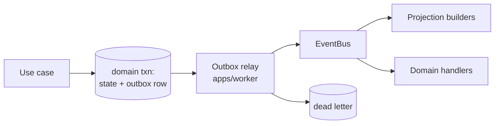

# Backend Architecture

**Stack:** NestJS · strict TypeScript · PostgreSQL · Prisma (confined to `infrastructure/`)
**ADRs:** 0004, 0005, 0012, 0013 · **Phase:** 1–2

---

## 1. Two entrypoints, one application

```
apps/
├── api/        — HTTP. Serves consumer, admin, and partner surfaces
└── worker/     — Jobs, outbox relay, projection builders, scheduled work
```

**`worker` is a second entrypoint, not a second application** (ADR-0013). It imports the same modules, the same use cases, the same domain. It has no duplicate logic and no private copy of a rule.

This matters for a reason the legacy demonstrates: when a scheduled job carries its own copy of a transition, it can eventually make a move a human could not. The legacy avoided this deliberately — its subscription lifecycle job routes every transition through the same state machine — and recorded the invariant as *"the job cannot make a move a human could not."* Karar makes that structural rather than disciplined: the job **calls the use case**.

Both entrypoints boot the same root module and differ only in what they start: `api` starts the HTTP adapter, `worker` starts schedulers and relays.

## 2. Repository layout

```
karar/
├── apps/
│   ├── api/
│   ├── worker/
│   └── admin/              — Super Admin SPA. CI-enforced: no database driver
├── packages/
│   ├── shared-kernel/      — 9 universals. Zero framework deps
│   ├── financial-engine/   — pure. Zero framework deps
│   ├── jurisdiction-policy/— pure. Zero framework deps
│   ├── state-machine/      — pure. ~100 lines
│   └── api-contracts/      — OpenAPI spec + event catalogue
├── modules/                — bounded contexts
├── infra/terraform/        — dev/ staging/ production/ from Phase 1
└── docs/
```

`apps/admin` carrying no database driver is enforced, not assumed: the Super Admin talks to the control plane over HTTP and never to Postgres.

## 3. Module anatomy

Every module has the same shape. Deviation is a review comment.

```
modules/<name>/
├── public-api.ts        ← the only legal import surface
├── capability.ts        ← static CapabilityDescriptor
├── MODULE.md            ← ownership. CI fails if absent
├── permissions.ts
├── domain/
├── application/
│   ├── use-cases/
│   └── ports/
├── infrastructure/
│   ├── persistence/
│   └── providers/
├── presentation/
│   ├── http/
│   └── dto/
└── __tests__/
```

Wiring is **ordinary NestJS module imports**. The capability registry governs availability and entitlement; it does not resolve dependencies and performs no dynamic loading (ADR-0016).

## 4. Request lifecycle

```mermaid
sequenceDiagram
    participant C as Client
    participant G as Guards
    participant CTX as Context resolver
    participant CTRL as Controller
    participant UC as Use case
    participant TX as Tenant transaction
    participant DB as PostgreSQL

    C->>G: request + token
    G->>G: authn · rate limit (normalised path)
    G->>CTX: resolve tenant · jurisdiction · operatingEntity · subjectProfile
    CTX->>G: RequestContext
    G->>G: @RequiresCapability — deny by default
    G->>CTRL: validated DTO + context
    CTRL->>UC: execute(input, context)
    UC->>UC: re-check capability (HTTP is not the only caller)
    UC->>TX: withTenant(ctx, fn)
    TX->>DB: BEGIN; SET LOCAL app.tenant_id = …
    TX->>DB: queries under RLS
    TX->>DB: INSERT INTO outbox_events
    TX->>DB: COMMIT
    UC->>CTRL: Result<T>
    CTRL->>C: response + capability state
```

**Capability is checked twice, deliberately.** At the controller boundary because that is where HTTP arrives, and inside the use case because **HTTP is not the only caller** — the worker and AI tools call use cases directly. A guard that only exists at the edge protects only one of three entrances.

## 5. Context resolution at the edge

```ts
interface RequestContext {
  tenantId: TenantId
  userId: UserId | null
  jurisdiction: JurisdictionId          // legal regime — the policy key
  operatingEntity: OperatingEntityId    // legal person responsible
  subjectPolicyProfile: ProfileRef | null
  locale: Locale
  environment: Environment
}
```

Resolved once, at the edge, and threaded through `AsyncLocalStorage`. **Use cases receive it; they never derive it.** A use case that resolves its own jurisdiction is a use case that can disagree with the guard that admitted the request.

## 6. Persistence

**Prisma, confined to `infrastructure/persistence/`** (ADR-0005). No Prisma type appears in any other layer — architecture test 4.

Repositories are declared as ports in `application/ports/` and implemented here. They map persistence models to domain objects explicitly; there is no ORM object flowing into the domain.

### Schemas

| Schema | Holds | Written by |
|---|---|---|
| `public` | Domain tables. RLS enabled and FORCEd | Use cases, under tenant transactions |
| `readmodel` | Projections. Non-authoritative, rebuildable | Projection builders only |
| `audit` | Append-only. Grants revoked for UPDATE/DELETE | Append-only writer |
| `sealed` | Ciphertext only. Grant-gated. Extractable | `SealedRecordStore` only |

### Migrations

Flyway-style forward-only SQL, run **as the restricted application role, not an owner**.

This one is inherited directly from the legacy, where the equivalent script is recorded as *"proven to fail on a genuinely defective migration"* — a control that has actually caught something. A migration that only works with elevated privilege is a migration that will fail in production, and running it as `karar_app` in CI finds that on a laptop instead.

Every migration carries a rollback script, as the legacy does.

## 7. Tenant transactions and RLS

The isolation mechanism is **PostgreSQL RLS**. The Prisma extension is convenience on top of it, not the boundary.

```ts
await withTenant(ctx, async (tx) => { /* queries */ })
// BEGIN; SET LOCAL app.tenant_id = $1; … ; COMMIT
```

**Documented cost:** Prisma cannot set a session GUC per query outside an interactive transaction, so all tenant-scoped queries route through this wrapper. That costs connection overhead and constrains query style. It is accepted and recorded rather than worked around, because the alternative — trusting an application-layer filter — is the failure mode RLS exists to prevent.

The application role has **no `BYPASSRLS`**. Migrations run as a separate role. See [`tenancy.md`](tenancy.md).

## 8. Transactional outbox



State change and event enqueue commit in **one transaction**. The relay publishes at-least-once with idempotent consumers. There is no path that publishes an event for a state change that did not commit, and none that commits a change whose event is lost.

## 9. Errors and results

Use cases return `Result<T, DomainError>`. Exceptions are for genuinely exceptional conditions, not for expected business outcomes — "insufficient balance" is a result, not a throw.

`presentation/` maps errors to RFC 7807 problem responses. **Every capability denial carries a machine-readable reason** (`CAPABILITY_UNAVAILABLE`, `PENDING_LEGAL_REVIEW`, `CONSENT_REQUIRED`, `ENTITLEMENT_MISSING`), so the client can render an honest state rather than an unexplained absence.

## 10. Security controls at the edge

Each of these exists because the legacy audit found its absence. See [`../legacy/security-findings.md`](../legacy/security-findings.md).

| Control | Rule | From |
|---|---|---|
| Trusted proxy | Client IP is derived from a **configured trusted-proxy allow-list**. A client-supplied header is never trusted on its own | AUTHN-04 (HIGH) |
| Rate limiting | Policy selected from the **normalised, decoded** path. Never the raw URI | API-01 (HIGH) |
| Rate limiting scope | Distributed, not per-instance | API-01 |
| Ingestion limits | Every ingestion and rendering path declares bytes, rows, pages, wall-clock, and memory ceilings, and **rejects rather than degrades** | FILES-2 (HIGH), FILES-7 |
| CORS | Pinned origins in code **and** in declarative infrastructure config. No wildcard in either | API-03 |
| DB transport | `verify-full`, not `require` — authenticate the server, not merely encrypt | ENC-1 |
| Health | Readiness probe that actually checks the database. **A constant is not a health check** | INFRA-04 |
| Consent gates | **Fail closed.** No published disclosure ⇒ unavailable | AI-5 |
| Staff reads | **Audited**, including reads that return nothing | AZ5 |

## 11. Observability

Structured JSON logs with correlation and tenant IDs; **never** `SEALED` data, and `HIGHLY_SENSITIVE_FINANCIAL` redacted (architecture test 13).

Metrics: RED per endpoint, job outcomes, outbox lag, **projection lag**, AI usage and cost, capability-denial counts by reason.

Production log level must retain the forensic timeline the incident plan depends on — the legacy pinned its level so high that it suppressed exactly that (INFRA-09).

## 12. Testing

| Layer | Style |
|---|---|
| `domain/` | Pure unit tests. No mocks, no container, no database |
| `financial-engine` | Exhaustive, table-driven, including currency exponents and rounding |
| `application/` | Use case tests with in-memory port fakes |
| `infrastructure/` | Integration against a real PostgreSQL in Docker |
| Tenant isolation | **Adversarial** cross-tenant tests asserting on **non-empty expected data** |
| Architecture | 26 tests, CI-blocking |

The non-empty assertion is not pedantry. The legacy's tenant roster returns empty for everyone because a policy is missing, and *an empty result is indistinguishable from correct isolation* — so the isolation claim on that endpoint has never actually been tested.

## 13. What the backend does not do

| | Why |
|---|---|
| No dynamic module loading or plugin system | Every capability is a named bounded context with an owner (ADR-0016) |
| No `executeSql()` tool for AI | AI asks, Karar calculates (ADR-0010) |
| No business logic in controllers | Architecture test 6 |
| No GCP names in `domain/` or `application/` | Ports only (ADR-0023) |
| No `features/`, `future/`, `services/`, or `misc/` module | These are where bounded contexts go to die |
