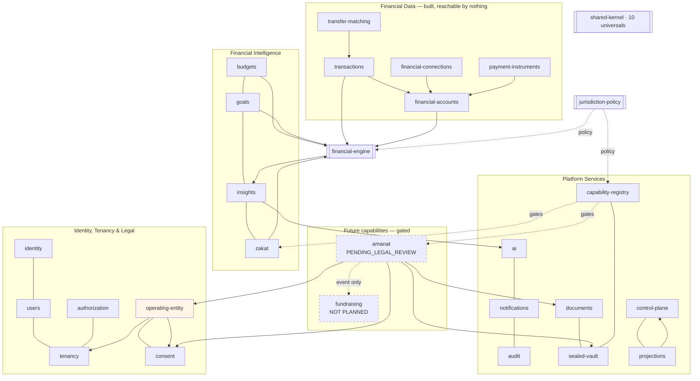

# Capability Map

**Deliverable:** Phase 0.7 · **Maintained:** every capability addition updates this file

Capability × bounded context × owning module × dependencies × jurisdiction availability × operating-entity requirements × external providers.

---

## 1. Consumer capabilities

The registry's three separated state dimensions are canonical in [`capability-registry.md` §3](capability-registry.md); this table adds the module, classification, provider, and phase view of the same set. Since Phase 3.5 the registry state columns are read from `packages/capability-registry/src/index.ts`, not from intent.

| Capability | Module | Classification | Lifecycle | Implementation | Deployed | `declaredJurisdictions` | Entity licences | External providers | Phase |
|---|---|---|---|---|---|---|---|---|---|
| `TRANSACTIONS` | `transactions` | `HIGHLY_SENSITIVE_FINANCIAL` | `PLANNED` | `NOT_IMPLEMENTED` | nowhere | `[]` | none | none in v1 | 5 |
| `BUDGETS` | `budgets` | `HIGHLY_SENSITIVE_FINANCIAL` | `PLANNED` | `NOT_IMPLEMENTED` | nowhere | `[]` | none | none | 9 |
| `GOALS` | `goals` | `HIGHLY_SENSITIVE_FINANCIAL` | `PLANNED` | `NOT_IMPLEMENTED` | nowhere | `[]` | none | none | 9 |
| `INSIGHTS` | `insights` | `HIGHLY_SENSITIVE_FINANCIAL` | `PLANNED` | `NOT_IMPLEMENTED` | nowhere | `[]` | none | none | 6 |
| `AI_ADVISOR` | `ai` | `CONFIDENTIAL` | `PLANNED` | `NOT_IMPLEMENTED` | nowhere | `[]` | none | AI provider | 7 |
| `ZAKAT` | `zakat` | `HIGHLY_SENSITIVE_FINANCIAL` | `PLANNED` | `NOT_IMPLEMENTED` | nowhere | `[]` | none | metal price feed | 9 |
| `AMANAT` | `amanat` | **`SEALED`** | `PLANNED` | `NOT_IMPLEMENTED` | nowhere | **`[]`** | TBD per jurisdiction | death + recipient verification | 14 |

> **No capability is available anywhere.** The availability and entitlement tables ship with no rows, and the descriptor gate denies every id before any row, pack, or entitlement is consulted.

`AMANAT` is additionally `clientExposure: HIDDEN` and disclosure-bearing, so it is omitted from client output in every state — never returned as unavailable. With `declaredJurisdictions: []` its clearance intersection is empty for every regime, so **no PolicyPack can reach it** until a real declaration exists in reviewed code.

Two entries that a reader may expect here and will not find in the registry:

| Name | Status |
|---|---|
| `FINANCIAL_ACCOUNTS`, `FINANCIAL_CONNECTIONS`, `PAYMENT_INSTRUMENTS`, `TRANSFER_MATCHING` | **Bounded contexts, not registry capability ids.** The closed union has seven members and none of these is one of them |
| `FUNDRAISING` | **Deliberately absent from the runtime registry.** Documentation-only future concept: no id, no descriptor, nothing in the platform can reference it |

**Module boundaries and capability ids are deliberately different things.** The `TRANSACTIONS` capability sits above five Phase 5 bounded contexts — `financial-accounts`, `transactions`, `financial-connections`, `payment-instruments`, `transfer-matching` — and none of them earns its own id. A user who has accounts but no transactions has nothing, and the reverse is incoherent, so a second id would add a dimension the product does not have while widening the surface that availability, entitlement and PolicyPack clearing all have to reason about. Adding one would need an ADR, a change here, a registry change, and an analysis of its bootstrap and client exposure.

**All five contexts are `NOT_IMPLEMENTED` at the registry and that is accurate**, not a lag. Schema and domain code exist; no controller, route, composition-root binding, client method or screen does. `IMPLEMENTED` in this registry means the capability's code exists as something a deployment could expose, and nothing here can be exposed.

## 2. Platform capabilities

| Capability | Module | Purpose | Phase |
|---|---|---|---|
| `IDENTITY` | `identity` | Authentication, sessions, MFA | 3 |
| `USERS` | `users` | Profile, preferences | 3 |
| `TENANCY` | `tenancy` | Tenant model, isolation | 3 |
| `AUTHORIZATION` | `authorization` | Deny-by-default RBAC: permission/role catalogue, assignments, `PolicyService` | 3 |
| `OPERATING_ENTITY` | `operating-entity` | Legal person, controller/processor, migration | 3 |
| `CONSENT` | `consent` | Consent triple, legal documents, re-consent | 3 |
| `AUDIT` | `audit` | Append-only records | 2 |
| `JURISDICTION` | `jurisdiction` | Country and jurisdiction registers, assignments, restrict-only settings, the pack-activation ledger | 3.5 |
| `CAPABILITY` | `capability` | Availability resolution over eight gates, availability rows, tenant entitlements, the client-safe projection | 3.5 |
| `SUBJECT_POLICY` | `subject-policy` | `SubjectPolicySelection` — immutable, version-pinned elections; content stays capability-owned | 3.5 |
| `BOOTSTRAP` | `bootstrap` | The authenticated client bootstrap surface and tenant binding; owns no data | 3.5 |
| `DOCUMENTS` | `documents` | Evidence, file references, object storage port | 13 |
| `SEALED_VAULT` | `sealed-vault` | Grant-gated sealed storage | 13 |
| `NOTIFICATIONS` | `notifications` | Delivery behind channel ports | 9 |
| `PROJECTIONS` | `projections` | Read models for admin/ops | 8 |
| `CONTROL_PLANE` | `control-plane` | Security gateway, token minting | 3 (kill-switch slice) / 8 (gateway) |

## 3. Pure packages

| Package | Contents | Framework deps |
|---|---|---|
| `shared-kernel` | The ten universals | **zero** |
| `financial-engine` | Calculators, ruleset registry | **zero** |
| `jurisdiction-policy` | Country and Jurisdiction models, typed PolicyPacks, the decision union, lifecycle and validation predicates, the strategy registry, `EffectivePolicy` | **zero** |
| `capability-registry` | The closed `CapabilityId` union, descriptors, the three state dimensions, registry validation | **zero** (depends only on `jurisdiction-policy`) |
| `state-machine` | ~100 lines: states, transitions, guards, audit hook | **zero** |
| `api-contracts` | OpenAPI spec, event catalogue | build-time only |

Architecture test 17 currently guards the four packages it was configured with; `capability-registry` is framework-free by declaration (its only dependency is `@karar/jurisdiction-policy`) and is not yet in the checker's list.

## 4. Dependency map

`zakat` is new relative to Plan v2, which does not mention it. It is a production capability in the legacy — see [`plan-v2-deltas.md` D1](plan-v2-deltas.md).

## 5. External providers — all behind ports

| Port | v1 implementation | Deferred |
|---|---|---|
| `AiProvider` | Mock (dev), one production adapter | Second provider |
| `FinancialDataConnector` | **none — no bank connection exists** | Per-market connectors |
| `StatementLayout` | One layout | Additional bank layouts |
| `EncryptionProvider` | Local key (dev), KMS (prod) | Per-tenant KEK (L3) |
| `ObjectStorage` | MinIO (dev), Cloud Storage (prod) | |
| `NotificationChannel` | Email, in-app | Push (FCM/APNs), SMS |
| `IdentityProvider` | Local | Per-tenant IdP (L3) |
| `SubscriptionBillingProvider` | **none — no rail** | Consumer rail, app stores |
| `MetalPriceFeed` | One public source | Benchmark source |
| `DeathVerificationProvider` | Manual review | Jurisdiction integrations |
| `RecipientVerificationProvider` | Manual review | Identity provider |

**A port with no implementation is honest. A fake implementation that pretends to work is not.**

The full provider-port catalogue — including cache, job queue, secrets, key management, analytics, and observability — is canonical in [`infrastructure-portability.md` §5](infrastructure-portability.md); implementations bind per `DeploymentProfile`.

## 6. Non-engineering gates

| Capability | Gate | Owner |
|---|---|---|
| `AMANAT` | Legal clearance **per jurisdiction** | Legal |
| `AMANAT` | Domain terminology review | Legal + domain |
| `ZAKAT` | **Sharia review — none exists.** Outputs are deterministic calculations/estimates and are **never represented as a fatwa** | External |
| `AI_ADVISOR` | Cross-border processing basis, DPAs | Legal |
| All | Operating-entity and licensing decision per market | Legal |
| All | Data-residency determination | Legal |
| Platform | Independent security assessment | External |
| Platform | Penetration test | External |

**No regulatory approval, licence, certification, or Sharia clearance is claimed anywhere in this documentation.**

## 7. Ownership

Every module carries `MODULE.md` declaring business owner, technical owner, data owned, events published and consumed, APIs, permissions, jurisdictions, operating entities, classification, erasure strategy, and dependencies. **CI fails if a module directory lacks one** (architecture test 16).

CODEOWNERS is deferred until the team makes it meaningful. Ownership is documented from Phase 0.
