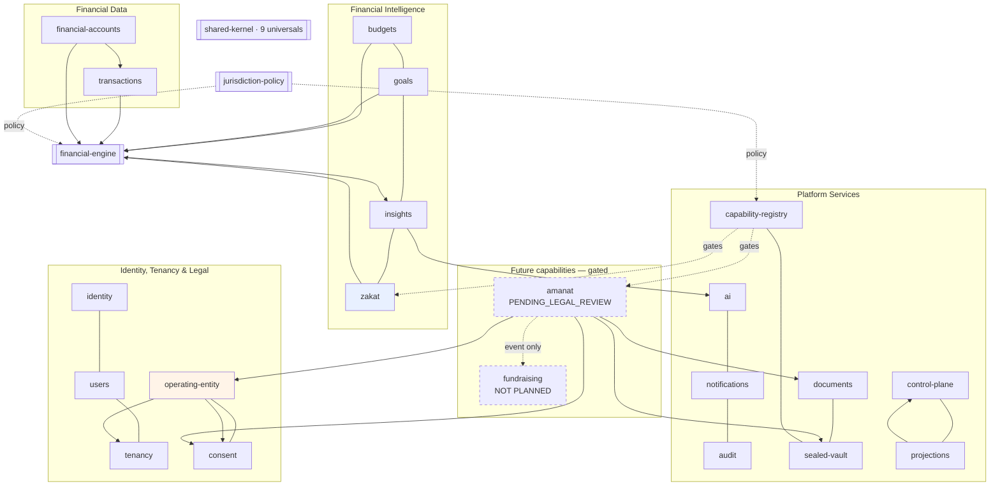

# Capability Map

**Deliverable:** Phase 0.7 · **Maintained:** every capability addition updates this file

Capability × bounded context × owning module × dependencies × jurisdiction availability × operating-entity requirements × external providers.

---

## 1. Consumer capabilities

| Capability | Module | Classification | QA | SA/AE/OM | Entity licences | External providers | Phase |
|---|---|---|---|---|---|---|---|
| `FINANCIAL_ACCOUNTS` | `financial-accounts` | `HIGHLY_SENSITIVE_FINANCIAL` | planned | `DISABLED` | none | none in v1 | 5 |
| `TRANSACTIONS` | `transactions` | `HIGHLY_SENSITIVE_FINANCIAL` | planned | `DISABLED` | none | none in v1 | 5 |
| `BUDGETS` | `budgets` | `HIGHLY_SENSITIVE_FINANCIAL` | planned | `DISABLED` | none | none | 9 |
| `GOALS` | `goals` | `HIGHLY_SENSITIVE_FINANCIAL` | planned | `DISABLED` | none | none | 9 |
| `INSIGHTS` | `insights` | `HIGHLY_SENSITIVE_FINANCIAL` | planned | `DISABLED` | none | none | 6 |
| `ZAKAT` | `zakat` | `HIGHLY_SENSITIVE_FINANCIAL` | planned | `DISABLED` | none | metal price feed | 9 |
| `AI_ADVISOR` | `ai` | `CONFIDENTIAL` | planned | `DISABLED` | none | AI provider | 7 |
| `AMANAT` | `amanat` | **`SEALED`** | **`PENDING_LEGAL_REVIEW`** | **`DISABLED`** | TBD per jurisdiction | death + recipient verification | 14 |
| `FUNDRAISING` | — | — | **not planned** | **not planned** | unknown | licensed provider | — |

**`declaredJurisdictions` for `AMANAT` is `[]`** — it is unreachable regardless of configuration until per-jurisdiction legal clearance exists.

## 2. Platform capabilities

| Capability | Module | Purpose | Phase |
|---|---|---|---|
| `IDENTITY` | `identity` | Authentication, sessions, MFA | 3 |
| `USERS` | `users` | Profile, preferences | 3 |
| `TENANCY` | `tenancy` | Tenant model, isolation | 3 |
| `OPERATING_ENTITY` | `operating-entity` | Legal person, controller/processor, migration | 3 |
| `CONSENT` | `consent` | Consent triple, legal documents, re-consent | 3 |
| `AUDIT` | `audit` | Append-only records | 2 |
| `CAPABILITY_REGISTRY` | `capability-registry` | Descriptors, availability, entitlement | 3.5 |
| `DOCUMENTS` | `documents` | Evidence, file references, object storage port | 13 |
| `SEALED_VAULT` | `sealed-vault` | Grant-gated sealed storage | 13 |
| `NOTIFICATIONS` | `notifications` | Delivery behind channel ports | 9 |
| `PROJECTIONS` | `projections` | Read models for admin/ops | 8 |
| `CONTROL_PLANE` | `control-plane` | Security gateway, token minting | 8 |

## 3. Pure packages

| Package | Contents | Framework deps |
|---|---|---|
| `shared-kernel` | The nine universals | **zero** |
| `financial-engine` | Calculators, ruleset registry | **zero** |
| `jurisdiction-policy` | PolicyPacks, resolution, subject profiles | **zero** |
| `state-machine` | ~100 lines: states, transitions, guards, audit hook | **zero** |
| `api-contracts` | OpenAPI spec, event catalogue | build-time only |

## 4. Dependency map

`zakat` is new relative to Plan v2, which does not mention it. It is a production capability in the legacy — see [`plan-v2-deltas.md` D1](plan-v2-deltas.md).

## 5. External providers — all behind ports

| Port | v1 implementation | Deferred |
|---|---|---|
| `AiProvider` | Mock (dev), one production adapter | Second provider |
| `FinancialDataConnector` | **none — no bank connection exists** | Per-market connectors |
| `StatementLayout` | One layout | Additional bank layouts |
| `EncryptionProvider` | Local key (dev), KMS (prod) | Per-tenant KEK (L3) |
| `ObjectStorage` | MinIO (dev), Cloud Storage (prod) | |
| `NotificationChannel` | Email, in-app | Push (FCM/APNs), SMS |
| `IdentityProvider` | Local | Per-tenant IdP (L3) |
| `SubscriptionBillingProvider` | **none — no rail** | Consumer rail, app stores |
| `MetalPriceFeed` | One public source | Benchmark source |
| `DeathVerificationProvider` | Manual review | Jurisdiction integrations |
| `RecipientVerificationProvider` | Manual review | Identity provider |

**A port with no implementation is honest. A fake implementation that pretends to work is not.**

## 6. Non-engineering gates

| Capability | Gate | Owner |
|---|---|---|
| `AMANAT` | Legal clearance **per jurisdiction** | Legal |
| `AMANAT` | Domain terminology review | Legal + domain |
| `ZAKAT` | **Sharia review — none exists** | External |
| `AI_ADVISOR` | Cross-border processing basis, DPAs | Legal |
| All | Operating-entity and licensing decision per market | Legal |
| All | Data-residency determination | Legal |
| Platform | Independent security assessment | External |
| Platform | Penetration test | External |

**No regulatory approval, licence, certification, or Sharia clearance is claimed anywhere in this documentation.**

## 7. Ownership

Every module carries `MODULE.md` declaring business owner, technical owner, data owned, events published and consumed, APIs, permissions, jurisdictions, operating entities, classification, erasure strategy, and dependencies. **CI fails if a module directory lacks one** (architecture test 16).

CODEOWNERS is deferred until the team makes it meaningful. Ownership is documented from Phase 0.
