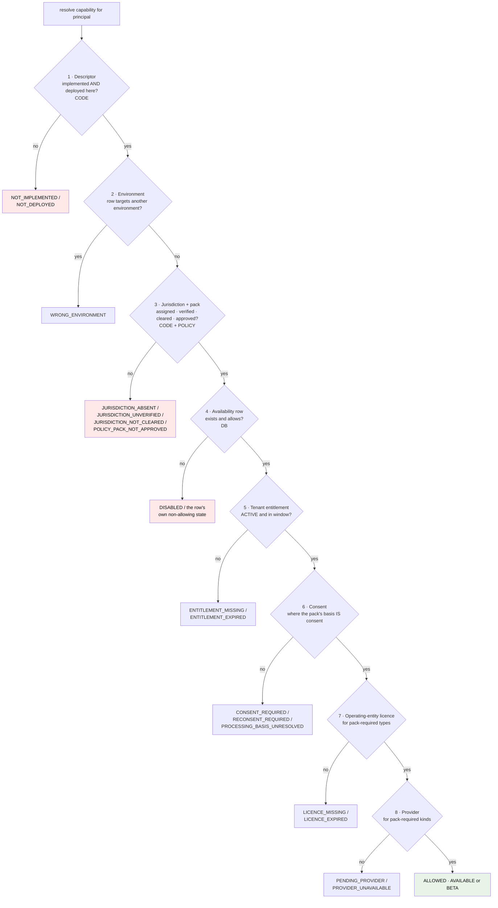

# Capability Registry and Availability

**ADR:** 0016 · **Phase:** 3.5 · **Canonical for:** capability descriptors, availability resolution, denial reasons, client exposure, entitlements

**Code:** [`packages/capability-registry`](../../packages/capability-registry) — the closed id union, the descriptor shape, the production registry, structural validation · [`modules/capability`](../../modules/capability/MODULE.md) — the gate engine, availability rows, entitlements, the client-safe projection

---

## 1. What the registry is for — and what it is not

| It governs | It does not do |
|---|---|
| Governance — who owns a capability | Dependency resolution |
| Availability — where it may be exposed | Dynamic loading |
| Entitlement — which tenants reach it | Runtime registration |
| Discoverability — what exists, and its honest state | DI-by-name |

> **Registering a capability wires nothing.** Wiring is ordinary NestJS module imports.

A registry that also resolves dependencies becomes a service locator, and a service locator makes the dependency graph invisible to the compiler — which is the opposite of what the rest of this architecture is for. Nothing in `packages/capability-registry` loads code, constructs an object, or reads configuration.

## 2. Compile-time and typed

The id set is a closed union. Adding a member is a reviewed code change, never configuration, and the canonical migrations `CHECK`-constrain the same closed set so the database cannot hold an id the compiler has not seen.

```ts
export const CAPABILITY_IDS = [
  'TRANSACTIONS', 'BUDGETS', 'GOALS', 'INSIGHTS', 'AI_ADVISOR', 'ZAKAT', 'AMANAT',
] as const;
```

`FUNDRAISING` is **deliberately absent from the runtime registry.** It remains a possible future bounded context discussed in architecture documentation only; it has no id, no descriptor, and nothing in the platform can reference it.

Each id maps to a static descriptor:

```ts
interface CapabilityDescriptor<Id extends string = CapabilityId> {
  id: Id
  lifecycle: 'PLANNED' | 'ALPHA' | 'BETA' | 'GA' | 'DEPRECATED' | 'RETIRED'
  implementation: 'NOT_IMPLEMENTED' | 'IMPLEMENTED'
  deployment: Partial<Record<KararEnvironment, 'NOT_DEPLOYED' | 'DEPLOYED'>>
  declaredJurisdictions: readonly JurisdictionId[]   // a ceiling INPUT, not a grant
  disclosureBearing: boolean
  clientExposure: 'ACTIONABLE' | 'HIDDEN'
  providerPendingExplainable?: boolean               // absent means NOT explainable
}
```

`validateRegistry` checks the structural invariants over *any* registry shape, generic over the id type: ids unique, every id mapped to a descriptor whose `id` matches its key, no descriptor claiming `DEPLOYED` anywhere while `NOT_IMPLEMENTED`, deployment keys naming real environments, `declaredJurisdictions` carrying no duplicates, and a disclosure-bearing descriptor with an empty jurisdiction list forced to be `HIDDEN`. `assertValidRegistry` is the throwing form used at construction — an invalid registry is a defect, not a runtime state.

Generic-over-`Id` is what lets test suites build their own registries over their own synthetic ids to exercise positive paths. A synthetic id never enters the production union, the production registry, client output, or a database row: the write use cases validate ids against the production view the composition root gives them, and the migrations constrain the same set.

## 3. Three separated state dimensions

The single most common modelling mistake here is one `status` field answering three unrelated questions. They are separate because they can disagree, and every combination in which they disagree is real:

| Dimension | Answers | Values |
|---|---|---|
| **Lifecycle** | What is the product *intent*? | `PLANNED` · `ALPHA` · `BETA` · `GA` · `DEPRECATED` · `RETIRED` |
| **Implementation** | Does the code exist in this repository? | `NOT_IMPLEMENTED` · `IMPLEMENTED` |
| **Deployment** | Is the built code deployed, per environment? | `NOT_DEPLOYED` · `DEPLOYED`, per environment; an absent key means `NOT_DEPLOYED` |

> **"GA planned" is not a state.** It is a lifecycle intent (`PLANNED`) plus an implementation fact (`NOT_IMPLEMENTED`) plus a deployment fact (deployed nowhere), and collapsing the three into one label is how a roadmap ambition comes to read as a shipped feature.

A capability can be `GA` in intent, `IMPLEMENTED`, and deployed in `staging` but not `production` — three different answers, all true at once. Only the second and third gate exposure: **no lifecycle value ever makes a capability available**, and no configuration can make missing code available, because the first gate reads implementation and deployment and nothing else.

### The stored availability dimension

Separate again from all three, because it is *configuration* rather than a fact about code: one `capability_availability` row per `(environment, jurisdiction?, capability)`, where a null jurisdiction reference means the row is environment-wide and a jurisdiction-specific row is narrower. Migration `0076`; the vocabulary is closed by `CHECK`:

```
AVAILABLE · BETA · INTERNAL_ONLY · PARTNER_ONLY · DISABLED
PENDING_PROVIDER · PENDING_LEGAL_REVIEW · PENDING_REGULATORY_REVIEW
```

**Only `AVAILABLE` and `BETA` permit exposure.** `INTERNAL_ONLY` and `PARTNER_ONLY` **deny in this phase**: no internal or partner audience model exists to check a principal against, and a state that cannot be checked must not widen access. When such a model lands they become checkable rather than silently permissive.

### Deny by default

> **A capability with no availability row is `DISABLED`.**
> **Code existing is never sufficient for exposure.**

The tables ship with **no seed rows at all** — deny-by-default means the ground state is absence, not a row saying "off".

This is what makes Scenario C structurally safe. A white-label bank does not have a capability *switched off*; it was **never on**, because no row was ever created. There is no configuration mistake that could expose it, because exposure requires a positive act at every gate and the default at each is absence.

The legacy demonstrates the opposite default's cost: its entitlement enforcement flag `enforce-entitlements` **defaults to false**, so *"the paid-feature boundary is currently not a control"* (API-13). A boundary that must be switched on is a boundary that is off somewhere.

## 4. The resolution gates

Resolution is one pure deterministic function over one immutable facts snapshot. Eight gates, in order; every gate is AND; the first failure names the denial.



### The ceiling argument

**Gates 1–4 consume no grant-like input.** The descriptor, the environment, the jurisdiction assignment with the PolicyPack ceiling, and the availability row all run *before* the entitlement, consent, licence, and provider dimensions are consulted at all. An entitlement row, a consent grant, a held licence, or a connected provider can therefore **satisfy its own gate and nothing else** — none of them can flip a denial that a ceiling gate already returned.

That is the restrict-only invariant of [`jurisdiction-policy.md` §2](jurisdiction-policy.md) expressed as an ordering rather than as a rule anyone has to remember. It is proven rather than asserted: a property harness runs the ceiling core exhaustively over generated configurations and then sweeps randomized grant-like inputs across them, asserting that the resolved outcome never exceeds the ceiling and that adding any grant never converts a ceiling denial into an allowance.

The write path holds the same line from the other side: recording an *allowing* availability state above the descriptor ceiling is refused as `ABOVE_CEILING` and audited with outcome `DENIED`. An operator cannot even store the row, let alone have it honoured.

### Clearance is an intersection

Gate 3 grants clearance only where the PolicyPack's cleared set **and** the descriptor's `declaredJurisdictions` both contain the effective jurisdiction. Either side missing denies with `JURISDICTION_NOT_CLEARED`.

This is why `AMANAT` is unreachable by construction: its `declaredJurisdictions` is `[]`, so the intersection is empty for every jurisdiction, and **no pack — present or future — can clear it** until a real declaration exists in reviewed code.

Where the pack's clearance requires a verified jurisdiction assignment, an `UNVERIFIED` assignment denies exactly as an absent one does; the three-arm effective state in [`jurisdiction-policy.md` §12](jurisdiction-policy.md) is what makes that non-optional.

### Gates 6–8 fail closed

- **Consent** applies only where the pack declares consent as the basis for that capability's processing. A different declared basis must not demand consent; a basis the pack leaves unresolved denies with `PROCESSING_BASIS_UNRESOLVED`. **No published disclosure document denies** (`CONSENT_REQUIRED`) — the inversion of the legacy's AI-5, whose consent gate fails open when nothing is published.
- **Licence** requirements are read from the pack, never invented here. A `CLAIMED_UNVERIFIED` licence never satisfies a requirement: a claim is not evidence ([ADR-0024](../adr/0024-operating-entity.md)). A revoked licence is an absence (`LICENCE_MISSING`), a lapsed one an expiry (`LICENCE_EXPIRED`).
- **Provider** requirements likewise come from the pack. The only shipped source answers `NOT_CONFIGURED` for every kind, so a pack-required provider yields `PENDING_PROVIDER` — the gate never fabricates a connection.

### Provenance, not locking

Each resolution reads one snapshot per dimension and records the pack version, availability row id and version, and entitlement id and version it used. A concurrent change therefore lands wholly in a later resolution and is detectable from the pins; a resolution is never a half-applied mix. This is provenance, not serialization — two resolutions racing a change may legitimately disagree, and the pins say why.

The environment is bound at **construction** from server-side configuration. There is no environment field on the resolver's input, so a client cannot supply one — structurally, not by validation.

## 5. Availability state, denial reason, and what a client sees

Three vocabularies, deliberately distinct, and conflating any two is a leak:

| Concept | Lives in | Answers |
|---|---|---|
| **Availability state** | a database row | What did an operator configure? |
| **Denial reason** | a resolution result | Why did this principal not get it, at which gate? |
| **Client exposure** | the client-safe projection | What may this principal be told? |

A row *stores* a state; a resolution *reports* a reason. Many reasons no row can ever hold — `NOT_IMPLEMENTED`, `NOT_DEPLOYED`, `JURISDICTION_ABSENT`, `JURISDICTION_UNVERIFIED`, `JURISDICTION_NOT_CLEARED`, `POLICY_PACK_NOT_APPROVED`, `ENTITLEMENT_MISSING`, `ENTITLEMENT_EXPIRED`, `CONSENT_REQUIRED`, `RECONSENT_REQUIRED`, `PROCESSING_BASIS_UNRESOLVED`, `LICENCE_MISSING`, `LICENCE_EXPIRED`, `PROVIDER_UNAVAILABLE`, `WRONG_ENVIRONMENT` — because they are facts about code, policy, and the principal, not configuration.

### Hidden versus actionable

Client exposure is deny-by-default, decided in one place (`domain/denial-reason.ts`, applied by `domain/client-view.ts`) and nowhere else:

| Reason | Client sees |
|---|---|
| `CONSENT_REQUIRED` | the capability, with an offer to consent |
| `RECONSENT_REQUIRED` | the capability, with an offer to re-accept |
| `ENTITLEMENT_MISSING`, `ENTITLEMENT_EXPIRED` | the capability, with the path to obtain it |
| `PENDING_PROVIDER` | *only* where the descriptor sets `providerPendingExplainable` |
| everything else | **nothing — the capability is absent from the response** |

> **Absent entirely is not `available: false`.** A capability omitted for a hidden reason has no entry in client output at all, in any state.

The distinction is the point. An actionable denial invites an action the subject can actually take. A legal, jurisdictional, or not-yet-built denial must not advertise the capability's existence: `available: false, reason: PENDING_LEGAL_REVIEW` tells a reader that the capability exists, that it is coming, and that lawyers are looking at it — three facts nobody outside the platform is entitled to. The same applies to `NOT_IMPLEMENTED` and `NOT_DEPLOYED`, which would turn the client response into a roadmap.

**A `HIDDEN` capability is omitted in every state, including `ALLOWED`.** `AMANAT` is `HIDDEN`, and the registry validator enforces the general rule behind it: a disclosure-bearing descriptor with no declared jurisdiction must be `HIDDEN`, so an uncleared disclosure-bearing capability cannot be made advertisable by editing one field.

Client channels consume `ResolveClientCapabilityView`; the full internal view with real reasons and provenance pins never leaves the server. The bootstrap surface ([`tenancy.md` §11](tenancy.md)) passes the filtered output through unenriched and never re-derives visibility, so the filter cannot drift into two implementations.

### How the Flutter client consumes it, and why it is an allowlist

**Landed in Phase 4.** The client keeps a compile-time set of navigable capability ids and renders only entries that are both `AVAILABLE` and in that set. It is an **allowlist, never a denylist**, and the difference is the whole point: an omitted capability is not one the client should mark unavailable, it is one the client must not know exists, so there is nothing to filter and nothing to explain. An id outside the set produces no destination, is not counted, is not summarised, and reaches no state the presentation layer can read.

There is deliberately **no collection of unrecognised ids** anywhere in the client. Such a collection would itself be a channel for the names it holds — the exact disclosure this section exists to prevent — and it is the reason a "coming soon" tile for an omitted id would defeat the server-side filter entirely.

The set is **empty today**, which is correct rather than incomplete: nothing is implemented. The consequence, stated so nobody reads the empty services screen as a bug, is that the resolved-and-non-empty path is exercised only against synthetic fixtures — the same discipline the resolver's own positive paths follow.

**An empty resolution and a failed one are different answers to the client**, carried as a discriminated section on the bootstrap response since Phase 4: `RESOLVED` with no items renders a stated empty state inside the signed-in surface, while an unavailable resolution is a 503 that renders an outage screen naming no service, no entitlement and no dependency.

## 6. Entitlements — a gate, not a plan

`tenant_capability_entitlements` (migration `0077`) holds one current row per `(tenant, capability)`: status, an opaque `source_ref`, an effective window, a version, a reason, and actor provenance. An entitlement satisfies gate 5 when its status is `ACTIVE` and the window covers the instant. Everything else denies — `REVOKED` as missing, a lapsed window or a stored `EXPIRED` as expired.

**There is deliberately no subscription, plan, price, or billing concept here.** `source_ref` is the seam: an opaque typed reference (`operator:<ref>` today) that a future subscription module fills by minting its own references, becoming one source among possible others. Subscriptions are Phase 10 and belong to their own bounded context; an entitlement table that grew a `plan_id` would have quietly made the capability platform a billing system.

Both the availability and entitlement tables carry trigger-written append-only history ledgers, written `SECURITY DEFINER` so `karar_app` holds no `INSERT` on them: a ledger row can only come from an actual state change, and `UNIQUE (row_id, version)` forbids skipped or forked history. Every `UPDATE` must increment `version` by exactly one, and `DELETE`/`TRUNCATE` raise even for the table owner — a capability is withdrawn by setting `DISABLED`, which keeps the accountability.

## 7. Where enforcement happens

Availability is resolved server-side and enforced in the use case as well as at the transport edge, because **HTTP is not the only caller**: jobs in `apps/worker` and AI tools call use cases directly, and a guard that exists only at the HTTP edge protects one of three entrances.

Both management use cases are permission-gated (`capability.availability.manage`, `capability.entitlement.manage`) and both permissions are **declared and deliberately unseeded** this phase: no role carries them, deny-by-default means absence denies, and every write path is therefore closed until a reviewed seeding migration and an operator surface exist. **No permission can enable a capability the PolicyPack has not cleared or that has no code** — that constraint lives in the merge and the ceiling check, not in form validation. No permission exists to delete an availability row, delete an entitlement, edit either ledger, or bypass the consent or licence gates.

Availability changes are on the mandatory-staging list alongside financial rules, migrations, AI changes, bank connectors, subscriptions, white-label configuration, mobile releases, country policy changes, and operating-entity changes ([`environments.md`](environments.md)).

## 8. Super Admin

The Phase 8 **Capability Management** surface shows capability × version × owning domain × states × jurisdictions × tenants × required integrations × required entity licences × legal status × deployed version × health.

**No such surface exists today.** The use cases exist and are permission-gated; no admin route is mounted, following the control-plane deferral ([ADR-0021](../adr/0021-control-plane-gateway.md)).

## 9. Registering a new capability

Append-only. Nothing existing is modified.

| Step | Change |
|---|---|
| 1 | `CAPABILITY_IDS` union **+1 member** |
| 2 | A descriptor in `CAPABILITY_REGISTRY` — `NOT_IMPLEMENTED`, deployed nowhere, `declaredJurisdictions: []` until legal clearance exists |
| 3 | The `capability_id` CHECK constraint in a new migration, matching the union |
| 4 | `<module>/MODULE.md` and the module skeleton |
| 5 | PolicyPack clause — cleared capability, resolution strategy, approval policy if disclosure-bearing |
| 6 | Availability rows — new rows, or none (⇒ `DISABLED`) |
| 7 | Root NestJS module import; admin nav entry; GoRouter route |

**If registering a capability requires *editing* logic in an unrelated module, the seam is wrong and gets fixed before proceeding.** See [`extension-pattern.md`](extension-pattern.md).

## 10. Current registry

Every real capability is honestly unbuilt. This table is the descriptor content, not an ambition:

| Capability | Lifecycle | Implementation | Deployment | `declaredJurisdictions` | Client exposure |
|---|---|---|---|---|---|
| `TRANSACTIONS` | `PLANNED` | `NOT_IMPLEMENTED` | none | `[]` | `ACTIONABLE` |
| `BUDGETS` | `PLANNED` | `NOT_IMPLEMENTED` | none | `[]` | `ACTIONABLE` |
| `GOALS` | `PLANNED` | `NOT_IMPLEMENTED` | none | `[]` | `ACTIONABLE` |
| `INSIGHTS` | `PLANNED` | `NOT_IMPLEMENTED` | none | `[]` | `ACTIONABLE` |
| `AI_ADVISOR` | `PLANNED` | `NOT_IMPLEMENTED` | none | `[]` | `ACTIONABLE` |
| `ZAKAT` | `PLANNED` | `NOT_IMPLEMENTED` | none | `[]` | `ACTIONABLE` |
| `AMANAT` | `PLANNED` | `NOT_IMPLEMENTED` | none | `[]` | **`HIDDEN`** (disclosure-bearing) |
| `FUNDRAISING` | — | not in the registry | — | — | — |

> **No capability is available anywhere.** Gate 1 denies all seven regardless of any row, pack, or entitlement, and the availability and entitlement tables ship empty.

**`ZAKAT` carries a non-engineering gate** recorded outside the descriptor: no Sharia review, board, scholar, or certificate exists, and none is implied by any of this work. **`AMANAT` declares no jurisdiction**, so it is unreachable regardless of configuration until per-jurisdiction legal clearance exists.

See [`capability-map.md`](capability-map.md) for the module, classification, provider, and phase view of the same set.

## 11. What the registry deliberately is not

| | Why |
|---|---|
| A plugin system | Every capability is a named bounded context with an owner |
| A dynamic loader | Compile-time union; the compiler knows every capability |
| A DI container | Wiring is ordinary module imports |
| A service locator | A dependency graph the compiler cannot see is the failure this architecture exists to avoid |
| A feature-flag system | Flags would be one input to a gate, never the mechanism |
| A subscription or billing model | Entitlements gate; they do not price (§6) |
| A `features/` or `misc/` module | These are where bounded contexts go to die |
