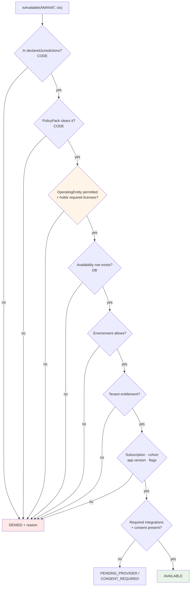

# Capability Registry and Availability

**ADR:** 0016 · **Phase:** 3.5

---

## 1. What the registry is for — and what it is not

| It governs | It does not do |
|---|---|
| Governance — who owns a capability | Dependency resolution |
| Availability — where it may be exposed | Dynamic loading |
| Entitlement — which tenants and plans reach it | Runtime registration |
| Discoverability — what exists, and its status | DI-by-name |

> **Registering a capability wires nothing.** Wiring is ordinary NestJS module imports.

A registry that also resolves dependencies becomes a service locator, and a service locator makes the dependency graph invisible to the compiler — which is the opposite of what the rest of this architecture is for.

## 2. Compile-time and typed

Each module declares a static descriptor in `<module>/capability.ts`. A build step collects them into a discriminated union.

**No string-keyed lookup. No dynamic import. No plugin system.**

```ts
// modules/amanat/capability.ts — CODE, static, reviewed
export const AMANAT: CapabilityDescriptor = {
  id: CapabilityId.AMANAT,
  version: '1.0.0',
  owningModule: 'amanat',
  businessOwner: '…',
  technicalOwner: '…',
  status: 'ALPHA',                      // ALPHA | BETA | GA | DEPRECATED
  declaredJurisdictions: [],            // MAXIMUM legally-cleared set — empty until cleared
  requiredOperatingEntityLicenses: [],
  requiredPermissions: [...],
  requiredIntegrations: [...],
  requiredConsent: [...],
  requiredLegalPolicy: [...],
  dataClassification: 'SEALED',
  apiExposure: 'PRIVATE',
  sdkExposure: false,
  whiteLabelEligible: false,
  publishesEvents: [...],
  consumesEvents: [...],
}
```

`declaredJurisdictions` is the **maximum** set — the ceiling that configuration may restrict but never exceed.

## 3. Static descriptor vs dynamic availability

```
CapabilityAvailability — DATABASE, audited, restrict-only
  (capability × jurisdiction × environment × tenant) → AvailabilityState
```

`AvailabilityState`:

```
AVAILABLE · BETA · INTERNAL_ONLY · PARTNER_ONLY · DISABLED
PENDING_PROVIDER · PENDING_LEGAL_REVIEW · PENDING_REGULATORY_REVIEW
```

### Deny by default

> **A capability with no availability row is `DISABLED`.**
> **Code existing is never sufficient for exposure.**

This one rule is what makes Scenario C structurally safe. A white-label bank does not have Amanat *switched off* — it was **never on**, because no entitlement row was ever created. There is no configuration mistake that could expose it, because exposure requires a positive act and the default is absence.

The legacy demonstrates the opposite default's cost: its entitlement enforcement flag `enforce-entitlements` **defaults to false**, so *"the paid-feature boundary is currently not a control"* (API-13). A boundary that must be switched on is a boundary that is off somewhere.

## 4. The resolution gates



**Every gate is AND.** Gates 1–3 are code and policy; gates 4–8 are configuration and context. Configuration can only ever narrow what gates 1–3 permit — the restrict-only invariant from [`jurisdiction-policy.md`](jurisdiction-policy.md).

### Gate 8 fails closed

A capability requiring consent, with no published disclosure document, is **unavailable** — not permitted. The legacy's consent gate *"fails open when no disclosure document is published"* (AI-5), which is precisely the inversion of the correct behaviour.

## 5. Every denial carries a reason

```ts
type CapabilityResolution =
  | { state: 'AVAILABLE' }
  | { state: 'DENIED'; reason: DenialReason; actionable: boolean }
```

Reasons are machine-readable and surfaced to admin and to Flutter as a typed state. **A hidden feature is explainable, not mysterious.**

| Reason | Client behaviour |
|---|---|
| `CONSENT_REQUIRED` | Offer the consent action |
| `ENTITLEMENT_MISSING` | Offer the upgrade path |
| `PENDING_PROVIDER` | Explain that a connection is not yet available |
| `PENDING_LEGAL_REVIEW` | **Absent entirely** — no nav entry, no route, no teaser |
| `JURISDICTION_NOT_CLEARED` | **Absent entirely** |

The distinction matters: an actionable denial invites an action; a legal denial must not advertise the capability's existence at all.

## 6. Enforcement in two places

```ts
@RequiresCapability(CapabilityId.AMANAT)     // controller boundary
async record(...) { … }

// and inside the use case:
await this.capabilities.assert(CapabilityId.AMANAT, ctx)
```

**Both, deliberately — because HTTP is not the only caller.** Jobs in `apps/worker` and AI tools call use cases directly. A guard that exists only at the HTTP edge protects one of three entrances.

## 7. Availability changes are staged

A capability availability change is on the mandatory-staging list, alongside financial rules, migrations, AI changes, bank connectors, subscriptions, white-label configuration, mobile releases, country policy changes, and operating-entity changes. See [`environments.md`](environments.md).

Every change is versioned, audited, permission-controlled, and environment-aware.

## 8. Super Admin

**Capability Management** shows: capability × version × owning domain × status × countries × tenants × required integrations × **required entity licences** × legal status × flags × deployed version × health.

> **No capability silently becomes globally available.** The restrict-only invariant means the UI *cannot* grant what code has not cleared — the constraint lives in the merge function, not in form validation.

## 9. Registering a new capability

Append-only. Nothing existing is modified.

| Step | Change |
|---|---|
| 1 | `CapabilityId` union **+1 member** |
| 2 | `<module>/capability.ts` — new file |
| 3 | PolicyPack capability clause — new clause |
| 4 | Availability rows — new rows, or none (⇒ `DISABLED`) |
| 5 | Admin nav entry — new entry |
| 6 | Root NestJS module import — new import |
| 7 | GoRouter route — new route |

**If registering a capability requires *editing* logic in an unrelated module, the seam is wrong and gets fixed before proceeding.** See [`extension-pattern.md`](extension-pattern.md).

## 10. Current registry

| Capability | Status | Jurisdictions | Classification |
|---|---|---|---|
| `TRANSACTIONS` | GA (planned) | QA | `HIGHLY_SENSITIVE_FINANCIAL` |
| `BUDGETS` | GA (planned) | QA | `HIGHLY_SENSITIVE_FINANCIAL` |
| `GOALS` | GA (planned) | QA | `HIGHLY_SENSITIVE_FINANCIAL` |
| `INSIGHTS` | GA (planned) | QA | `HIGHLY_SENSITIVE_FINANCIAL` |
| `AI_ADVISOR` | GA (planned) | QA | `CONFIDENTIAL` |
| `ZAKAT` | GA (planned) | QA | `HIGHLY_SENSITIVE_FINANCIAL` |
| `AMANAT` | ALPHA | **`[]` — none** | `SEALED` |
| `FUNDRAISING` | Not planned | `[]` | — |

**`ZAKAT` carries a non-engineering gate:** no Sharia review, board, scholar, or certificate exists, and none is implied by any of this work. **`AMANAT` ships with `declaredJurisdictions: []`** until per-jurisdiction legal clearance exists — so it is unreachable regardless of any configuration.

See [`capability-map.md`](capability-map.md).

## 11. What the registry deliberately is not

| | Why |
|---|---|
| A plugin system | Every capability is a named bounded context with an owner |
| A dynamic loader | Compile-time union; the compiler knows every capability |
| A DI container | Wiring is ordinary module imports |
| A feature-flag system | Flags are one input to gate 7, not the mechanism |
| A `features/` or `misc/` module | These are where bounded contexts go to die |
