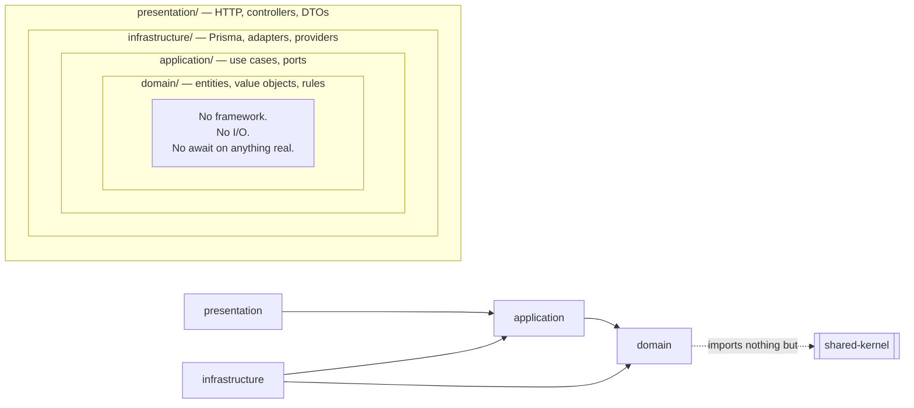

# Clean Architecture and the Dependency Rule

**ADR:** 0001 · **Enforcement:** architecture tests 1–11, 17, 20 · **Status:** binding from Phase 1

---

## 1. The rule

**Source-code dependencies point only inward.** Nothing in an inner circle knows anything about an outer one.



The direction is what matters, and one consequence is counter-intuitive enough to state explicitly: **`infrastructure/` depends on `application/`, not the other way round.** A repository implementation imports the port interface the use case declared. The use case never imports the repository.

## 2. Why compiler-enforced, not convention-enforced

A layering rule that lives in a wiki is a layering rule that decays. Karar makes violations **fail to compile or fail CI**, by construction:

| Mechanism | Prevents |
|---|---|
| `domain/` and pure packages declare **zero framework dependencies** in `package.json` | A domain file importing NestJS, Prisma, or Express — the import does not resolve |
| Each module exposes exactly one `public-api.ts` | Cross-module reach-through into internals |
| ESLint boundary rules + `dependency-cruiser` in CI | Any edge the layering forbids |
| Architecture tests asserting layer imports | Regressions that slip past lint |

**The strongest of these is the first.** `packages/financial-engine`, `packages/jurisdiction-policy`, `packages/shared-kernel`, and `packages/state-machine` have no framework in their dependency tree at all. A developer who tries to inject a repository into a calculator discovers it is not merely discouraged — the symbol does not exist.

## 3. The four layers

### `domain/`

Entities, aggregates, value objects, domain events, domain services, and invariants.

- **May import:** `shared-kernel` and nothing else.
- **May not:** touch a framework, a database, a clock, a random source, the network, or the filesystem.
- **Time and randomness arrive as arguments.** `Clock` is one of the nine universals precisely so that `domain/` never reads the system clock.

A domain object is testable with no mocks, no container, and no database, because it has nothing to mock.

### `application/`

Use cases — one class per business operation — and the **ports** they require.

- **Declares** the interfaces it needs (`TransactionRepository`, `EncryptionProvider`, `DeathVerificationProvider`).
- **Never** names an implementation.
- Orchestrates domain objects, enforces authorization, emits events, and returns `Result`.

A use case reads as the business operation it performs. If reading one requires knowing which database is underneath, the layering has failed.

### `infrastructure/`

Implementations of the ports: Prisma repositories, provider adapters, message publishing, object storage, key management.

- **This is the only layer that names a vendor.** Cloud KMS, Vertex, MinIO, Twilio — all here, all behind a port declared in `application/`.
- Contains the ORM. **No Prisma type escapes this layer** (ADR-0005).

### `presentation/`

HTTP controllers, request/response DTOs, OpenAPI decorators, capability guards.

- Thin by design. A controller validates, resolves context, calls one use case, and maps the result.
- **Business logic in a controller is a bug**, and the architecture tests treat it as one.

## 4. The `public-api.ts` rule

```
modules/transactions/
├── public-api.ts          ← the ONLY legal import surface
├── domain/
├── application/
├── infrastructure/
└── presentation/
```

Every cross-module import resolves to `@karar/transactions` → `public-api.ts`. Reaching into `@karar/transactions/domain/Transaction` fails CI.

**What a `public-api.ts` may export:**

| Exported | Not exported |
|---|---|
| Use case interfaces and their input/output types | Entities and aggregates |
| Read-model / query types | Repositories |
| Published event types | Prisma models |
| Public value objects the module owns | Anything from `infrastructure/` |
| Its `CapabilityDescriptor` | Internal services |

The discipline this creates is the point: **a module's public surface is a deliberate design artefact**, reviewed like any other. Widening it is a visible act.

## 5. Cross-module references

Modules reference each other's data by **raw UUID plus a locally-declared reference type in the consuming module** — not by importing the owner's ID type.

```ts
// modules/budgets/domain/TransactionRef.ts — declared HERE, in the consumer
export type TransactionRef = string & { readonly __brand: 'TransactionRef' }
```

This looks like duplication and is not. It makes the coupling **visible and local**: `budgets` declares, in its own code, that it depends on the existence of transactions. If that dependency should later be severed, exactly one file changes. Importing `TransactionId` from `transactions` would instead make the coupling ambient and invisible — and would tempt `TransactionId` into `shared-kernel`, which is how shared kernels rot.

This is why `shared-kernel` narrowed from v1: see §7.

## 6. Ports and adapters

**Every external dependency is a port.** No exceptions, including ones that feel permanent.

| Port | Why it is a port even though we "know" the answer |
|---|---|
| `AiProvider` | Model availability is regional and changes; a second provider is a resilience requirement |
| `FinancialDataConnector` | No bank connection exists yet. The port is what keeps that honest |
| `EncryptionProvider` | Local key in development, KMS in production, per-tenant KEK at L3 |
| `ObjectStorage` | MinIO locally, Cloud Storage in production. **No domain touches either directly** |
| `SubscriptionBillingProvider` | The rail is deferred; the seam is not |
| `Clock` | Determinism in tests, and time zones are a correctness concern (Qatar is UTC+3) |
| `DeathVerificationProvider` | Every implementation is jurisdiction-specific; the first is manual review |

**A port with no implementation is honest. A fake implementation that pretends to work is not.** The legacy shipped a `BillerConnector` interface with no implementations by explicit design, and that was the right call — while a sibling screen fabricated bank connections in local state, which was not. See [`../legacy/reusable-assets.md`](../legacy/reusable-assets.md).

## 7. `shared-kernel` — exactly nine universals

```
Money · Currency · Percentage · ExchangeRate · Clock · Result · DomainEvent · TenantId · UserId
```

Nothing else. CI caps the export surface; additions require an ADR.

**Why `UserId` is in and `TransactionId` is out.** `UserId` appears in audit, consent, and nearly every tenant-owned aggregate across every module — forcing each domain to declare its own `OwnerRef` would produce duplication without buying isolation. `TransactionId` appears in `transactions` and in whatever consumes transactions, and that consumption is exactly the coupling §5 wants visible.

**Removed from the v1 kernel:** `AccountId`, `TransactionId`, `BudgetId`, `GoalId`, `FinancialPeriod`.

`FinancialPeriod` moved to `financial-engine` because it encodes **calendar policy** — when a month begins for budgeting purposes, how a Hijri year is bounded — which is a business rule, not a universal. Leaving it in the kernel would have made every module a silent participant in a calendar decision.

**The rule of thumb:** a type belongs in `shared-kernel` only if a module that has never heard of any other module still needs it. `Money` qualifies. `BudgetId` does not.

## 8. Enforcement — what CI actually checks

| # | Test | Fails when |
|---|---|---|
| 1 | Domain purity | `domain/` imports a framework, ORM, or HTTP symbol |
| 2 | Layer direction | `application/` imports `infrastructure/`, or `domain/` imports either |
| 3 | Module boundary | A cross-module import bypasses `public-api.ts` |
| 4 | No ORM leakage | A Prisma type appears outside `infrastructure/` |
| 5 | Ports declared inward | An adapter exists with no port in `application/` |
| 6 | No business logic in controllers | Controller methods exceed declared complexity or call more than one use case |
| 7 | Money discipline | A float or `number` appears in a monetary position |
| 8 | Event catalogue | A published event is absent from the catalogue |
| 9 | Tenant scoping | A repository method can be reached without tenant context |
| 10 | No direct provider access | A domain or application file names a vendor SDK |
| 11 | Deterministic domain | `domain/` reads the system clock or a random source |
| 12 | No jurisdiction branching | A conditional on a country or jurisdiction identifier appears in `domain/`, `application/`, or `presentation/` |
| 17 | Pure packages | `jurisdiction-policy` or `state-machine` gains a framework dependency |
| 20 | Kernel surface | `shared-kernel` exports anything beyond the nine universals |
| 23 | No orphan guards | A class documented as a protection has no call site |

Tests 13–16, 18–19, 21–22, 24–26 concern sealed data, events, documents, disclosure, pinning, RLS, limits, erasure, and legal-document reconciliation; they are listed in `docs/testing/architecture-tests.md`.

## 9. The branching prohibition, stated precisely

The banned thing is **country- or jurisdiction-keyed business branching**, not the appearance of country codes.

| Permitted | Prohibited |
|---|---|
| `'QA'` in localization tables, currency reference data, address and phone formatting, seed data, test fixtures, ISO data | `if (country === 'QA')` or `switch (jurisdiction)` **that changes business behavior**, in `domain/`, `application/`, or `presentation/` |

Banning the literal outright would fire constantly on legitimate reference data and would train engineers to suppress the rule. **A test nobody trusts enforces nothing.** Test 12 targets conditionals and pattern matches on country/jurisdiction identifiers in business layers, which is the actual sin.

## 10. What Clean Architecture costs, honestly

It is not free, and pretending otherwise sets up the first engineer who feels the cost to conclude the rule is wrong.

| Cost | Why it is paid |
|---|---|
| More files per feature | A use case, a port, an adapter, and a controller where a framework tutorial would write one service |
| Mapping between layers | Domain objects ↔ persistence models ↔ DTOs. Three shapes, deliberately |
| Indirection when reading | Finding the implementation of a port means following an interface |
| The tenant transaction wrapper | RLS requires `SET LOCAL` in an interactive transaction, which constrains query style ([`tenancy.md`](tenancy.md)) |

What it buys: a financial engine testable with no database, a domain unaffected by swapping Prisma, an AI provider replaceable in an afternoon, a sealed vault extractable into its own process without touching a use case, and a jurisdiction added without editing a single consumer domain.

**The legacy is the control experiment.** It retrofitted RLS across three migrations and still leaves 24 tables uncovered; it has a guard class with two protections that have no call site; its AI categorisation path bypasses logging, metrics, provenance, and rate limiting by calling the provider directly. None of those are failures of skill. They are what happens when the boundary is a convention rather than a compiler error.
