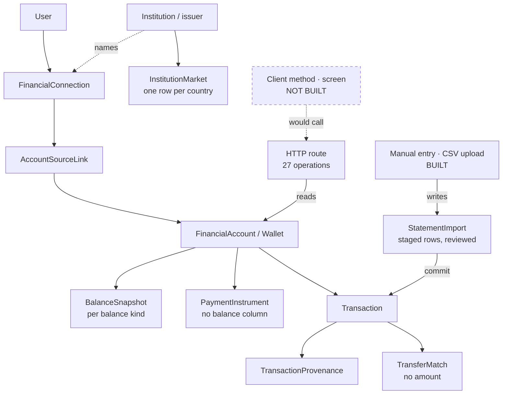

# Data Model

**ADRs:** 0005, 0006, 0008, 0022, 0026 · **Phase:** 2–3.5

---

## 1. Money — the decision that cannot be revisited later

**Money is `BIGINT` minor units paired with a `Currency` that carries its ISO 4217 exponent.**

```sql
amount_minor   BIGINT      NOT NULL,
currency_code  CHAR(3)     NOT NULL
```

```ts
class Money {
  private constructor(
    readonly minorUnits: bigint,
    readonly currency: Currency,   // carries exponent: QAR=2, KWD=3, JPY=0
  ) {}
}
```

**No floating point anywhere in the money path.** Not in the database, not in the domain, not in the API, not in Dart. Architecture test 7 fails a build where a `number`, `float`, or `double` appears in a monetary position.

### Why the exponent lives on `Currency`

Karar's markets include **three-decimal currencies** — KWD, BHD, OMR — alongside two-decimal QAR, SAR, and AED. Code that assumes "minor units means cents" is wrong for a third of the Gulf. `Currency.exponent` makes `1000` unambiguous: ten QAR, or one KWD.

### On the wire

```json
{ "amount": { "minorUnits": "1234567", "currency": "QAR" } }
```

`minorUnits` is a **string** in JSON. A 64-bit integer does not survive JavaScript's number type, and a generated TypeScript SDK that silently truncates a balance is a defect no test would catch until the amounts got large.

### What is not money

Weights, purities, ratios, rates, and percentages are **not** `Money` and do not use minor units. Zakat's gold weight in grams and 0.875 purity are measurements; `Percentage` and `ExchangeRate` are separate kernel types. Forcing them into `Money` would corrupt both.

## 2. Identifiers

| Kind | Rule |
|---|---|
| Primary keys | UUID v7 — time-ordered, so index locality is preserved without exposing a sequence |
| Domain ID types | Declared **in the owning module**, not in `shared-kernel` |
| Cross-module references | Raw UUID + a reference type **declared in the consuming module** |
| In `shared-kernel` | Only `TenantId` and `UserId` |

See [`clean-architecture.md` §5](clean-architecture.md) for why the coupling is deliberately local and visible.

## 3. Schemas

| Schema | Contents | Writers | RLS |
|---|---|---|---|
| `public` | Domain tables | Use cases via tenant transactions | Enabled **and** FORCEd |
| `readmodel` | Projections | Projection builders only | Enabled |
| `audit` | Append-only records | Append-only writer | Enabled; UPDATE/DELETE grants revoked |
| `sealed` | Ciphertext + wrapped DEKs | `SealedRecordStore` only | Enabled + grant GUC required |
| `platform` | Infrastructure bookkeeping: migration metadata, outbox, jobs | Migration runner; producers, relay, and job queue | Not tenant-scoped; access bounded by role grants |

**As implemented in Phases 2–5** — **66 tables** across `platform`, `audit`, and `public`, created by **53 migrations** numbered `0001` through `0101` (number ranges owned per workstream, with deliberate gaps that stay gaps): 48 through Phase 3.5, and **eighteen** added by the Phase 5 financial data platform. Phase 2 created the `platform` and `audit` schemas and their five infrastructure tables; Phase 3 created the first 32 domain tables in `public`; Phase 3.5 added eleven more for the jurisdiction, capability, and subject-policy dimensions. Every one is RLS-enabled and FORCEd or allow-listed with a written reason (§12; architecture test 22 is active). Full six-field lifecycle declarations: each owning module's `MODULE.md`, mirrored with [`packages/platform/db/DATA_LIFECYCLE.md`](../../packages/platform/db/DATA_LIFECYCLE.md) — that register holds 62 rows, and the four it does not hold are the statement-import tables, declared in `modules/statement-imports/MODULE.md` because that module owns both the tables and the decision. Architecture test 25 reads both, so the split is checked rather than trusted. Of the 66, **61 are mapped in Prisma** and verified against the live database by `scripts/db/prisma-mapping-check.mjs`; the five that are not are the platform and audit infrastructure tables no module owns. `readmodel` and `sealed` arrive with their phases.

| Table | Purpose | Classification |
|---|---|---|
| `platform.schema_migrations` | Migration bookkeeping — the database's verifiable history | `INTERNAL` |
| `platform.outbox_events` | Transactional outbox rows until published or dead-lettered | mirrors the envelope; at most `CONFIDENTIAL` in Phase 2 |
| `platform.event_consumer_receipts` | Consumer idempotency — `(consumer, event id)` receipts | `INTERNAL` |
| `platform.jobs` | Background jobs with lease, retry, and dead-letter semantics | mirrors the payload; at most `CONFIDENTIAL` in Phase 2 |
| `audit.audit_events` | Append-only accountability record | `CONFIDENTIAL` |

The Phase 3 domain tables, by owning module (purpose, classification, and lifecycle are declared per table in the linked `MODULE.md`; the migration files carry the same headers):

| Module | Tables (migrations) |
|---|---|
| [`identity`](../../modules/identity/MODULE.md) | `identity_accounts`, `password_credentials`, `email_verifications`, `password_reset_requests`, `sessions`, `refresh_token_families`, `refresh_tokens`, `mfa_enrolments`, `mfa_recovery_codes`, `authentication_security_events` (`0030`–`0034`) |
| [`users`](../../modules/users/MODULE.md) | `user_profiles`, `user_status_history` (`0040`) |
| [`tenancy`](../../modules/tenancy/MODULE.md) | `tenants`, `tenant_members`, `tenant_invitations` (`0041`–`0044`) |
| [`authorization`](../../modules/authorization/MODULE.md) | `permissions`, `roles`, `role_permissions`, `role_assignments` (`0050`–`0052`, `0054`) |
| [`control-plane`](../../modules/control-plane/MODULE.md) | `kill_switches`, `kill_switch_history` (`0053`) |
| [`operating-entity`](../../modules/operating-entity/MODULE.md) | `operating_entities`, `entity_jurisdiction_permissions`, `entity_licences`, `data_protection_role_assignments`, `operating_entity_assignments`, `entity_migrations` (`0060`–`0063`) |
| [`consent`](../../modules/consent/MODULE.md) | `legal_documents`, `legal_document_versions`, `consent_grants`, `reconsent_evaluations`, `processing_basis_references` (`0064`–`0065`) |

The Phase 3.5 domain tables, same convention:

| Module | Tables (migrations) |
|---|---|
| [`jurisdiction`](../../modules/jurisdiction/MODULE.md) | `countries`, `jurisdictions`, `user_jurisdiction_assignments`, `tenant_jurisdiction_assignments`, `jurisdiction_settings`, `policy_pack_activations` (`0070`–`0075`) |
| [`capability`](../../modules/capability/MODULE.md) | `capability_availability`, `capability_availability_history`, `tenant_capability_entitlements`, `tenant_capability_entitlement_history` (`0076`–`0077`) |
| [`subject-policy`](../../modules/subject-policy/MODULE.md) | `subject_policy_selections` (`0083`) |

The Phase 5 financial tables, same convention. They are reached by **27 operations over 21 `/financial/*` paths**, and `modules/provider-capabilities` is listed with them precisely because it owns **no table at all**:

| Module | Tables |
|---|---|
| [`financial-accounts`](../../modules/financial-accounts/MODULE.md) | `institutions`, `financial_accounts`, `financial_account_balance_snapshots`, `institution_markets` (`0087`–`0089`, `0094`; `0095` adds columns and creates no table) |
| [`transactions`](../../modules/transactions/MODULE.md) | `transactions`, `transaction_revisions`, `transaction_provenance`, `financial_categories`, `merchant_rules`, `transaction_category_assignments` (`0090`–`0093`) |
| [`financial-connections`](../../modules/financial-connections/MODULE.md) | `financial_connections`, `account_source_links` (`0096`–`0097`) |
| [`payment-instruments`](../../modules/payment-instruments/MODULE.md) | `payment_instruments` (`0098`) |
| [`transfer-matching`](../../modules/transfer-matching/MODULE.md) | `transfer_matches` (`0099`) |
| [`statement-imports`](../../modules/statement-imports/MODULE.md) | `statement_imports`, `statement_import_sources`, `statement_import_rows`, `statement_import_row_errors` (`0100`–`0101`) |
| [`provider-capabilities`](../../modules/provider-capabilities/MODULE.md) | **none** — the module is typed profiles describing what a rail could do, and a profile that owned a row would look like a fact about a provider |



**The dashed box is the one that is not built.** Every solid box is a table that exists, code tested against live PostgreSQL, and — where it is a route — an operation the runtime-conformance suite drives for real. **Staged import rows are not financial records**: they live in their own tables, they are inert, and only a reviewed commit turns them into transactions.

Seven concepts the Phase 5 model keeps apart, following [ADR-0028](../adr/0028-multi-rail-financial-sources.md), because collapsing any pair produces a specific untruth:

- **An issuer is not a market presence.** `institutions` holds stable global issuer identity with a kind (`BANK`, `E_MONEY_ISSUER`, `MOBILE_MONEY_OPERATOR`, `TELCO_FINANCIAL_SERVICES`, `PAYMENT_INSTITUTION`, `FINTECH_WALLET`, `CARD_ISSUER`, `EXCHANGE_HOUSE`, `OTHER`); `institution_markets` holds one row per issuer per **country**. A global issuer operating in four countries is one issuer with four market rows, not four issuers. The issuer code carries no country prefix, precisely because a code beginning `QA_` reads as a fact about where the issuer belongs and invites a second row the moment a second market appears. **Country is not Jurisdiction**: the market table keys on country and has no jurisdiction column.
- **A connection is not an account.** `financial_connections` says how data arrives; one connection may feed many accounts, and one person may hold several connections to one institution. **Thirteen acquisition rails are named and only `MANUAL` and `USER_FILE_UPLOAD` may exist**, refused otherwise by `financial_connections_rail_implemented_check` at the database rather than by application code — so an unimplemented rail cannot be written even by direct SQL. **No credential of any kind is stored** in any column of any table here, and the absence is proved by reading `information_schema.columns` against an exhaustive expected list, because a CHECK cannot assert that a column does not exist.
- **A source link is neither.** `account_source_links` is many-to-many in both directions and carries the encrypted external account reference plus a keyed, per-subject, versioned fingerprint — never a plain hash, which would be a confirmation oracle over a real account number.
- **An account's origin is not its current source.** `origin_kind` (`MANUAL`, `CSV`, `EXTERNAL_PROVIDER`) is immutable and says only how the account first came to exist. `provider_connection_ref` and the biconditional that bound it to a source kind are **gone from the schema**, not merely unused — an account may be typed in, then fed by CSV, then linked to an API, and remain one account. Later sources belong to account-source links, not to the account row.
- **A wallet is an account; a card is not.** `account_type = 'WALLET'` carries a required `wallet_kind`, enforced biconditionally: `CHECK ((wallet_kind IS NOT NULL) = (account_type = 'WALLET'))`. Crypto is not modelled here. `payment_instruments` has **no balance column at all**, so two virtual cards on one wallet cannot read as two more balances.
- **A liability is not cash.** `account_nature` (`ASSET`, `LIABILITY`, `UNKNOWN`) is stored rather than derived from the type, and nothing in Phase 5 sums, nets or totals with it. `UNKNOWN` is the honest default rather than a placeholder.
- **A reported balance is a specific balance.** `financial_account_balance_snapshots.balance_kind` is `NOT NULL` **with no default** (`BOOKED`, `AVAILABLE`, `CURRENT`, `OUTSTANDING`, `CREDIT_LIMIT`, `OTHER_SOURCE_REPORTED`). A default would be a guess written on a caller's behalf and stored as though a source had said it, and a caller asking what can be spent would be able to receive a settled figure silently.
- **A transfer match is a relationship, not a movement.** `transfer_matches` names two of a person's transactions and carries **no amount** — the figures stay on the transactions, where a third copy cannot disagree with them.

**No provider is connected, and nothing in this schema can say otherwise.** `provider_access_status` is `NOT_IMPLEMENTED` on every market row and `AVAILABLE` is refused by CHECK unless regulatory evidence is named. Neither the connection nor the instrument vocabulary contains a `CONNECTED`, `SYNCED`, `LINKED` or `AUTHORIZED` value, and `impliesLiveInstitutionLink` / `impliesLiveIssuerLink` answer `false` for every value they permit — functions rather than sentences, so the claim is checkable. Nothing may display "Connected" for data a person typed or uploaded.

**The account is identified by its id and nothing else.** There is deliberately no uniqueness over institution + user, institution + type, institution + currency, institution + type + currency, or issuer + wallet kind — every one of those forbids something people actually have, such as two current accounts at one bank in one currency, or two credit cards from one issuer. The absence is asserted against the live catalogue rather than merely intended: a test reads `pg_index` and requires the only unique indexes to be the primary key and the composite the currency-freeze foreign key depends on.

Three of them — `institutions`, `financial_categories`, `merchant_rules` — are catalogue tables owned by no tenant, and are allow-listed with a written reason rather than given a no-op policy (§12). On `financial_accounts`, the holder-sensitive fields are stored only as ciphertext with a nonce, an auth tag, an algorithm and a key version; there is no plaintext column for a display name, an institution label or a mask.

### A calendar day is not an instant, and a session is not a timezone

[ADR-0027](../adr/0027-calendar-day-and-instant.md) is ACCEPTED, approved by the Platform Owner, and admits **`CalendarDay` as the tenth shared-kernel universal** — the cap architecture test 20 enforces, in both directions, so a rename shows up as one absent name and one extra. The kernel's ten are `CalendarDay`, `Clock`, `Currency`, `DomainEvent`, `ExchangeRate`, `Money`, `Percentage`, `Result`, `TenantId`, `UserId`; an eleventh needs its own ADR, architecture justification, test change and approval.

The distinction is not pedantry about types. A booking date is what an institution wrote on its books — no time, therefore no timezone, therefore nothing to shift by. Stored as an instant it moves across day and month boundaries for readers at different offsets, and a statement for August gains or loses a line depending on where it is read. So `booking_date` and `value_date` are `date` in PostgreSQL and `CalendarDay` in the domain; `event_occurred_at` is `timestamptz` and is present **only when the source actually supplied an instant**, never manufactured from midnight on a booked day; and `source_timezone` is present only when the source explicitly stated one, never guessed from the account's country, the issuer, the server or the device.

**Every database session is pinned to UTC by a connection STARTUP parameter**, which closes a defect that would otherwise have made every time-window predicate wrong by the server's offset. Reading one row in one transaction, the `pg` driver returned the correct instant while Prisma returned it shifted — so on a UTC+3 server a fresh grant read as not-yet-effective and, in the direction that matters, a time-bounded window read as still open for three hours after it should have closed. A startup parameter rather than a per-checkout statement is the point: a pool cannot hand out a session that missed it, and no round trip is needed. Readiness pings with `SHOW TimeZone` rather than `SELECT 1`, so a session that would misreport time reads as `postgres: down` rather than as healthy.

The verification environment is deliberately adversarial: **PostgreSQL 17.10 with the server default left at `Asia/Qatar`.** CI runs `postgres:17-alpine`, which is UTC and would not have caught this. A test environment that agrees with the code's assumption is not evidence for the assumption.

Two Phase 3.5 migrations create no table: `0080` and `0081` add the self- and member-arm policies that make tenant *selection* possible before a session is bound ([`tenancy.md` §6](tenancy.md)). [`modules/bootstrap`](../../modules/bootstrap/MODULE.md) owns no persistent data at all — it composes views over the modules above.

Four of the new tables are **append-only ledgers** written by trigger rather than by the application (`capability_availability_history`, `tenant_capability_entitlement_history`) or by insert-only grant (`policy_pack_activations`), each immutable against the table owner as well as `karar_app` (§10). Two more are immutable by trigger with supersession as the only lifecycle: `subject_policy_selections`, and the assignment tables, whose single permitted UPDATE closes an open row's `effective_to`.

## 4. Columns every tenant-owned table carries

```sql
id           UUID        PRIMARY KEY,
tenant_id    UUID        NOT NULL,          -- RLS predicate
created_at   TIMESTAMPTZ NOT NULL DEFAULT now(),
updated_at   TIMESTAMPTZ NOT NULL
```

The Phase 2 `platform` and `audit` tables are platform infrastructure, not tenant-owned domain tables — they carry opaque tenant *references* where an envelope or audit row concerns one, never the RLS-predicate `tenant_id` column above. The first tenant-owned tables arrived in Phase 3 (`user_profiles`, `tenant_members`, `consent_grants`, and their siblings) and carry these columns. Two recorded variations, decided per table in the owning migration: identity's tables are keyed by **account** rather than tenant (their RLS predicate is `app.user_id` — [`modules/identity/MODULE.md`](../../modules/identity/MODULE.md)), and the platform-global legal/reference tables (operating entities, legal documents, the RBAC catalogue, kill switches) carry no `tenant_id` because no tenant owns them — each is allow-listed with its reason (§12).

## 5. Pinning — records with legal consequence

A record whose legality, consent basis, or calculation depends on policy **pins the policy that produced it**, at creation, forever.

```sql
jurisdiction_at_creation        TEXT NOT NULL,
policy_pack_version_at_creation TEXT NOT NULL,
operating_entity_at_creation    UUID NOT NULL,
subject_policy_selection_version         TEXT     NULL   -- where the capability has elective options
```

**Why all four, and why never a silent `UPDATE`:**

- **Jurisdiction** — the regime that governed the record when it was made.
- **Policy pack version** — so a rule change does not retroactively rewrite history.
- **Operating entity** — consent given to Entity A is not automatically valid for Entity B. If Karar restructures, incorporates locally, or is acquired, existing contracts were made with a specific legal person. Storing it makes re-consent a query rather than an archaeology project.
- **Subject profile version** — the elective conventions in force, so a Zakat assessment remains explainable under the conventions the customer had chosen. See [`plan-v2-deltas.md` D1](plan-v2-deltas.md).

Architecture test 21 asserts the pinning columns exist on every table declared to carry legal consequence. `EntityMigration` is an explicit, audited operation with a re-consent evaluation step — never an `UPDATE`.

**As implemented:** two tables carry declared legal consequence — `consent_grants` and `data_protection_role_assignments`. Phase 3 pinned the jurisdiction reference and the operating entity at creation, so an assignment change never silently migrates a consent (proven by the consent module's integration suite), and deferred the other two dimensions behind architecture test 21's activation gate, because PolicyPacks and `SubjectPolicySelection` did not yet exist. Phase 3.5 built both, so the gate came due and migration [`0086`](../../packages/platform/db/migrations/0086_legal_consequence_pack_pins.sql) completes the block on both tables.

The landed shape is a **pair per dimension**: a nullable version column plus a `NOT NULL` pin-state column saying, per row, why the value is what it is, tied together by a CHECK so "no version recorded" can never be silent. The states distinguish a real pin (`PINNED`) from a capability that declares no elective options (`NOT_APPLICABLE`) from a row that genuinely predates the machinery (`PRE_POLICY_PACK`, `PRE_SUBJECT_POLICY_SELECTION`) — and a cutoff CHECK makes the historical states unusable for new rows, so they state a fact about history rather than offering an escape hatch.

> **A sentinel string in a `*_version` column would read like a version.** No version was ever resolved for pre-Phase-3.5 rows, and the pin-state column is what lets the schema say that instead of implying otherwise. Both tables are append-only evidence, so existing rows were backfilled with the honest historical state and nothing was rewritten.

The legacy validates the pattern independently: its Zakat assessments snapshot the jurisprudential settings in force into every assessment, which is exactly this rule applied to one capability.

## 6. Data lifecycle — declared, not discovered

**Every persistent dataset declares its lifecycle at design time**, recorded in its module's `MODULE.md` and asserted by architecture test 25 ([ADR-0026](../adr/0026-data-lifecycle.md)). Six fields:

| Field | Declares |
|---|---|
| Subject relationship | `SUBJECT_OWNED` · `SUBJECT_DERIVED` · `AGGREGATE` · `NON_PERSONAL` |
| Purpose | The processing purpose the data serves |
| Classification | One of the six classes (§7) |
| Retention | Duration **from the PolicyPack, per jurisdiction — never a constant in code** |
| Export treatment | In the subject's export, excluded with a stated reason, or n/a |
| Erasure strategy | One of the four below |

| Erasure strategy | Meaning |
|---|---|
| `CASCADE_DELETE` | Deleted with the owning subject |
| `ANONYMIZE_IRREVERSIBLY` | Subject linkage severed **irreversibly**; the row survives without it |
| `RETAIN_WITH_BASIS` | Retained, with a stated legal basis and retention period |
| `NON_PERSONAL_BY_DESIGN` | Deliberately holds no personal data from creation, with a stated reason and a demonstration it cannot be re-identified |

This exists because the legacy discovered, during an erasure review, that one production table holds statement-derived data belonging to no user and **therefore cannot be erased on request** (finding P7). Phase 5 builds normalisation, dedup, and categorisation — all of which naturally produce data derived from a subject without belonging to one.

**`NON_PERSONAL_BY_DESIGN` is a decision requiring justification, not a description of an accident.** And **pseudonymization is not anonymization** — data whose subject linkage can be restored remains personal data and cannot claim `ANONYMIZE_IRREVERSIBLY` or `NON_PERSONAL_BY_DESIGN`.

**On the retention field, as of Phase 3.5:** PolicyPacks now exist, so the rule "from the PolicyPack, per jurisdiction — never a constant in code" has a mechanism behind it. It does not yet have numbers. `qa/v1` names the retention categories the platform already carries — `audit-events`, `consent-evidence`, `user-profile` — and declares each `PENDING_LEGAL_REVIEW` with its open question ([`jurisdiction-policy.md` §13](jurisdiction-policy.md)). That is the honest intermediate state: the prose deferrals became typed, resolvable states rather than durations someone invented, and the interim policy-configuration placeholders stay placeholders until legal review decides.

## 7. Data classification on every column

Six classes: `PUBLIC` · `INTERNAL` · `CONFIDENTIAL` · `HIGHLY_SENSITIVE_FINANCIAL` · `SECRET` · `SEALED`.

| Class | At rest | In events | In projections | In logs | AI |
|---|---|---|---|---|---|
| `PUBLIC` | plain | yes | yes | yes | yes |
| `INTERNAL` | plain | yes | yes | yes | yes |
| `CONFIDENTIAL` | plain or encrypted | yes | yes | redacted | minimized |
| `HIGHLY_SENSITIVE_FINANCIAL` | encrypted | **identifier-only by default** | yes | redacted | minimized |
| `SECRET` | KMS | no | no | no | no |
| `SEALED` | **per-record DEK** | **identifier-only, mandatory** | **never** | **never** | **never** |

`HIGHLY_SENSITIVE_FINANCIAL` may carry payload in an event only with a declared `payloadExemption` naming owner, reason, and reviewer — CI fails without it. **`SEALED` has no exemption mechanism at all.** See [`event-governance.md`](event-governance.md).

## 8. Sealed storage — the split that makes it work

```
amanat_records                      sealed.sealed_payloads
─────────────────────────────       ──────────────────────────────
id, owner_user_id, tenant_id        id
jurisdiction_at_creation            ciphertext
policy_pack_version_at_creation     wrapped_dek
operating_entity_at_creation        key_ref
status, created_at, updated_at      alg, checksum
sealed_payload_ref  ──────────────► created_at
```

**Metadata is ordinary, RLS-scoped, and projectable. The payload is not.**

The platform can answer *"how many records are pending disclosure"* while having no capacity to read one. Lifecycle is queryable; substance is not.

Reading a payload requires a `SealAccessGrant` as a **compiler-required, non-nullable argument** — there is no overload without one. RLS on `sealed_payloads` additionally requires a grant GUC, so a SQL-level mistake in application code returns nothing rather than ciphertext. See [`sealed-data.md`](sealed-data.md).

### The amount is sealed

It is tempting to keep obligation amounts in metadata for reporting. **Resist it.** An amount plus a counterparty reference is most of the sensitive content. Operational dashboards show counts, states, and ages — never sums.

## 9. Encryption at rest

| Layer | Mechanism |
|---|---|
| Column-level | AES-256-GCM, fresh 12-byte IV per encryption, 128-bit tag, 32-byte key enforced, versioned prefix |
| Sealed payloads | Per-record DEK, wrapped by a jurisdiction-scoped KEK via `EncryptionProvider` |
| Keys | Local key file in development; KMS in production; per-tenant KEK at topology rung L3 |

**Startup refuses to boot** without a key, or when existing encrypted data cannot be decrypted. Inherited from the legacy, which built this well.

**Also inherited — the lesson the legacy paid for.** Key rotation, escrow, and a second copy were **NOT BUILT**, and the production key *"has already been lost once."* For `SEALED` data that failure is both unrecoverable and undetectable. Karar therefore requires, before any production sealed data exists: **KEK escrow under split control with a rehearsed recovery drill**, and a **sealed-integrity canary** — a synthetic sealed record per KEK, holding known non-customer plaintext, decrypted on a schedule. See [`plan-v2-deltas.md` D2](plan-v2-deltas.md) and `../security/sealed-access.md`.

**One known constraint, inherited:** a column that must be sorted or matched exactly cannot use random-IV GCM. The legacy hit this with `merchant_rules.pattern`, whose repository sorts on `LENGTH(pattern)`. Such columns need a different design — deterministic encryption with its own trade-offs, or a redesigned lookup — decided per column, not by default.

## 9.1 Provider-neutral references

**No provider-specific identifier is ever a domain field.** A `gs://bucket/file` URL, an `arn:aws:s3` path, a cloud key resource name, or a secret-manager ID persisted as domain identity would weld every stored row to one vendor.

| Reference | Resolves to | Resolved by |
|---|---|---|
| `ObjectRef` | Stored bytes | The active `ObjectStorage` adapter |
| `KeyRef` | An encryption key | The active key-management adapter |
| `SecretRef` | A secret | The active secret-provider adapter |

Domain and application code persist and pass the opaque reference; only the infrastructure adapter for the active deployment profile knows what it maps to. This is what makes moving a deployment between providers a data-free operation for the domain. See [`infrastructure-portability.md`](infrastructure-portability.md).

## 10. Audit

Append-only, enforced by **both** revoked grants and a trigger that raises on UPDATE and DELETE **even for the table owner**. Two mechanisms because the legacy's audit table itself carries the schema's one flagged anomaly — RLS FORCEd but not enabled — and no guard detected that shape.

**Implemented in Phase 2:** `audit.audit_events` (migration `0010_audit_events.sql`) grants `karar_app` `SELECT, INSERT` only, and its statement-level trigger raises on UPDATE, DELETE, and TRUNCATE including for the owning `karar_migrator` role — both mechanisms are proven by integration tests, owner path included. The writer is the audit module ([`modules/audit/MODULE.md`](../../modules/audit/MODULE.md)), whose metadata guard keeps payloads and secrets out of `before/after_metadata`.

Audited: every mutation; every **staff read of a customer record, including reads returning nothing**; every capability availability change; every policy and entity change; and **every attempted sealed access, successful or refused**.

Staff-read auditing is inherited from legacy finding AZ5, which the legacy's own worklist ranks as *"the only item on the whole list that gets permanently worse every day it stays open"* — unrecorded events cannot be recovered later.

## 11. Projections

`readmodel` schema. **Never a source of truth.** Fully rebuildable — `make rebuild-projection <name>` — which is what makes them safe to change. Every admin view shows an "as of" timestamp because they are eventually consistent, and lag is monitored and alerted.

**`SEALED` data never enters a projection**, asserted by architecture test 13.

## 12. RLS

Enabled **and** FORCEd on every `public` table, or on an explicit allow-list with a stated reason. The application role has no `BYPASSRLS`. Migrations run as a separate role.

Architecture test 22 detects all three failure shapes the legacy exhibits:

| Shape | Legacy instance |
|---|---|
| No RLS at all | 24 of 69 tables; 6 unexplained, `users` among them (P14) |
| Enabled but no policy | The only shape the legacy's own guard tested for |
| **FORCEd but not enabled** | The admin audit log itself (RLS-02) |

**Active since Phase 3** (CODE). Current coverage, as architecture test 22 reports it over the tree at `ef1d155`: **66 tables scanned across 53 migrations — 36 RLS-enabled and FORCEd, 37 allow-listed** in [`packages/platform/db/rls-allow-list.json`](../../packages/platform/db/rls-allow-list.json) with written reasons, **7 deliberately both** (identity's bootstrap-armed tables). The Phase 5 additions split the same way as everything before them: every subject-owned financial table is ENABLE + FORCE with principal GUCs, the four statement-import tables included, and the three catalogue tables that sit outside the tenant boundary (`institutions`, `financial_categories`, `merchant_rules`) are allow-listed rather than given a no-op policy, so a reviewer reads them in the register instead of inferring them from an absent one. Policies read their GUCs through the fail-closed `NULLIF(current_setting(name, true), '')` pattern, bound transaction-locally by `withPrincipalContext`. The landed mechanism is canonical in [`tenancy.md` §3–§4](tenancy.md).

The six new allow-list entries are all Phase 3.5 reference or deployment-wide configuration with no tenant or subject column to scope on: the country and jurisdiction registers, jurisdiction settings, the pack-activation ledger, and capability availability with its history. The five new ENABLE+FORCE tables are the ones that do have a subject or tenant: both jurisdiction-assignment tables, subject policy selections, and the tenant entitlement table with its history. Each carries its own compensating grants — `karar_app` holds `SELECT` only on the reference and configuration tables, and `SELECT`+`INSERT` only on the ledgers. A tenant predicate on capability availability would fabricate a relationship that does not exist and break resolution for every tenant at once, which is the reason recorded in the entry.

## 13. Migrations

Forward-only SQL, applied by the platform's real runner as of Phase 2 (`packages/platform/src/db/migrations.ts`; policy in [`db/migrations/README.md`](../../packages/platform/db/migrations/README.md)): strict filename order, one transaction per file, sha256 checksums in `platform.schema_migrations` with hard failure on drift, and a mandatory `-- rollback:` recovery block per file. The runner connects **as the restricted `karar_migrator` role** — never a superuser; `karar_app` gets minimal per-table DML and no DDL. A migration requiring elevated privilege fails on a laptop instead of in production — a control the legacy records as having genuinely caught a defective migration. Runner semantics and the from-zero flow are summarized in [`backend.md` §6](backend.md).

**Environments must be distinguishable at boot.** The legacy's development and production databases carry byte-identical connection URLs, differing only in a username suffix, and its production service ran against development for four days. Karar asserts environment identity at startup and refuses to boot on a mismatch.
