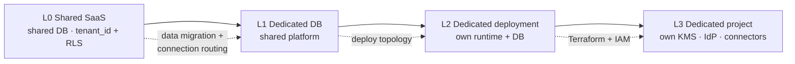

# Deployment Topology Ladder

**ADR:** 0023 · **Phase:** 17+ (infrastructure), design binding from Phase 1

---

## 1. Four rungs

| Rung | Isolation | Typical driver |
|---|---|---|
| **L0** | Shared database, `tenant_id` + RLS | Default. First-party and most partners |
| **L1** | Dedicated database, shared platform | Partner data-isolation requirement |
| **L2** | Dedicated deployment — own runtime and database | Contractual or performance isolation |
| **L3** | Dedicated project — own KMS, IdP, connectors | Regulatory or residency requirement |

## 2. The claim

> **Domain code is identical at every rung**, because it never names a database, provider, region, or key.

Moving a tenant up the ladder is **infrastructure resolution and Terraform** — not a rewrite, not a fork, not a branch.

## 3. The three mechanisms that make it true

| Mechanism | Resolves |
|---|---|
| **Tenant resolution at the infrastructure edge** | Which datasource this request uses |
| **`TenantProviderResolver`** | Which provider adapter binds for this tenant at runtime — IdP, bank connector, AI model routing |
| **`KeyRef`** | Which encryption key applies, per tenant and per jurisdiction |

All three live in `infrastructure/`. **No use case knows any of them exist.** A use case that asked "which database am I on?" would be the thing that breaks the ladder.

## 4. Not doing project-per-country

> **No regulatory, isolation, customer, or operational reason exists yet.**

The ladder means that if one appears, it is Terraform and IAM work rather than a rewrite. Building it speculatively would cost real complexity for a requirement nobody has stated.

This is the plan's seam test applied honestly: *"would retrofitting this be expensive?"* — yes, which is why the **seam** exists; *"might we want this?"* — unknown, which is why the **rungs** are not built.

## 5. What moves and what does not

| Moves | Stays |
|---|---|
| Terraform environment and project | Financial engine — a pure package |
| Datasource routing | Every consumer domain module |
| Key ring and `KeyRef` resolution | The API contract |
| Provider bindings | The Flutter client (API base is configuration) |
| IAM and service accounts | The capability registry and policy packs |

## 6. Sealed vault at each rung

The sealed vault is **extracted into its own security boundary before any production `SEALED` data exists**, regardless of rung — a Phase 20 gate.

At L3 it additionally gets a tenant-scoped KEK, its own key ring, and its own service account. The port surface does not change, because it was designed network-capable and transaction-independent from the first implementation. See [`sealed-data.md` §6](sealed-data.md).

## 7. Cost of readiness

Honest accounting of what the ladder costs before anyone climbs it:

| Cost | |
|---|---|
| Datasource resolution indirection | Real, small |
| Provider resolution indirection | Real, small — and needed anyway for mock providers in tests |
| `KeyRef` rather than a global key | Real, small — and needed anyway for jurisdiction-scoped KEKs |
| Terraform layout carrying three environments | Real, paid at Phase 1 |

Everything else is deferred. **No routing table, no per-tenant Terraform, no migration tooling exists until a tenant needs a rung.**
