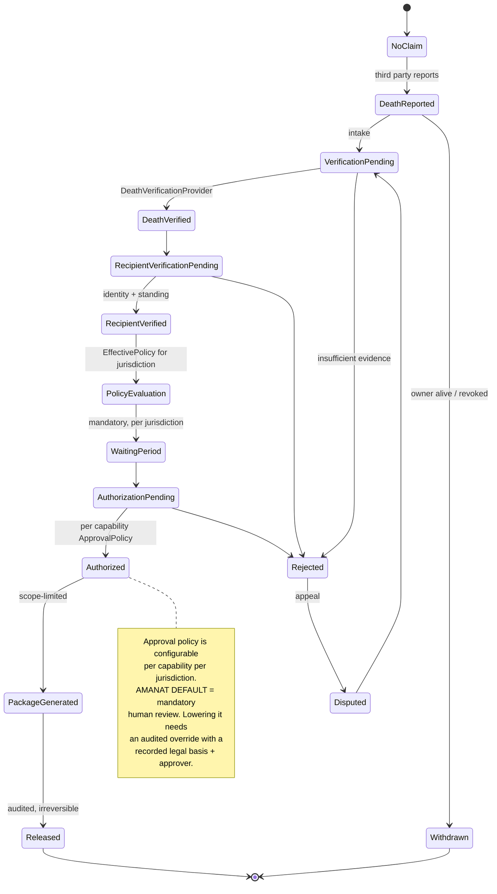

# Conditional Disclosure

**ADR:** 0018 · **Phase:** 13–14

---

## 1. Disclosure is not access

| | **Access** | **Disclosure** |
|---|---|---|
| Actor | The data subject | **A third party** |
| Basis | Ownership | Legal basis + verified event + policy |
| Authorization | Ordinary session | Independent, multi-step, approval-bearing |
| Scope | Everything owned | **A defined package** |
| Releasing party | n/a | **A named OperatingEntity** |
| Reversible | n/a | **No — irreversible once released** |
| Record | Access log | `DisclosureCase` + `DisclosurePackage` + audit |

Treating disclosure as a permissions problem is the mistake this document exists to prevent. Permissions answer *"may this actor read this?"* Disclosure answers *"has a verified event occurred, does a legal basis exist, has an authorized human approved, and which legal person is releasing what to whom?"* No RBAC system expresses that.

## 2. The model generalizes beyond Amanat

`DisclosureRequest`, `DisclosureCase`, and `DisclosurePackage` are platform concepts, not Amanat concepts. They also serve data-subject requests, legal orders, and estate processes.

```
DisclosurePackage
  recipient · purpose · legalBasis · scope · expiry
  jurisdiction · policyVersion
  releasingOperatingEntity          ← who is legally releasing this
  generatedAt · releasedAt
```

## 3. The workflow



## 4. Ports

Names provisional pending legal and domain review.

| Port | Purpose |
|---|---|
| `DeathVerificationProvider` | Verify the triggering event |
| `RecipientVerificationProvider` | Verify identity **and standing** |
| `EstateDisclosurePolicy` | Jurisdiction-specific rules |
| `DisclosureAuthorizationService` | Approval workflow |

**Each has a manual-review local implementation**, so the workflow is complete and testable with **no external provider and no jurisdiction assumptions**. That is what makes it buildable at Phase 13 without waiting on legal answers that belong to Phase 14.

## 5. Approval policy

Declared per capability per jurisdiction: number of approvers, required roles, separation of duties, waiting period, reauthentication, expiry.

| Rule | |
|---|---|
| **Amanat's default** | **Mandatory human review** (≥1 human approver) |
| A pack omitting an approval policy for a disclosure-bearing capability | **Fails to load.** No silent fallback (architecture test 19) |
| Other capabilities | May configure a different policy where their risk profile justifies it |
| Lowering a capability below its declared default | Requires an **explicit override** carrying a recorded legal basis, approving party, and effective date. The override is itself audited and must pass staging |

## 6. Safety properties — designed in, tested

### 6.1 Mandatory waiting period

Per jurisdiction, with an **enforced platform minimum**. A jurisdiction cannot configure it to zero.

### 6.2 Owner supremacy while living

The owner may amend or revoke disclosure instructions at any time. **Latest wins. History retained. Open cases auto-withdraw.**

### 6.3 Existence non-disclosure — the property most easily missed

> A death report by a third party must not reveal **whether the deceased had any records at all.**

The API returns **identical responses and identical timings** whether records exist or not, until authorization completes.

Without this, the report endpoint becomes an oracle: *"did this person secretly record debts?"* — answerable by anyone willing to file a report, and **a privacy breach requiring no data release at all**. For a capability whose entire premise is confidentiality, it would be the failure that matters most.

**Asserted by test**, including timing equivalence, because a response-time difference leaks the same bit as a response-body difference.

### 6.4 Released is irreversible

Everything before `Released` is reversible. `Released` is not.

It is therefore **the most heavily audited action in the platform**: reason, full approval chain, releasing entity, scope, recipient, and a security event.

### 6.5 Rate limiting and abuse detection

On death reports specifically. The endpoint is unauthenticated by necessity — a third party reporting a death has no account — which makes it the most abusable surface in the capability.

## 7. Package generation is a rendering path

Generating a `DisclosurePackage` reads `SEALED` data under a `DISCLOSURE` grant and renders it. It is therefore subject to the ingestion-and-rendering limits rule: explicit ceilings on bytes, pages, wall-clock, and memory, rejecting rather than degrading.

The legacy's PDF renderer *"converts up to 2 MB of caller-supplied HTML with no time or memory budget"* (FILES-7). An unbounded rendering path handling sealed data is the least acceptable place for that shape.

## 8. Scope discipline

**Not built now, and not assumed legal:**

- Actual estate or inheritance rules
- Fundraising
- Charitable coordination
- Repayment processing
- Government verification integrations

> **No jurisdiction's inheritance, disclosure, or estate law is asserted anywhere in this documentation.**

The architecture supports such a capability *after* legal analysis. It does not presume the outcome. Amanat ships with `declaredJurisdictions: []` and Qatar at `PENDING_LEGAL_REVIEW` precisely so that the code cannot run ahead of the clearance.

## 9. Fundraising — a separate capability, no direct coupling

Amanat emits `EligibleRepaymentSupportRequested` carrying **identifiers, jurisdiction, and status — never obligation contents**. A future `fundraising` bounded context may consume it.

**Amanat has no payment-provider dependency, direct or transitive.** Karar is not designed to hold funds. Any fundraising capability would integrate a licensed provider, bank, charity, or external platform through adapters — and its legality is unverified in every named market and is not assumed.

## 10. Testing

| Test | Asserts |
|---|---|
| State machine | Every transition; no path to `Released` skipping approval |
| **Existence non-disclosure** | Identical responses **and timings**, records or not |
| Owner supremacy | Revocation auto-withdraws open cases |
| Waiting period | Cannot be configured below the platform minimum |
| Approval policy required | A pack omitting one fails to load |
| Override audit | Lowering below default requires basis + approver |
| Grant scope | A `DISCLOSURE` grant reads only the package scope |
| Irreversibility | No transition out of `Released` |
| Rendering limits | Package generation rejects rather than degrades |
