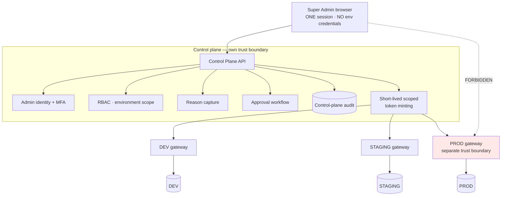

# Environments

**ADR:** 0021 · **Phase:** 1 (Terraform layout), 19 (staging), 20–21 (production)

---

## 1. The ladder

```
LOCAL → DEV → STAGING → PRODUCTION
```

Terraform carries the `deployments/qa/{dev,staging,production}/` compositions **from Phase 1** ([`infrastructure-portability.md` §Terraform](infrastructure-portability.md)), and each environment of each deployment binds to a **`DeploymentProfile`** — provider, region, database, storage, keys — rather than to an assumed cloud. There is no requirement to provision or pay for staging until a cloud account exists — but:

> **Production must not be introduced before a separate staging environment exists.** Hard gate, Phase 20.

Pre-cloud, staging is a **second Compose profile** used for release rehearsal, which keeps the discipline at near-zero cost.

## 2. Why staging is mandatory rather than advisable

The legacy is the argument. Its staging environment is **DESIGNED NOT BUILT** — committed in the blueprint, never provisioned. At the time of the audit it had become the item blocking the penetration test, which blocks independent assurance, which is a STOP condition on the legacy's own go-live checklist.

Its `render.yaml` **already declares a staging service tracking `branch: staging`** — and that branch does not exist, so the service has never been able to deploy. Right now `main` goes straight to production with nothing in between.

A staging environment deferred to "when we need it" is needed exactly when it is most expensive to create.

## 3. What each environment is for

| Environment | Purpose | Data |
|---|---|---|
| **LOCAL** | Development. **Zero cloud dependency** — Compose brings up PostgreSQL, MinIO, a mock AI provider | Synthetic seed |
| **DEV** | Shared integration | Synthetic |
| **STAGING** | Release rehearsal, pen testing, migration verification | **Synthetic only. Never production data** |
| **PRODUCTION** | Customers | Real |

**Local development has zero cloud dependency.** A developer clones, runs `make bootstrap` and `make dev`, and has a working system — no GCP account, no API key, no shared database.

## 4. Mandatory staging passage

Changes that must pass staging before production:

- Financial rules and ruleset versions
- Database migrations
- AI changes — prompts, models, routing
- Bank connectors
- Subscription and entitlement changes
- White-label configuration
- Mobile releases
- **Country and jurisdiction policy changes**
- **Capability availability changes**
- **Operating-entity changes**
- **Sealed vault and key operations**

## 5. Environment isolation

Each environment has **its own** database, encryption keys, secrets, AI credentials with a capped spend, and service accounts.

> **Never reuse production's encryption key anywhere.** A staging leak would otherwise decrypt production data.

### Environments must be distinguishable at boot

The legacy's development and production databases carry **byte-identical connection URLs** — the pooler host is regional and only a project-reference suffix on the username selects the project. Its production service ran against the development database for four days, and an audit read development's rows and reported them as production's.

**Karar asserts environment identity at startup and refuses to boot on a mismatch.** The check is cheap; the failure mode is not.

## 6. The control plane mediates environment access



**The browser holds a session with the control plane only.** Per request, the control plane mints a short-lived, single-environment, purpose-scoped token. The browser never holds an environment credential.

Production sits behind a stricter gateway: **reason required, optional second approval, reauthentication, network restriction, and a persistent production indicator** in the UI.

### Pragmatic implementation, stated honestly

For LOCAL and DEV, the control plane runs **as a module inside `apps/api`** — same process, gateway contract already in place.

> **A separately deployed control plane with independent credentials is a hard gate on production launch (Phase 20).**

`apps/admin` carries **no database driver**, CI-enforced.

## 7. Configuration and secrets

| | |
|---|---|
| Configuration | Typed and validated at boot. **A missing or malformed value fails startup** |
| Secrets | Never in the repository; never in logs; never in error messages |
| Local | `.env.example` committed, `.env` ignored |
| Production | Secret manager, rotatable |
| Scanning | CI secret scanning, blocking |

**Configuration is type-validated.** The legacy's admin settings are not: *"a non-numeric value where a number is expected is accepted and silently falls back to a default."* A silent fallback is a configuration change nobody made.

**Application configuration is not cloud configuration.** Business modules never read `GCP_PROJECT_ID`, `AWS_REGION`, or any provider variable — they consume ports. Provider selection, regions, and resource names are **infrastructure deployment configuration**, owned by the deployment profile and its Terraform composition. Scattering cloud variables through application modules is the anti-pattern the split exists to prevent ([`infrastructure-portability.md`](infrastructure-portability.md)).

## 8. CI gates block merges, not just runs

The legacy's gates *"block a workflow run, not a merge or a deploy; no enforcement path exists in the repository"* (INFRA-07), and **mobile is never built, linted, type-checked, or tested in CI** (INFRA-10).

Karar's CI blocks the **merge**, and the Flutter client is built, analysed, and tested in CI from Phase 4.

## 9. Production readiness gates (Phase 20)

Production launch requires all of:

| Gate | |
|---|---|
| Separate staging environment | Provisioned and exercised |
| Separately deployed control plane | Independent credentials |
| **Sealed vault extracted** to its own security boundary | Before any production `SEALED` data |
| **Approved key-custody strategy (ADR-0017)** — recovery/continuity tested, drill rehearsed where applicable | Before any production `SEALED` data |
| **Sealed-integrity canary** running | Staging and production |
| Independent security assessment | By a party that did not build the system |
| Penetration test | Executed, not merely scoped |
| Regulatory review | |
| Data-residency determination | |
| DR runbook **executed**, RTO **measured** | The legacy has RPO evidenced and RTO never measured |
| SLOs and alert rules live | With on-call rotation and escalation |
| Risk-acceptance register | Written, with named owners |
| Backup restore including **application recovery** | Not only a data restore |

The last several are inherited directly from legacy findings INFRA-02, INFRA-13, ENC-2, and worklist items M10, M11, M12.

## 10. On-call

**A single alert recipient is not on-call.** The legacy's arrangement — one email address, no rotation, no escalation — means *"a SEV-1 and a SEV-3 arrive identically."*

Production launch requires a rotation, escalation, and an alert routing policy that distinguishes severities.
