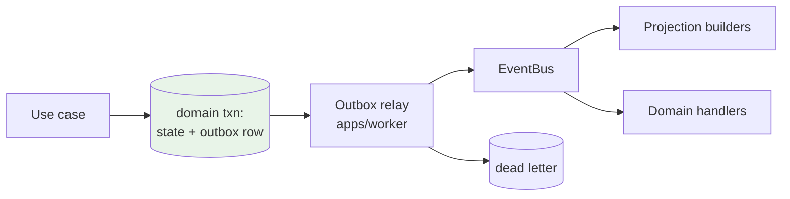

# Domain Event Governance

**ADRs:** 0012, 0025 · **Phase:** 2 · **Catalogue:** `packages/api-contracts/events/`

---

## 1. Why events need governance

**Events couple systems as surely as imports do** — and less visibly. An import that reaches into a module's internals fails CI; an event whose payload quietly grows a field that three consumers come to depend on fails nothing, until the day it changes.

Governing the catalogue now prevents the sprawl that makes an event bus indistinguishable from a shared database.

## 2. The catalogue

Every event declares:

```yaml
name: AmanatDisclosureAuthorized
schemaVersion: 1
owningModule: amanat
classification: SEALED
allowedConsumers: [notifications, audit, projections]
containsPii: false
retention: P7Y
payloadExemption: null
```

CI enforces, on every build:

| Rule | Fails when |
|---|---|
| Catalogue completeness | A published event is absent from the catalogue |
| Consumer allow-list | A module subscribes to an event that does not name it in `allowedConsumers` |
| Schema evolution | A change is neither additive nor version-bumped |
| Payload rules | See §3 |

The consumer allow-list is the rule that does the most work. It converts "who listens to this?" from an archaeology exercise into a declaration the owning module makes deliberately.

## 3. Payload rules by classification

| Classification | Rule |
|---|---|
| `SEALED` | **Identifier and status only. Mandatory. No exemption exists.** |
| `HIGHLY_SENSITIVE_FINANCIAL` | **Identifier-only by default.** Carrying payload requires a `payloadExemption` naming owner, reason, and reviewer — **CI fails without it** |
| Others | Payload permitted; schema versioned |

### The asymmetry is deliberate

`HIGHLY_SENSITIVE_FINANCIAL` has an exemption mechanism because there are legitimate cases — a projection that needs an amount to compute a total — and the mechanism makes each one a named, reviewed decision rather than a default.

**`SEALED` has no exemption mechanism at all.** Not "an exemption requiring executive approval." None. There is no field to set and no process to invoke, so there is no conversation in which someone argues for one.

```
AmanatDisclosureAuthorized {
  case_id, tenant_id, jurisdiction, operating_entity_id, occurred_at
}
```

— never the obligation.

Architecture test 15 asserts all of this.

## 4. Transactional outbox



State change and event enqueue commit in **one transaction**.

**Guarantees:** at-least-once delivery, idempotent consumers, ordering per aggregate. There is no path that publishes an event for a state change that did not commit, and none that commits a change whose event is lost.

**Failure handling:** bounded retry with backoff, then dead-letter. **Dead-lettered events alert** — a silent DLQ is a queue that fills up unnoticed until someone asks why a projection is stale.

## 5. Naming and versioning

`<Aggregate><PastTenseVerb>` — `TransactionCategorised`, `BudgetExceeded`, `AmanatDisclosureAuthorized`.

Past tense, because an event is a record of something that **happened**. `CategoriseTransaction` is a command; publishing it as an event invites a consumer to treat the bus as an RPC mechanism.

| Change | Handling |
|---|---|
| Additive optional field | Same version |
| Removing or renaming a field | New `schemaVersion`; both published during migration |
| Semantic change to an existing field | New version. **Same shape, different meaning is the worst break** — nothing fails, everything drifts |

## 6. Consumers

| Rule | |
|---|---|
| Idempotent | Keyed on event ID |
| Failure-isolated | One consumer's failure does not block others |
| No cross-module writes | A consumer writes only its own module's data |
| Declared | Listed in `allowedConsumers` and in `MODULE.md` |

The no-cross-module-writes rule closes the obvious loophole: an event handler that writes another module's tables has bypassed `public-api.ts` through the back door.

## 7. What events must never carry

| | Why |
|---|---|
| `SEALED` data of any kind | Mandatory, no exemption |
| Credentials, tokens, keys | `SECRET` never leaves its store |
| Full monetary detail without an exemption | Identifier-only default |
| PII not declared with `containsPii: true` | Retention and redaction depend on the declaration |
| Anything a consumer could not lawfully receive in its jurisdiction | Consumers are jurisdiction-scoped too |
