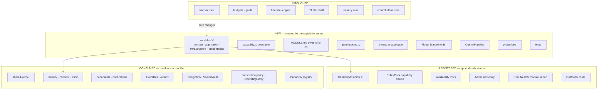

# Extension Pattern — how to add a capability

**ADR:** 0016 · **Applies from:** Phase 3.5

---

## 1. The claim this pattern has to earn

> A new capability can be added **without touching transactions, budgets, the financial engine, the Flutter shell, tenancy, or the control-plane core.**

Amanat is the proof (`../scenarios/b-add-amanat.md`); the seventeen-point checklist below is the acceptance test.

## 2. Three categories of change



### The distinction that makes this real

**Registered seams are append-only.** A union member, a policy clause, a nav entry, a module import, a route. **Nothing existing is modified.**

> If adding a capability requires *editing* logic in an unrelated module, **the seam is wrong and gets fixed before proceeding.**

This is a stop-work condition, not a preference. The whole design rests on it, and the only way to know a seam is real is to try it and refuse to work around it.

## 3. Order of work

1. **Write `MODULE.md` first**, answering all seventeen points below. Before any code.
2. **Get the checklist reviewed.** Points 4, 5, 6, 7, 16, and 17 are governance decisions, not engineering ones — several need a legal answer.
3. Create the module skeleton with `capability.ts` and `permissions.ts`.
4. Domain first, framework-free. Then use cases and ports. Then adapters. Then presentation.
5. Register the append-only seams.
6. Flutter feature folder + route.
7. Tests, including the capability-specific ones from point 14.

**Writing the checklist first is the point of the checklist.** Answering "what is this capability's data classification?" after the schema exists means answering it about a schema that already made the decision.

## 4. The seventeen-point checklist

Every capability answers all seventeen in its `MODULE.md` **before implementation begins**. Amanat's answers are in `../scenarios/b-add-amanat.md`.

| # | Item | What a good answer looks like |
|---|---|---|
| 1 | **Bounded context** | A named module directory. Not a folder inside an existing one |
| 2 | **Domain ownership** | Its own vocabulary, declared in `MODULE.md`. Borrowed vocabulary means a borrowed boundary |
| 3 | **Permissions** | Named `<capability>.<resource>.<action>`. **State which permissions deliberately do not exist** |
| 4 | **Capability registration** | `CapabilityId` member; `declaredJurisdictions` — **`[]` until legal clearance** |
| 5 | **Country availability** | Per-jurisdiction state. **Nothing enabled by default** |
| 6 | **Country policy** | Which PolicyPack clauses it needs. A disclosure-bearing capability with no `ApprovalPolicy` **fails to load** |
| 7 | **Data classification** | Per data element, not per module. Metadata and payload often differ |
| 8 | **Encryption** | Which key path. `SEALED` ⇒ per-record DEK + jurisdiction KEK + extractable vault |
| 9 | **API** | Namespace and admin namespace. Which admin routes exist, and which deliberately do not |
| 10 | **Flutter** | A new `features/` folder. **Zero shell changes.** Hidden entirely when unavailable |
| 11 | **Admin** | What operators see. For sensitive capabilities: state what they **cannot** see |
| 12 | **Events** | Names and payloads. `SEALED` ⇒ identifiers and status only, mandatory |
| 13 | **Projections** | What the read model carries — and what it must never carry |
| 14 | **Tests** | Domain, state machine, policy resolution, plus capability-specific safety properties |
| 15 | **Audit** | Every state-changing action; for sealed capabilities, **every attempted access, successful or not** |
| 16 | **SDK exposure** | Yes/no, with reason. Default no until the partner model is settled |
| 17 | **White-label entitlement** | Default **no**. Per-tenant opt-in requiring explicit legal sign-off |

## 5. Module skeleton

```
modules/<name>/
├── public-api.ts        ← the only legal import surface
├── capability.ts
├── MODULE.md            ← CI fails if absent (architecture test 16)
├── permissions.ts
├── domain/              ← framework-free
├── application/
│   ├── use-cases/
│   └── ports/
├── infrastructure/
│   ├── persistence/
│   └── providers/
├── presentation/
│   ├── http/
│   └── dto/
└── __tests__/
```

## 6. What a capability consumes

Platform services are **used, never modified**. If a capability needs a change to one, that change is a platform change with its own review — not a side effect of the capability's delivery.

| Service | Provides |
|---|---|
| `shared-kernel` | The nine universals |
| `identity`, `consent`, `audit` | Authentication, consent state, audit writing |
| `documents` | Evidence and file references. **No domain touches object storage directly** (test 18) |
| `notifications` | Delivery behind a channel port |
| `sealed-vault`, `EncryptionProvider` | Sealed storage and key handling |
| `jurisdiction-policy`, `operating-entity` | `EffectivePolicy`, legal-person resolution |
| `capability-registry` | Availability resolution |
| `EventBus` + outbox | Publication |
| `state-machine` | A ~100-line pure helper: states, transitions, guards, audit hook |

## 7. Case management — a seam, not an engine

No BPM engine. Each context owns its state machine on the pure helper, with a shared vocabulary: `Case`, `CaseState`, `Transition`, `Task`, `Review`, `Decision`, `Evidence`, `Approval`.

**Documented extraction trigger** — extract a shared Case Management capability when **all three** hold:

1. ≥3 contexts have human-review workflows, **and**
2. operations needs a unified queue, **and**
3. ≥2 share reviewer roles.

Before that, extraction costs more than it saves. Writing the trigger down is what stops the argument recurring every quarter.

## 8. What is explicitly not built

| | Why |
|---|---|
| A `features/`, `future/`, `services/`, or `misc/` module | Every substantial capability gets a named bounded context with an owner and its own vocabulary. These folders are where boundaries go to die |
| A plugin system | Compile-time union; the compiler knows every capability |
| Dynamic loading or runtime registration | Governance, not resolution |
| A shared "utils" module | Shared behaviour goes to a named package with an owner |

## 9. Verifying the seam

After adding a capability, verify the untouched list is genuinely untouched:

```bash
git diff --name-only main... | grep -E 'modules/(transactions|budgets|goals|insights)/|packages/financial-engine/|apps/mobile/lib/app/'
```

**Empty output, or the seam is wrong.**

For Amanat the untouched list is: `transactions`, `budgets`, `goals`, `financial-engine`, `insights`, `financial-accounts`, the Flutter shell, tenancy core, and control-plane core.

> **If this list shortens during implementation, the seam is wrong and gets fixed before the capability proceeds.**
