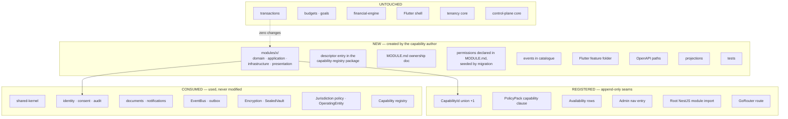

# Extension Pattern — how to add a capability

**ADR:** 0016 · **Applies from:** Phase 3.5 — the registered seams exist as of that phase; the checklist below names the landed ones

---

## 1. The claim this pattern has to earn

> A new capability can be added **without touching transactions, budgets, the financial engine, the Flutter shell, tenancy, or the control-plane core.**

Amanat is the proof (`../scenarios/b-add-amanat.md`); the seventeen-point checklist below is the acceptance test.

## 2. Three categories of change



### The distinction that makes this real

**Registered seams are append-only.** A union member, a policy clause, a nav entry, a module import, a route. **Nothing existing is modified.**

> If adding a capability requires *editing* logic in an unrelated module, **the seam is wrong and gets fixed before proceeding.**

This is a stop-work condition, not a preference. The whole design rests on it, and the only way to know a seam is real is to try it and refuse to work around it.

## 3. Order of work

1. **Write `MODULE.md` first**, answering all seventeen points below. Before any code.
2. **Get the checklist reviewed.** Points 4, 5, 6, 7, 16, and 17 are governance decisions, not engineering ones — several need a legal answer.
3. Create the module skeleton (§5), with the permissions — including the ones that deliberately do not exist — declared in `MODULE.md`.
4. Domain first, framework-free. Then use cases and ports. Then adapters. Then presentation.
5. Register the append-only seams (§3.1).
6. Flutter feature folder + route.
7. Tests, including the capability-specific ones from point 14.

**Writing the checklist first is the point of the checklist.** Answering "what is this capability's data classification?" after the schema exists means answering it about a schema that already made the decision.

### 3.1 The registration seams, concretely

Since Phase 3.5 these are real files and real rows rather than planned ones. Every one is an addition:

| # | Seam | Where | Honest starting value |
|---|---|---|---|
| 1 | `CAPABILITY_IDS` union member | `packages/capability-registry/src/index.ts` | — |
| 2 | `CAPABILITY_REGISTRY` descriptor | same file | `lifecycle: 'PLANNED'`, `implementation: 'NOT_IMPLEMENTED'`, `deployment: {}`, `declaredJurisdictions: []` |
| 3 | `capability_id` CHECK constraint | a new migration, matching the union | the closed set stays closed at the database too |
| 4 | PolicyPack clause | `packages/jurisdiction-policy/src/packs/` | absent from `clearedCapabilities` until legal review clears it |
| 5 | Resolution strategy | the same pack's `resolutionStrategies` | **required** for any cleared capability — no default exists |
| 6 | Approval policy | the same pack's `approvalPolicies` | **required as `DECIDED`** if the capability is disclosure-bearing; the pack fails validation without it |
| 7 | Subject-policy option set | the same pack's `subjectPolicyOptions` | only where the capability offers elections; absent is the common case |
| 8 | Availability rows | `capability_availability`, per environment | **none** — a missing row is `DISABLED` |
| 9 | Tenant entitlements | `tenant_capability_entitlements` | **none** — a missing row denies |
| 10 | Root NestJS module import, admin nav entry, GoRouter route | composition roots | — |

> **Steps 2, 4, 8, and 9 all start at "no".** A capability that appears in the union but nowhere else is denied at four separate gates, which is the intended state on the day it is registered. Flipping any one of them is a separate reviewed act.

`implementation` moves to `IMPLEMENTED` when the code exists; `deployment` gains an environment when it is actually deployed there; the registry validator refuses a descriptor claiming deployment while unimplemented. Neither is a lifecycle decision, and `lifecycle` alone never makes anything reachable ([`capability-registry.md` §3](capability-registry.md)).

## 4. The seventeen-point checklist

Every capability answers all seventeen in its `MODULE.md` **before implementation begins**. Amanat's answers are in `../scenarios/b-add-amanat.md`.

| # | Item | What a good answer looks like |
|---|---|---|
| 1 | **Bounded context** | A named module directory. Not a folder inside an existing one |
| 2 | **Domain ownership** | Its own vocabulary, declared in `MODULE.md`. Borrowed vocabulary means a borrowed boundary |
| 3 | **Permissions** | Named `<capability>.<resource>.<action>`. **State which permissions deliberately do not exist** |
| 4 | **Capability registration** | `CAPABILITY_IDS` member and a descriptor; `declaredJurisdictions` — **`[]` until legal clearance**; `implementation` and `deployment` state the truth, never the intent |
| 5 | **Country availability** | Per-jurisdiction, per-environment rows. **Nothing enabled by default** — a missing row is `DISABLED`, and so is a missing entitlement |
| 6 | **Country policy** | Which PolicyPack clauses it needs: clearance, a named resolution strategy, an `ApprovalPolicy` if disclosure-bearing (the pack fails validation without one), and a processing basis for every purpose it declares |
| 7 | **Data classification** | Per data element, not per module. Metadata and payload often differ |
| 8 | **Encryption** | Which key path. `SEALED` ⇒ per-record DEK + jurisdiction KEK + extractable vault |
| 9 | **API** | Namespace and admin namespace. Which admin routes exist, and which deliberately do not |
| 10 | **Flutter** | A new `features/` folder. **Zero shell changes.** Hidden entirely when unavailable |
| 11 | **Admin** | What operators see. For sensitive capabilities: state what they **cannot** see |
| 12 | **Events** | Names and payloads. `SEALED` ⇒ identifiers and status only, mandatory |
| 13 | **Projections** | What the read model carries — and what it must never carry |
| 14 | **Tests** | Domain, state machine, policy resolution, plus capability-specific safety properties |
| 15 | **Audit** | Every state-changing action; for sealed capabilities, **every attempted access, successful or not** |
| 16 | **SDK exposure** | Yes/no, with reason. Default no until the partner model is settled |
| 17 | **White-label entitlement** | Default **no**. Per-tenant opt-in requiring explicit legal sign-off |

Point 11 has a sharper form since Phase 3.5: for a capability whose denials must not be advertised, state its `clientExposure`. `HIDDEN` means the capability is omitted from client output in **every** state, including when it resolves as allowed — not returned as unavailable with a reason ([`capability-registry.md` §5](capability-registry.md)).

## 5. Module skeleton

```
modules/<name>/
├── public-api.ts        ← the only legal import surface
├── MODULE.md            ← CI fails if absent (architecture test 16)
├── domain/              ← framework-free
├── application/
│   ├── use-cases/
│   └── ports/
├── infrastructure/
│   ├── persistence/
│   └── providers/
├── presentation/
│   ├── http/
│   └── dto/
└── __tests__/
```

Two declarations a reader might expect inside the module live elsewhere, deliberately. The **descriptor** is an entry in `packages/capability-registry`, not a per-module file: the registry is a closed compile-time union whose validator must see every descriptor at once, and scattering them would make "what exists" a build step rather than a readable constant. **Permissions** are declared in `MODULE.md` — including the ones that deliberately do not exist — and seeded by reviewed migration against the closed catalogue in `modules/authorization/domain/catalogue.ts`; a permission exists because a migration created it, never because a module file mentioned it.

## 6. What a capability consumes

Platform services are **used, never modified**. If a capability needs a change to one, that change is a platform change with its own review — not a side effect of the capability's delivery.

| Service | Provides |
|---|---|
| `shared-kernel` | The nine universals |
| `identity`, `consent`, `audit` | Authentication, consent state, audit writing |
| `documents` | Evidence and file references. **No domain touches object storage directly** (test 18) |
| `notifications` | Delivery behind a channel port |
| `sealed-vault`, `EncryptionProvider` | Sealed storage and key handling |
| `jurisdiction-policy`, `jurisdiction` | `EffectivePolicy`; the effective jurisdiction state and its verification arm |
| `operating-entity` | Legal-person resolution and licence records |
| `capability-registry`, `capability` | Descriptors and availability resolution; the client-safe capability projection |
| `subject-policy` | Recording and reading a subject's pack-permitted elections, where the capability offers them |
| `EventBus` + outbox | Publication |
| `state-machine` | A ~100-line pure helper: states, transitions, guards, audit hook |

## 7. Case management — a seam, not an engine

No BPM engine. Each context owns its state machine on the pure helper, with a shared vocabulary: `Case`, `CaseState`, `Transition`, `Task`, `Review`, `Decision`, `Evidence`, `Approval`.

**Documented extraction trigger** — extract a shared Case Management capability when **all three** hold:

1. ≥3 contexts have human-review workflows, **and**
2. operations needs a unified queue, **and**
3. ≥2 share reviewer roles.

Before that, extraction costs more than it saves. Writing the trigger down is what stops the argument recurring every quarter.

## 8. What is explicitly not built

| | Why |
|---|---|
| A `features/`, `future/`, `services/`, or `misc/` module | Every substantial capability gets a named bounded context with an owner and its own vocabulary. These folders are where boundaries go to die |
| A plugin system | Compile-time union; the compiler knows every capability |
| Dynamic loading or runtime registration | Governance, not resolution |
| A shared "utils" module | Shared behaviour goes to a named package with an owner |

## 9. Verifying the seam

After adding a capability, verify the untouched list is genuinely untouched:

```bash
git diff --name-only main... | grep -E 'modules/(transactions|budgets|goals|insights)/|packages/financial-engine/|apps/mobile/lib/app/'
```

**Empty output, or the seam is wrong.**

For Amanat the untouched list is: `transactions`, `budgets`, `goals`, `financial-engine`, `insights`, `financial-accounts`, the Flutter shell, tenancy core, and control-plane core.

> **If this list shortens during implementation, the seam is wrong and gets fixed before the capability proceeds.**
