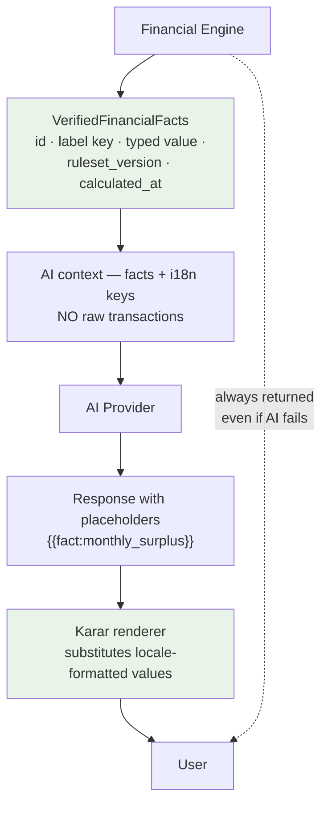

# Financial Engine

**ADRs:** 0006, 0007, 0011 · **Phase:** 6 · **Package:** `packages/financial-engine` (zero framework dependencies)

---

## 1. One engine, never forked

> **All authoritative financial math happens once, in TypeScript, in a pure package with no I/O.**

Not in the Flutter client (ADR-0007). Not in SQL. Not in a scheduled job's private copy. Not in the AI layer. **Not per country.**

The engine is a pure package: given the same inputs it returns the same outputs, with no clock read, no database, no network, and no randomness. Time arrives as an argument via `Clock`.

## 2. Why purity is worth the inconvenience

| Property | Consequence |
|---|---|
| No I/O | Testable exhaustively without a database |
| Deterministic | A recommendation is reproducible from its inputs and ruleset version |
| Framework-free | Cannot accidentally depend on request context |
| Identical everywhere | Same code at topology rungs L0 through L3 |

The reproducibility property is what makes per-recommendation provenance meaningful. *"This is what we told you in March"* is only defensible if re-running March's ruleset over March's inputs produces March's answer.

## 3. Money

**`BIGINT` minor units + `Currency` carrying its ISO 4217 exponent.** No floating point anywhere. See [`data-model.md` §1](data-model.md).

Karar's markets include **three-decimal currencies** — KWD, BHD, OMR — alongside two-decimal QAR, SAR, AED. Code assuming "minor units means cents" is wrong for a third of the Gulf.

**Rounding is explicit at every boundary.** A calculator that rounds implicitly is a calculator whose results depend on evaluation order. Rounding mode is a declared input, recorded in provenance.

## 4. Universal calculators vs jurisdiction inputs

```
FinancialEngine → RulesetRegistry → (capability, jurisdiction, version) → Ruleset
```

**Universal — never branched:** cash flow, savings rate, category aggregation, forecasting mechanics, recurring detection, reconciliation.

**Jurisdiction differences enter as explicit typed policy inputs** — thresholds, ratios, permitted assumptions — **never as branches**.

```ts
// correct
calculateHealthScore(facts, ruleset.healthScoreThresholds)

// prohibited — architecture test 12
if (jurisdiction === 'QA') { … }
```

A jurisdiction maps to an **existing** ruleset version unless business rules genuinely differ. `SA:v1` may point at the same ruleset object as `QA:v1`.

> **Divergence requires evidence, not anticipation.**

## 5. Ruleset versioning and provenance

Every recommendation records:

```
rulesetVersion · jurisdiction · operatingEntity · subjectProfileVersion
calculatedAt · inputHash
```

So **every historical recommendation remains explainable under the rules, jurisdiction, legal party, and elected conventions that produced it.**

The fourth field exists because some calculations vary by subject election rather than jurisdiction — Zakat's nisab basis and valuation convention being the concrete case. See [`jurisdiction-policy.md` §7](jurisdiction-policy.md).

Rulesets are **immutable once published**. A correction is a new version, never an edit — editing a published ruleset silently rewrites the explanation of every recommendation that used it.

## 6. `VerifiedFinancialFacts` — the boundary to AI



The engine emits **typed facts with label keys, not prose**. The AI layer consumes facts and never raw transactions. **The deterministic result is always returned to the user regardless of AI outcome** — if the model fails, the numbers still arrive; only the explanation is suppressed.

See [`ai.md`](ai.md).

## 7. Calculators in v1

| Calculator | Notes |
|---|---|
| Cash flow | Income, spend, net. **One shared definition** so no two screens can disagree |
| Savings rate | Deterministic, clamped |
| Financial health score | Deterministic formula, clamped |
| Safe-to-spend | Deterministic |
| Category aggregation | **Refunds netted so shares cannot exceed the whole; transfers excluded** |
| Period comparison | Against the **equivalent span** of the prior period, not a raw date subtraction |
| Recurring detection | ≥3 occurrences in monthly/yearly day bands, median amount tolerance |
| Subscription monthly equivalent | Cancelling excluded |
| Reconciliation | **Exact, no tolerance.** `BALANCED` / `UNBALANCED` / `NOT_CHECKED` |
| Zakat | Nisab, purity ladder, hawl, valuation by weight, liability 12-month portion |

Several of these carry rules derived from real data in the legacy and are ported as **rules plus test cases**, not as code. See [`../legacy/reusable-assets.md`](../legacy/reusable-assets.md).

## 8. Rules inherited from the legacy, and why

| Rule | Reason |
|---|---|
| **Unreadable input yields null, never zero** | *"A zero would silently understate spending"* |
| **Reconciliation has no tolerance** | A tolerance is how reconciliation silently stops working |
| **Ambiguous dates are flagged, not assumed** | Day-first where both components are ≤12 is a guess |
| **Local calendar days on the wire** | Qatar is UTC+3; a UTC serialisation ran every custom report a day early |
| **Refunds netted, transfers excluded** | Otherwise category shares exceed 100% |
| **Salary is not a subscription** | Recurring detection never proposes transfer, income, cash, or housing |
| **Refuse to compute on stale reference data** | Zakat returns an error past the configured price age rather than computing from a stale price. **Refusing is the correct default** |
| **Detection is a proposal, shown with its evidence** | *"Seen four times, about every 30 days"* — not a bare assertion |

## 9. Testing

Exhaustive and table-driven. The engine has no I/O, so there is no excuse for thin coverage.

| Area | Cases |
|---|---|
| Currency exponents | 0, 2, and 3-decimal currencies |
| Rounding | Every mode at every boundary; half-up ties |
| Boundaries | Zero, negative, single transaction, empty period |
| Overflow | `BIGINT` limits |
| Ruleset versions | Every published version still reproduces its recorded outputs |
| Determinism | Same inputs ⇒ same outputs, across runs |
| Multi-currency | Explicit conversion via `ExchangeRate`, never silent summation |

The last one is a legacy defect worth naming: its Zakat engine adds multi-currency holdings *"as one currency with a warning naming every currency found"* and performs **no FX conversion**. Karar has `ExchangeRate` in the kernel and converts explicitly.

## 10. What the engine never does

| | Why |
|---|---|
| Read a clock, database, network, or random source | Purity (architecture test 11) |
| Branch on jurisdiction | Typed policy inputs only (test 12) |
| Use floating point for money | Test 7 |
| Fork per country | One engine |
| Produce prose | It produces facts; the AI layer produces prose |
| Depend on a framework | Test 17 |
| Silently fall back | A declared-but-unimplemented option **fails loudly**. The legacy's Net Invested Funds setting *"falls back silently"* to a different method — a defect, not a convenience |
