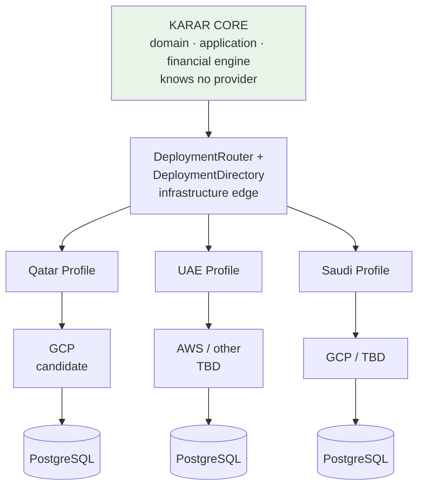

# Infrastructure Portability

**ADR:** 0023 (amended, Phase 0.5) · **Canonical for:** DeploymentProfile, deployment routing (DeploymentRouter + DeploymentDirectory), provider ports, opaque references, provider capability verification, observability portability, and the definition of "portable".

---

## 1. The rule

> **No business capability may care which cloud hosts it.**

The financial engine, transactions, budgets, Amanat, Zakat, AI orchestration, identity policies, and consent must remain **unchanged** when moving GCP → AWS, AWS → another approved provider, shared DB → dedicated DB, or shared deployment → dedicated deployment.

GCP is an infrastructure provider. **GCP is not part of Karar's domain** — and neither is any other cloud. The reality the architecture must support:

```
Qatar          → GCP (candidate)
Saudi Arabia   → GCP or another approved provider
UAE            → AWS / Azure / a UAE-local provider
Oman           → provider per local availability and regulation
Bank A         → dedicated infrastructure the bank requires
Bank B         → shared Karar infrastructure
Future country → unknown provider
```

The decided state per jurisdiction lives in [`country-deployment-matrix.md`](country-deployment-matrix.md) — never in code, and never inferred.

## 2. DeploymentProfile — a first-class platform concept

A **typed, provider-independent** description of one deployment. Its purpose is **routing and provisioning, not business logic** — and it is typed contracts, not one giant JSON object.

```
DeploymentProfile
├── deploymentId
├── environment              (DEV | STAGING | PRODUCTION)
├── provider                 (the IaC composition to use)
├── region
├── databaseProfile          (a managed-PostgreSQL binding — see database-portability.md)
├── objectStorageProfile
├── cacheProfile
├── messagingProfile
├── secretsProfile
├── keyManagementProfile
├── identityProfile
├── aiProfile                (routing only — policy stays in the PolicyPack)
├── analyticsProfile
├── observabilityProfile
├── networkProfile
└── residencyClassification
```

**Distinct from every business dimension.** A `DeploymentProfile` is not a Country, not a Jurisdiction, not a Tenant, not an OperatingEntity, and not a Brand:

- A jurisdiction does **not** automatically determine one cloud.
- A tenant does **not** automatically determine one deployment.

## 3. Deployment routing — two different problems

Routing involves two problems that must not be conflated, solved by two distinct mechanisms. **Domain code never invokes either.**

**Problem A — which Karar deployment receives this request?** A Qatar user reaches the Qatar deployment; a UAE user the UAE deployment; a Bank X user that bank's dedicated deployment. Solved **at the Karar edge, before any business data access**, by:

| Concept | Role |
|---|---|
| **`DeploymentRouter`** | The edge component that answers Problem A per request/connection |
| **`DeploymentDirectory`** | The minimal lookup the router consults: assignment → `DeploymentId` → `DeploymentProfile` |

**Problem B — once inside that deployment, which datasource belongs to the tenant?** Solved **inside the runtime** by the existing `DataSourceResolver` ([`database-portability.md` §4](database-portability.md)) — shared vs dedicated PostgreSQL within that deployment's own resources.

```
Client
    ↓
Karar Edge / DeploymentRouter
    ↓
DeploymentDirectory lookup
    ↓
Home deployment / tenant deployment       ← Problem A answered here
    ↓
Karar runtime
    ↓
Tenant context
    ↓
DataSourceResolver                         ← Problem B answered here
    ↓
PostgreSQL
```

Assignment may depend on **tenant, jurisdiction, environment, contract, and deployment-isolation requirement — not country alone**:

```
Qatar shared SaaS                 (jurisdiction default)
UAE shared SaaS                   (jurisdiction default)
Bank X dedicated UAE deployment   (contract-driven)
Bank Y dedicated global deployment
```

### 3.1 The directory is minimal

The `DeploymentDirectory` is **routing metadata only — not another global customer database**:

| Holds | Never holds |
|---|---|
| `TenantDeploymentAssignment` / `HomeDeploymentRef` | Financial data of any kind |
| `DeploymentId` | Replicated transactions |
| `RoutingVersion` | Customer content, balances, documents |

For **B2B / white-label**, `tenant/domain/app identity → DeploymentId` is typically sufficient.

For **B2C**, there is an **account-home-deployment bootstrap problem**: before sign-in, the edge must learn which deployment holds the account without a global customer store. Candidate mechanisms — an opaque account routing identifier, a region/home-deployment claim in identity metadata, tenant-specific endpoints, or another approved design — are **deliberately not selected yet**. The architecture rule that is binding now:

> **Routing to the correct deployment occurs before business data access.**

### 3.2 Deployment moves

An assignment is **versioned and audited**, and supports controlled movement — shared → dedicated, or provider A → provider B — through states such as:

```
ACTIVE → MIGRATING → CUTOVER_PENDING → ROLLBACK_WINDOW → ACTIVE
```

**The migration engine is not built now** (§9 documents the contract). What is binding now: moving a tenant changes an assignment — it must require **no mobile-app change, no financial-rule change, no Domain code change, and no tenant-specific business recompilation.**

### 3.3 Portability is not cross-cloud runtime coupling

> **Infrastructure portability means Karar can be *deployed on* different approved providers. It does not mean every runtime should hold credentials and network access to every provider.**

Prefer isolation:

```
QA runtime  → QA resources
AE runtime  → AE resources
Bank runtime → that bank's resources
```

over one runtime reaching every country's database, KMS, object store, and secrets. A Qatar API runtime querying a UAE RDS on an ordinary UAE customer request is the anti-pattern: the UAE request goes to the UAE deployment. Cross-deployment access requires an explicitly reviewed architecture — the default protects **data residency, blast radius, latency, IAM boundaries, network complexity, and operational independence.**

## 4. The deployment picture



> **Provider assignments are examples and configuration, not Domain assumptions.**

## 5. Provider ports — the canonical catalogue

Every infrastructure dependency is a provider-neutral contract. Implementations belong **exclusively** in `infrastructure/`.

```
DatabaseProvider*       ObjectStorage         CacheProvider
EventBus                JobQueue              SecretProvider
EncryptionProvider      KeyManagementProvider IdentityProvider
AIProvider              AnalyticsSink         EmailProvider
SmsProvider             NotificationProvider  ObservabilityProvider

*provisioning/connection contract only — never consumed by application code,
 which sees Repository interfaces (database-portability.md §2)
```

Illustrative adapter names (not commitments):

```
GcpCloudStorageAdapter       AwsS3Adapter
GcpPubSubAdapter             AwsMessagingAdapter
GcpSecretManagerAdapter      AwsSecretsManagerAdapter
GcpKmsAdapter                AwsKmsAdapter
VertexGeminiProvider         FutureAlternateAIProvider
```

**The database is deliberately absent from that list.** Managed PostgreSQL providers do **not** get per-cloud persistence adapters — one `PostgresPersistenceAdapter` serves them all, and provider differences live in **connection profiles and Terraform** (networking, TLS, IAM/database authentication, secrets, discovery, backup, HA). `DatabaseProvider` is an infrastructure **provisioning and connection** concern, never an Application or Domain dependency — the application requests a `Repository`. See [`database-portability.md` §2](database-portability.md).

**Do not implement every adapter now.** Build the ports correctly; implement only what the active development profile requires (local Docker + mocks in Phase 1–2, one cloud provider set when its deployment phase arrives).

## 6. Opaque references — nothing provider-specific is ever domain identity

A country deployment must not be trapped because documents assume GCS URLs, events assume Pub/Sub payloads, secrets assume Secret Manager IDs, cache assumes one product, or KMS assumes one vendor's resource names.

| Reference | Never persisted as | Resolved by |
|---|---|---|
| `ObjectRef` | `gs://bucket/file`, `arn:aws:s3:…` | The profile's `ObjectStorage` adapter |
| `SecretRef` | A secret-manager resource ID | The profile's `SecretProvider` adapter |
| `KeyRef` | A KMS key resource name | The profile's `KeyManagementProvider` adapter |
| `EventEnvelope` | A transport-specific message shape | The profile's `EventBus` adapter |
| `CacheKey` | A product-specific namespace | The profile's `CacheProvider` adapter |

Provider-specific identifiers live inside infrastructure implementations and configuration. **This is a precondition for ever migrating a deployment between providers** — see §9 and [`data-model.md` §9.1](data-model.md).

**Implemented as of Phase 2** (`packages/platform/src/config/refs.ts`, `src/keys/refs.ts`): the opaque scheme is `karar-ref:<kind>:<id>`, with branded types and parsers for `SecretRef`, `KeyRef`, `ObjectRef`, `DatabaseProfileRef`, and `DeploymentProfileRef`, plus `KeyVersionRef` (`karar-ref:key-version:<keyId>@v<N>`) for the wrap/rotation provenance ADR-0017 requires. **Types and validation exist today; resolution is deliberately future** — the active profile's adapters resolve a ref to a provider resource when their deployment phases arrive. Everything persisted from Phase 2 on is already in the portable form.

## 7. Provider capability verification

Not every cloud offers every service in every region, and:

> *"Cloud provider operates in the country"* does **not** mean *"every Karar dependency is available locally."*

Before any country's production deployment, a **provider capability check** verifies each required component locally available or under an approved cross-region treatment:

```
ProviderCapability
├── database          ├── containerRuntime
├── objectStorage     ├── messaging
├── KMS               ├── AI          ← the component most often missing in-region
├── secretManager     ├── analytics
└── identity
```

The verified result is recorded per jurisdiction in [`country-deployment-matrix.md`](country-deployment-matrix.md), with evidence labels. **AI availability is verified separately and explicitly** — model regions lag infrastructure regions everywhere.

## 8. AI routing is independent of the deployment provider

An AWS deployment does not imply an AWS model; a GCP deployment does not imply Gemini. `AIProvider`, `AIProcessingPolicy`, and `AIRegionPolicy` resolve independently of the `DeploymentProfile`; **the jurisdiction's PolicyPack determines what is permitted**, and AI may be disabled or localized per jurisdiction regardless of the hosting cloud. See [`ai.md`](ai.md).

## 9. DR backup vs provider migration — two different objectives

**Disaster-recovery backup** restores *the same deployment* after loss. Native database backups serve this well.

**Provider migration / tenant portability** moves a tenant or deployment *between* deployments or providers:

```
Shared Qatar deployment → dedicated bank deployment
Provider A → Provider B
```

**A native backup format is not the portability plan** — it is vendor-shaped by definition. The migration engine is **not built now**; the contract it must satisfy is documented so nothing forecloses it:

- export canonical data · validate row counts and checksums
- preserve IDs where appropriate · preserve provenance · preserve ruleset versions
- preserve consent history · preserve audit history according to policy
- preserve encryption and key relationships safely (re-wrap DEKs under the target's KEK; never export plaintext keys)
- import · verify · cut over · rollback window

The opaque references of §6 and the migrations-from-zero rule of [`database-portability.md`](database-portability.md) are what make this contract satisfiable later.

## 10. Observability stays portable

Application code emits **logs, metrics, and traces through OpenTelemetry-compatible instrumentation** — provider-neutral by construction. The deployment profile routes them to Google Cloud Operations, an AWS monitoring stack, or another approved platform **without rewriting business code**.

Implemented locally as of Phase 2: platform code depends on `@opentelemetry/api` only, the apps initialize the OTel SDK at their composition roots, and telemetry exports over OTLP to the Compose `otel-collector` — the same seam a cloud profile later points at its provider's backend ([`backend.md` §11](backend.md)).

## 11. Application config is not cloud config

Business modules never read `GCP_PROJECT_ID`, `GOOGLE_REGION`, or `AWS_REGION`. The application consumes **ports**; infrastructure composition chooses implementations. Provider variables belong to the deployment profile and its Terraform composition ([`environments.md` §7](environments.md)).

## 12. Terraform — multi-provider by structure

Terraform remains the IaC tool. The structure supports provider-specific implementations without duplicating whole stacks:

```
infra/terraform/
├── modules/
│   └── contracts/        — provider-neutral module interfaces (what a deployment needs)
├── providers/
│   ├── gcp/              — GCP implementations of the contracts
│   ├── aws/              — AWS implementations (structure now, built when needed)
│   └── …
└── deployments/
    ├── qa/
    │   ├── dev/  staging/  production/
    ├── sa/   ae/   om/     — created when those launches are real
```

Compositions under `deployments/` bind a contract to one provider's implementation per environment. **Prefer reusable composition over duplicated stacks.** Phase 0.5 designs this structure; the active provider's modules get implemented when its deployment phase arrives — **no cloud is provisioned now**.

## 13. Control plane and Super Admin

The Environment/Deployment Center displays, per deployment, without hard-coding any cloud: provider · region · deployment profile · database profile · runtime, storage, and messaging health · AI provider and AI region · KMS and key-custody status · residency status · tenant assignment · jurisdiction · operating entity.

**Provider-specific operations stay behind control-plane adapters. No cloud console is exposed through Karar Admin.**

## 14. Definition of portable

Karar is infrastructure-portable **only if all of these hold**:

- Domain knows no cloud provider · Application knows no cloud provider
- The PostgreSQL schema is not tied to any one managed provider
- Object, secret, and key references are provider-neutral
- AI is separately routable · Telemetry is provider-neutral
- A tenant can map to a `DeploymentProfile`
- A new PostgreSQL database can be built entirely from migrations
- A new deployment can be provisioned from IaC
- Moving provider changes **no financial rule and no business use case**
- A dedicated tenant deployment requires **no code fork**

Enforced by architecture test 10 (no cloud SDK, provider client, or provider URI in `domain/` or `application/`) and the database contract tests.

## 15. The honest limit

> **Karar is designed for PostgreSQL provider portability and controlled deployment portability. The domain/application boundaries make a future database-engine replacement possible — but replacing PostgreSQL itself would be a deliberate migration project, not a configuration change.**

Do not claim engine-agnosticism. See [`database-portability.md`](database-portability.md).
