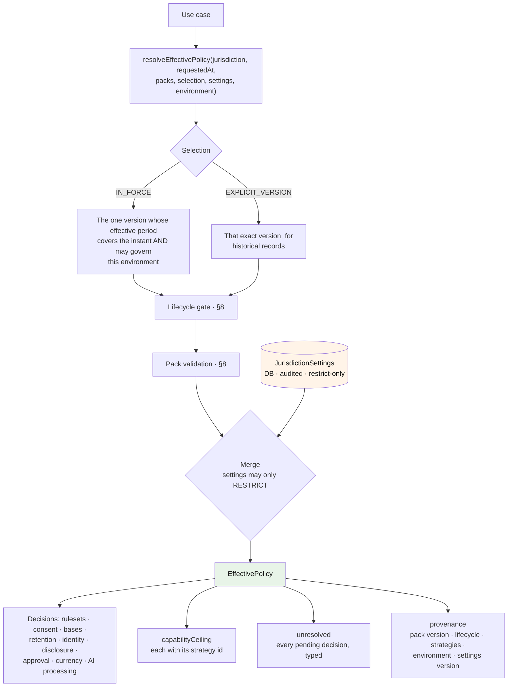
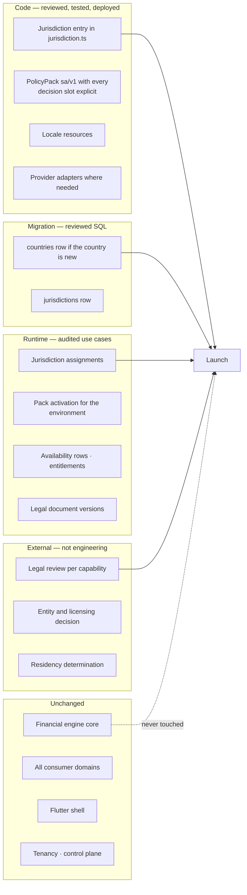

# Jurisdiction, Country, and Policy

**ADRs:** 0014, 0015 · **Phase:** 3.5 · **Canonical for:** the country/jurisdiction split, PolicyPacks, the restrict-only invariant, resolution strategies, `EffectivePolicy`

**Code:** [`packages/jurisdiction-policy`](../../packages/jurisdiction-policy/README.md) — pure, zero framework dependencies (architecture tests 1 and 17) · [`modules/jurisdiction`](../../modules/jurisdiction/MODULE.md) — the runtime half (assignments, settings, the activation ledger)

---

## 1. Country is not jurisdiction

| Dimension | Answers | Keys |
|---|---|---|
| **Country** | Where, geographically? (ISO 3166-1 alpha-2) | Currency defaults, languages, formatting, addresses, phone numbers |
| **Jurisdiction** | Which legal regime governs this person or record? | Policy packs, consent, retention, rulesets, disclosure rules |

> **Jurisdiction is the policy key. Country is an attribute.**

A `Country` (`src/country.ts`) carries a branded alpha-2 code, a localization key, an ISO 4217 *reference* for formatting defaults, and the lifecycle of the ISO code itself (`ACTIVE`, `RETIRED`). It carries **no business rule**: no consent requirement, no capability clearance, no retention period, no legal conclusion. Which currencies may actually be transacted is the pack's `currencyPolicy` decision, not the country row's `defaultCurrency`.

A `Jurisdiction` (`src/jurisdiction.ts`) is the regime itself, and it models the review question explicitly rather than implying that a declared regime is a reviewed one:

```ts
interface Jurisdiction {
  id: JurisdictionId              // branded; the code IS the id value
  code: string
  countryCode: CountryCode
  type: 'NATIONAL' | 'FINANCIAL_FREE_ZONE' | 'SPECIAL_REGIME'
  status: 'DRAFT' | 'PENDING_LEGAL_REVIEW' | 'APPROVED' | 'RETIRED'
  reviewStatus: 'NOT_SUBMITTED' | 'PENDING_LEGAL_REVIEW' | 'REVIEW_COMPLETE'
  effectiveFrom: Date | null      // null until a reviewed decision supplies it
  effectiveTo: Date | null
  provenance: string              // who declared it, on what footing
}
```

**Nothing assumes one jurisdiction per country.** The seeded set proves the shape rather than asserting a legal fact: `QA` (national, submitted for review alongside the `qa/v1` draft pack), `AE` (national, not submitted), and `AE-DIFC` — a `FINANCIAL_FREE_ZONE` inside the same country, which is the whole reason the two dimensions are separate. A Qatari national resident in Saudi Arabia is the mirror case: nationality does not determine the regime either.

**No seeded jurisdiction is `APPROVED`.** Approval is a legal decision this repository cannot take, so `status` says where the declaration stands and `provenance` says who declared it — a declaration, never a claim.

Conflating the two dimensions is cheap today and expensive once records exist, because unpicking it means re-deriving the governing regime for every historical record from data that no longer distinguishes them.

Two further dimensions are orthogonal to both: **OperatingEntity** ([`operating-entity.md`](operating-entity.md)) and **SubjectPolicySelection** (§7).

## 2. The typed/configured split

Policies with business consequence stay **typed, testable, versioned code**. Operational availability stays **audited database configuration**.

| | **PolicyPack** — code | **JurisdictionSettings** — database |
|---|---|---|
| Contains | Financial ruleset selection, consent requirements, declared purposes and their processing bases, retention durations, identity requirements, disclosure and approval policy, currency policy, AI-processing policy, the cleared-capability ceiling, per-capability resolution strategies, permitted subject-policy option sets | A capability disable list and an AI-processing suspension flag, per jurisdiction, with a row version and reason |
| Changed by | Pull request → review → tests → staging → deploy | Authorized operator, audited, no deploy |
| Versioned by | Semantic version in code (`qa/v1`, `qa/v2`); published versions are immutable | Row version + audit trail |
| Why | A legal rule change must be reviewed, diffed, tested | An operator must be able to disable a capability **now** |

### The invariant that makes this a control

> **Database settings may only ever *restrict* what the code pack permits. They can never expand it.**

An operator can turn a capability **off** in a jurisdiction instantly. An operator **cannot** turn one **on** where the pack has not cleared it — that requires reviewed, tested, deployed code.

**This is structural here, not procedural.** The settings type has no field capable of expressing an enablement:

```ts
interface JurisdictionRuntimeSettings {
  disabledCapabilityIds?: readonly string[]   // removes from the ceiling
  aiProcessingSuspended?: boolean             // narrows a DECIDED policy
  settingsVersion?: number                    // provenance only
}
```

There is no `enabledCapabilityIds`, so "settings widening" is not expressible in the first place, and an unknown id in the disable list restricts nothing that was not already permitted. The merge in `resolveEffectivePolicy` only ever removes from the pack's ceiling or narrows a `DECIDED` state to `RESTRICTED_BY_SETTINGS`. The table has the same shape (migration `0074`): a `text[]` disable list, a boolean suspension flag, and no column that could name an addition. An absent row restricts nothing — absence is the common case, never a default decision.

Three independent mechanisms therefore have to be wrong simultaneously before a mis-click, an operational mistake, or a compromised operator account could expose a capability with no legal basis: the type, the merge, and the table. The property tests assert the merge over generated settings rather than asserting it in prose.

### Pack content never enters the database

Packs are code. The database stores which reviewed **version** is operative for a `(jurisdiction, environment)` pair — activation metadata, in an append-only ledger (§12). A database write can change which reviewed version is in effect; it can never change what a pack says.

Which versions may become operative where is the **environment rule**, stated with the pack lifecycle in §8: unapproved packs govern local development and tests only, and an approval claim without evidence is refused everywhere.

## 3. Package and module layout

```
packages/jurisdiction-policy/src/       — pure: data and pure functions
├── country.ts                          — Country reference data
├── jurisdiction.ts                     — the Jurisdiction model
├── jurisdiction-id.ts                  — the branded policy key
├── environment.ts                      — local | dev | staging | production
├── decision.ts                         — the PolicyDecision union (§8)
├── policy-pack.ts                      — the PolicyPack contract (§8)
├── lifecycle.ts                        — canActivate / canResolveExplicitVersion (§8)
├── validation.ts                       — validatePack / validatePackSet (§8)
├── packs/qa-v1.ts                      — the Qatar draft pack (§13)
└── resolution/
    ├── strategies.ts                   — the strategy registry (§5)
    └── effective-policy.ts             — resolveEffectivePolicy (§4)

modules/jurisdiction/                   — the runtime half (§12)
```

The package is framework-free, ORM-free, HTTP-free, and database-free; its only permitted dependency is `@karar/shared-kernel`. Capability identifiers travel through it as plain strings, generic over `Id extends string`: `@karar/capability-registry` imports `JurisdictionId` from here, so importing `CapabilityId` back would close a package cycle. The capability workstream validates ids on its side.

## 4. Resolution — `EffectivePolicy`



> **Use cases never read a country code and never branch on jurisdiction. They ask `EffectivePolicy` a question.**

That sentence is enforced by architecture test 12 (§6), and it is why `EffectivePolicy` is one result object rather than a set of lookup helpers: a consumer that had to assemble the answer itself would be free to assemble it differently in two places.

`resolveEffectivePolicy` returns `Result<EffectivePolicy, ResolvePolicyError>` and fails closed on every ambiguity. The error arms are the ambiguities themselves: `NO_PACK_FOR_JURISDICTION`, `PACK_VERSION_NOT_FOUND`, `NO_PACK_IN_FORCE`, `OVERLAPPING_PACKS_IN_FORCE`, `PACK_NOT_RESOLVABLE` (the lifecycle gate refused it for this environment), and `PACK_INVALID` (validation findings). **One instant, one pack in force** — two eligible versions is a defect the resolver reports rather than a choice it makes silently.

Three properties of the result are worth stating explicitly:

- **`capabilityCeiling` is a ceiling, never a grant.** It carries the pack's cleared capabilities that settings have not removed, each paired with its named resolution strategy. Reaching a capability still requires every gate in [`capability-registry.md` §4](capability-registry.md).
- **Every non-`DECIDED` decision surfaces in `unresolved`**, with where it sits, which state it is in, and the stated reason. A consumer enforces it as a denial; it never defaults.
- **Provenance is part of the answer**, not a logging afterthought: jurisdiction, pack version, pack lifecycle, selection kind, environment, the instant, the strategy id per capability, and the settings row version. A past resolution stays explainable because the inputs it used are named in its output.

The result also carries `subjectPolicyOptions` — the option sets the pack permits per capability — and a `subjectPolicySelectionVersion` slot that this resolver leaves `null`. The subject's actual election is not a jurisdiction fact and does not belong in a jurisdiction-keyed resolution; the consumer fills the slot from `modules/subject-policy` where the capability offers elections (§7).

## 5. Resolution strategies — a registry, not an enum

Which policy version governs a long-lived record is a **legal** question, not an engineering one, and the set of possible answers is open. So strategies are a registry:

```ts
interface ResolutionStrategyDefinition {
  id: string
  description: string
  governingVersions(context: GoverningVersionContext): readonly string[]
}
```

`GoverningVersionContext` carries the pack version in force when the record was created and the version in force at the instant the question is asked. Registered at launch (`DEFAULT_RESOLUTION_STRATEGIES`):

| Strategy | Governing version(s) |
|---|---|
| `AT_CREATION` | The policy in force when the record was made |
| `AT_EVALUATION` | The policy in force when the question is asked |
| `MOST_RESTRICTIVE` | Both, where they differ — the consumer permits only what both permit |

An empty result means the strategy cannot answer from the context it was given, and the consumer fails closed. Each jurisdiction's pack names a strategy **per cleared capability**.

> **No default is invented anywhere.** A cleared capability with no named strategy is a validation finding (`MISSING_RESOLUTION_STRATEGY`); a name the registry does not know is another (`UNKNOWN_RESOLUTION_STRATEGY`). Both fail the pack, and an invalid pack neither resolves nor activates.

**Why no default:** a default here is a legal position taken by whoever wrote the fallback branch. Failing loudly is the only honest behaviour, and it fails in CI rather than in front of a customer.

Adding a strategy is a new registered definition plus tests. `createResolutionStrategyRegistry` builds an immutable registry and throws on a duplicate id; a consumer may pass a wider registry to `resolveEffectivePolicy` and `validatePack` without either function changing.

## 6. The branching prohibition

The banned thing is **country- or jurisdiction-keyed business branching outside this package** — not the appearance of country codes.

| Permitted | Prohibited |
|---|---|
| Country codes in localization, currency and reference tables, address/phone formatting, seed data, test fixtures, ISO data | `if (country === 'QA')` / `switch (jurisdiction)` **that changes business behavior**, in `domain/`, `application/`, or `presentation/` |

Banning literals outright would fire constantly on legitimate reference data and would train engineers to suppress the rule. **A test nobody trusts enforces nothing.** Architecture test 12 targets conditionals and pattern matches on jurisdiction identifiers in business layers.

Two consequences visible in the landed code: this package exports `sameJurisdiction` so no consumer writes the comparison itself, and consumers that must compare jurisdictions structurally — the capability resolver, the bootstrap enrichment path — carry them as opaque `scopeRef` strings and branch only on whether declared facts hold, never on which regime it is.

## 7. SubjectPolicySelection — the fourth dimension

Some policy variation is neither geographic, legal-regime, nor legal-person. It is **elected by the subject**.

Two customers in Qatar, contracting with the same operating entity, under the same pack, can legitimately require different Zakat calculations — different positions on nisab basis, valuation convention, treatment of doubtful portions, and calendar. The same shape appears in accounting-basis choices, fiscal-year conventions, and risk-tolerance bands. It is not Zakat-specific, and it was found by auditing a real system rather than anticipated ([`plan-v2-deltas.md` D1](plan-v2-deltas.md)).

**The split of responsibilities:**

- **`SubjectPolicySelection` is the common platform mechanism** ([`modules/subject-policy`](../../modules/subject-policy/MODULE.md)). It records *which pack-permitted option a subject elected*, with the jurisdiction, pack version, and profile version pinned at recording — and knows nothing about any capability's options.
- **Profile content is capability-scoped.** The option set itself — `ZakatMethodologyProfile`, for instance — is declared and owned by the capability's bounded context. The next capability with elective options declares its own profile type; the mechanism is reused unchanged. No generic preferences store exists, deliberately: one would become the place option content leaks into the platform.

The pack side of the contract is `subjectPolicyOptions`, a per-capability `SubjectPolicyOptionSet` carrying an option-set id, its version, and the permitted option ids. The pack bounds the electable set; the selection chooses within it.

**Rules, mirroring the restrict-only invariant:**

1. A selection may only elect **among options the jurisdiction's PolicyPack permits.** It can never expand the permitted set. Recording denies an option outside the set, a capability that declares no subject policy, and a pack version that is not the applicable one.
2. The selection's jurisdiction, pack version, and profile version are **pinned at recording**, so a later pack change cannot retroactively reinterpret an election.
3. Per-recommendation provenance records the selection version, so every historical result stays explainable under the rules, jurisdiction, legal party, **and elected conventions** that produced it.
4. Where a capability declares no elective options, the selection is absent and costs nothing. **This is the common case** — it must not tax capabilities that do not need it.
5. **Elections are potentially sensitive and are purpose-limited.** A jurisprudential methodology choice can reveal religious affiliation. Selections are `CONFIDENTIAL` at minimum, readable only by the capability that owns them, and **never exposed to marketing, analytics, or unrelated AI processing.**

The legacy validates the pattern: its jurisprudential settings are named, validated, audit-logged on change, and **snapshotted into every assessment**. That is this rule, discovered independently, applied to one capability.

## 8. What a PolicyPack contains

```ts
interface PolicyPack<Id extends string = string> {
  jurisdiction: JurisdictionId
  version: string                       // 'qa/v1'; published versions are immutable
  lifecycle: 'DRAFT' | 'PENDING_LEGAL_REVIEW' | 'APPROVED' | 'RETIRED'
  reviewStatus: ReviewStatus
  effectiveFrom: Date
  effectiveTo: Date | null

  financialRulesets:    Partial<Record<Id, PolicyDecision<RulesetReference>>>
  consentRequirements:  PolicyDecision<readonly ConsentRequirement[]>
  declaredPurposes:     readonly string[]
  processingBases:      Record<string, PolicyDecision<string>>
  retention:            Record<string, PolicyDecision<RetentionPeriod>>
  identityRequirements: PolicyDecision<readonly IdentityRequirement[]>
  disclosurePolicy:     PolicyDecision<DisclosurePolicy>
  approvalPolicies:     Partial<Record<Id, PolicyDecision<ApprovalPolicy>>>
  currencyPolicy:       PolicyDecision<CurrencyPolicy>
  aiProcessingPolicy:   PolicyDecision<AiProcessingPolicy>

  clearedCapabilities:  readonly Id[]                       // the MAXIMUM set
  resolutionStrategies: Partial<Record<Id, string>>         // one per cleared capability
  subjectPolicyOptions: Partial<Record<Id, SubjectPolicyOptionSet>>

  provenance:           PackProvenance                      // who declared it, when, from what
  approvalReference:    string | null                       // null means NOT approved
}
```

### `PolicyDecision` — a pending decision is a first-class state

A pack never encodes "we have not decided" as a default value, an empty array that reads as permission, or an absent key that reads as denial. Every decision slot holds exactly one of three arms:

| Arm | Meaning | Consumer behaviour |
|---|---|---|
| `DECIDED` | A reviewed value, carrying the `basis` — the review, opinion, or instrument that makes the actual claim | The value applies |
| `PENDING_LEGAL_REVIEW` | The question is with legal review, with the open question stated | Denies, with a stated reason |
| `UNRESOLVED` | The question has not been taken up, with the reason stated | Denies, with different provenance |

The two denying arms exist separately because *"we know we have not decided"* and *"nobody asked"* are different facts about the same absence, and only the first is a state a reviewer can act on.

**A pending decision is a valid pack.** A *required* decision that is absent entirely is not: a declared purpose with no `processingBases` entry fails validation, because a purpose whose basis nobody recorded is not the same as a purpose whose basis is openly undecided. This is the distinction the whole union exists to keep.

`resolveEffectivePolicy` collects every non-`DECIDED` slot into `EffectivePolicy.unresolved` with its location (`processingBases['purpose:ai-processing']`, `retention['audit-events']`, …), so a consumer enforces a typed denial rather than discovering an absence.

**Consent is one legal basis among several, never assumed.** Each declared purpose names its basis for that jurisdiction — consent, contract performance, legal obligation, or another basis the regime recognises. The consent machinery gates the purposes whose declared basis *is* consent; a purpose with a different basis is gated on that basis's own conditions; a purpose with **no declared basis fails closed** ([ADR-0024](../adr/0024-operating-entity.md)).

### Pack lifecycle and the production-activation rule

`canActivate(pack, environment)` answers "may this version become the operative pack here, now":

| Lifecycle | `local` | `dev` / `staging` / `production` |
|---|---|---|
| `DRAFT` | activatable | **refused** |
| `PENDING_LEGAL_REVIEW` | activatable | **refused** |
| `APPROVED` **with** a non-empty `approvalReference` | activatable | activatable |
| `APPROVED` **without** an `approvalReference` | **refused** | **refused** |
| `RETIRED` | **refused** | **refused** |

> **The lifecycle field is not the approval. The evidence is.** An `APPROVED` claim with no `approvalReference` is refused everywhere, including locally, and fails validation as well.

`canResolveExplicitVersion` differs on exactly one arm: a `RETIRED` pack can never be newly activated, but records created under it stay resolvable forever (with approval evidence outside local environments). Effective dates and retirement never rewrite history — that is what makes `AT_CREATION` a usable strategy years later.

The runtime activation use case in `modules/jurisdiction` calls the same predicate before writing any ledger row, so the rule holds identically whether a pack is being resolved or activated.

### Load-time failures — not runtime, not silent

`validatePack` returns typed findings; `validatePackSet` adds the cross-version checks. A finding is a structural defect, categorically different from a pending decision:

| Finding | Raised when |
|---|---|
| `MISSING_VERSION`, `MISSING_JURISDICTION` | The pack does not identify itself |
| `INVALID_EFFECTIVE_PERIOD` | `effectiveTo` is not after `effectiveFrom` |
| `MISSING_RESOLUTION_STRATEGY` | A cleared capability names no strategy (§5) |
| `UNKNOWN_RESOLUTION_STRATEGY` | It names one the registry does not carry |
| `MISSING_PROCESSING_BASIS` | A declared purpose has no basis entry at all |
| `MISSING_APPROVAL_POLICY` | A cleared disclosure-bearing capability has no `DECIDED` approval policy |
| `APPROVAL_EVIDENCE_MISSING` | `lifecycle: 'APPROVED'` with no `approvalReference` |
| `DECISION_WITHOUT_BASIS` | A `DECIDED` slot carries no basis — a decision without its instrument is an assertion |
| `DUPLICATE_VERSION`, `OVERLAPPING_EFFECTIVE_PERIODS` | Two versions claim the same identity, or the same instant, in one jurisdiction |

The resolver refuses an invalid pack (`PACK_INVALID`) and the activation use case refuses it too, so an invalid pack is unreachable from both directions.

Disclosure-bearing ids arrive as **data** on the validation context rather than as a type import, because capability descriptors live in `@karar/capability-registry`, which depends on this package. `validatePack` therefore checks the approval-policy rule for whichever ids the caller declares, and synthetic test ids work identically. The equivalent CI structural check is architecture test 19, whose activation phase is 3.5.

## 9. Adding a jurisdiction



The register itself changes **by reviewed migration only** — no use case, permission, or operator grant can alter a regime declaration at runtime, because none exists. Worked end to end in [`../scenarios/a-new-country.md`](../scenarios/a-new-country.md); the step-by-step engineering version is [Q54 in the developer onboarding](../onboarding/developer.md).

**Financial rules usually do not change.** A jurisdiction maps to an existing ruleset version unless business rules genuinely differ — `SA:v1` may point at the same ruleset object as `QA:v1`. **Divergence requires evidence, not anticipation.**

## 10. Legal-document versions and re-consent

The in-force legal document version for an `(entity, jurisdiction)` pair is database state owned by the consent module, audited.

**Changing it triggers a re-consent evaluation** for every affected subject, on the same audited footing as `EntityMigration`. The evaluation classifies the change as:

| Classification | Effect |
|---|---|
| **Material** | Re-acceptance required before the affected purpose may continue |
| **Non-material** | Notice only |

**Neither is a default.** An unclassified republication **blocks the version change** — the same discipline as an unspecified resolution strategy.

A subject with an outstanding material re-consent is treated as consent-absent for that purpose, so the capability resolver denies with `RECONSENT_REQUIRED`.

This exists because the legacy's equivalent fails in both directions: publishing a new version *"asks nobody to accept it, which contradicts the terms themselves"* (P12), and its AI consent gate **fails open when no disclosure document is published** (AI-5). Karar fails closed. See [`plan-v2-deltas.md` D4](plan-v2-deltas.md).

## 11. Testing

| Test | Asserts | Where |
|---|---|---|
| Restrict-only | No settings combination produces an `EffectivePolicy` permitting more than its pack | `src/resolution/effective-policy.test.ts` |
| Lifecycle gate | DRAFT and pending packs never activate outside `local`; an `APPROVED` claim with no evidence is refused everywhere; retired versions still resolve historically | `src/lifecycle.test.ts` |
| Pack validation | Every finding kind, over synthetic packs | `src/validation.test.ts` |
| Strategy registry | Each strategy's governing versions; duplicate registration throws; an unknown name fails a pack | `src/resolution/strategies.test.ts` |
| `qa/v1` honesty | The pack clears nothing, decides nothing, and carries no approval reference | `src/packs/qa-v1.test.ts` |
| Runtime half | Assignment source/verification axes, temporal resolution, activation gates, RLS isolation, append-only enforcement, audit coverage | `modules/jurisdiction/__tests__/` |
| No branching | Architecture test 12 | `scripts/checks/architecture.mjs` |
| Purity | Architecture test 17 — no framework dependency | `scripts/checks/architecture.mjs` |
| Pinning | Architecture test 21 — pinning fields on records with legal consequence | `scripts/checks/architecture.mjs` |

Positive resolution paths are exercised over **synthetic** packs declared in test files. No real capability is cleared anywhere in the shipped set.

## 12. The runtime half

[`modules/jurisdiction`](../../modules/jurisdiction/MODULE.md) stores, audits, and gates what the pure package decides. It owns six tables (migrations `0070`–`0075`) and no HTTP surface.

**Assignments** record which regime governs a user or a tenant, as effective-dated history. Source and verification are **separate axes**, constrained by CHECK rather than by convention:

| `source` | Permitted `verification_status` |
|---|---|
| `USER_DECLARED` | `UNVERIFIED` only |
| `PROVIDER_VERIFIED` | `VERIFIED` only |
| `OPERATOR_ASSIGNED`, `CONTRACT_DERIVED` | either, recorded explicitly |

> **A user-selected country never becomes a verified jurisdiction by any path.** Verification arrives as a new `PROVIDER_VERIFIED` row, not as an edit.

Consumers read `EffectiveJurisdictionState`, a three-arm union — `NONE`, `UNVERIFIED`, `VERIFIED` — rather than a nullable row with a boolean, because a capability requiring a verified regime must deny on `NONE` and on `UNVERIFIED` alike, and a three-arm type makes forgetting one of them a compile error. The projection carries the assignment and its verification state and **never a pack decision**: clearance comes from `EffectivePolicy`, never from an assignment row.

History is ended and superseded, never edited or deleted; the only permitted UPDATE closes an open row's `effective_to`, enforced by trigger even for the table owner.

**The activation ledger** (`policy_pack_activations`, migration `0075`) is append-only by both mechanisms — `karar_app` holds `SELECT` and `INSERT` only, and the immutability trigger raises on UPDATE, DELETE, and TRUNCATE even for the owner. Each row is one `ACTIVATED` or `RETIRED` event with the pack's lifecycle at that moment, the environment, the actor, and the reason; the operative version is derived from the latest event. It stores **versions, never packs**.

Both mutating use cases are permission-gated (`jurisdiction.assignment.manage`, `jurisdiction.pack.activate`) and both permissions are **declared and deliberately unseeded** this phase, because no operator surface exists to exercise them. Deny-by-default means their absence denies: against the real `PolicyService` every mutating use case in the module currently refuses, and that is the honest state. Operator surfaces arrive with the control plane in Phase 8 ([ADR-0021](../adr/0021-control-plane-gateway.md)).

## 13. The status of `qa/v1`

`qa/v1` is a **structure awaiting answers, not a policy.**

| Field | Value |
|---|---|
| `lifecycle` | `DRAFT` |
| `reviewStatus` | `PENDING_LEGAL_REVIEW` |
| `approvalReference` | `null` |
| `clearedCapabilities` | `[]` — empty |
| `resolutionStrategies`, `subjectPolicyOptions`, `financialRulesets`, `approvalPolicies` | empty |
| Every remaining decision slot | `PENDING_LEGAL_REVIEW`, each with its open question stated |

Engineering cannot decide Qatari legal bases, retention periods, licence or disclosure requirements, cross-border AI permissions, or capability clearance, so the pack decides none of them. The consequences follow from the code rather than from intent:

- It is **not production-activatable**. `canActivate` refuses a `DRAFT` pack outside `local`, so the pack governs local development and tests and nothing else.
- It **clears no capability**, real or synthetic, so its ceiling is empty and no capability can pass the jurisdiction gate under it.
- Its pending decisions are typed denials, so `purpose:ai-processing` has no basis and fails closed, and the retention categories it names (`audit-events`, `consent-evidence`, `user-profile`) resolve to stated open questions rather than to numbers.

Declaring those questions `PENDING_LEGAL_REVIEW` is what turns the platform's prose deferrals — the lifecycle rows that read "from PolicyPack per jurisdiction" — into typed, resolvable states. When legal review decides a question, the decision lands as a new version with its approval reference; this file is not edited, because a published version is immutable.

**No jurisdiction is approved and no pack is approved.** Nothing in this repository claims otherwise.
