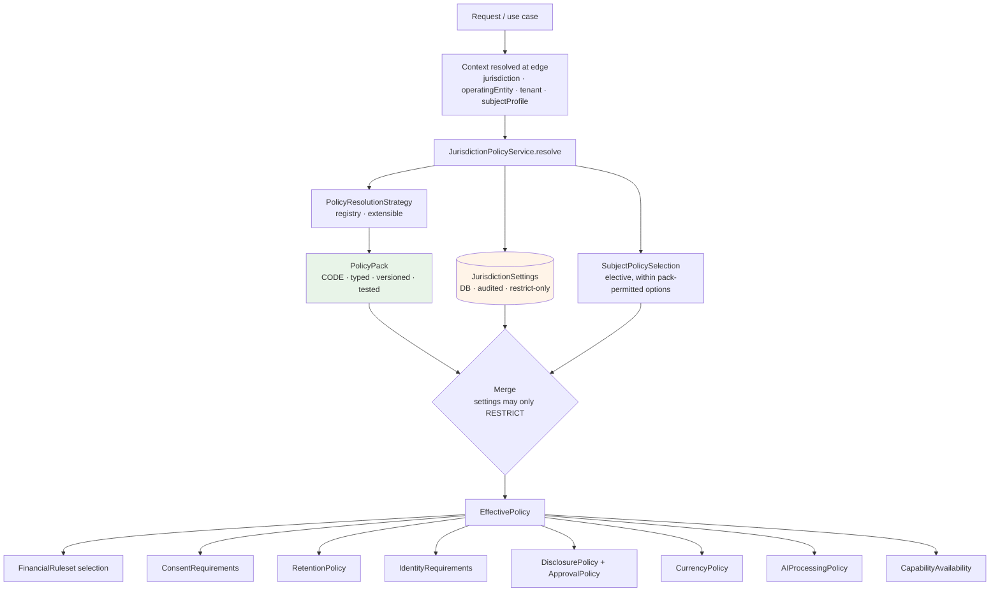
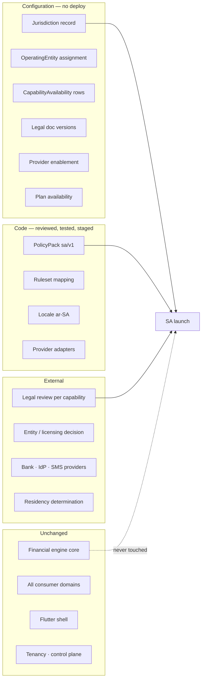

# Jurisdiction, Country, and Policy

**ADRs:** 0014, 0015 · **Phase:** 3.5 · **Package:** `packages/jurisdiction-policy` (zero framework dependencies)

---

## 1. Country is not jurisdiction

| Dimension | Answers | Keys |
|---|---|---|
| **Country** | Where, geographically? (ISO 3166-1 alpha-2) | Currency defaults, languages, formatting, addresses, phone numbers |
| **Jurisdiction** | Which legal regime governs this person or record? | Policy packs, consent, retention, rulesets, disclosure rules |

Usually 1:1. Not always: **UAE free zones (DIFC, ADGM) operate distinct legal regimes**, and a Qatari national resident in Saudi Arabia may fall under a different regime than nationality suggests.

> **Jurisdiction is the policy key. Country is an attribute.**

Conflating them is cheap today and expensive once records exist, because unpicking it means re-deriving the governing regime for every historical record from data that no longer distinguishes the two.

A third dimension — **OperatingEntity** — is orthogonal to both and documented in [`operating-entity.md`](operating-entity.md). A fourth — **SubjectPolicySelection** — is covered in §7 below.

## 2. The typed/configured split

Policies with business consequences stay **typed, testable, versioned code**. Operational availability stays **audited database configuration**.

| | **PolicyPack** — code | **JurisdictionSettings** — database |
|---|---|---|
| Contains | Financial ruleset selection, consent requirements, retention durations, identity-verification requirements, disclosure policy + approval policy, currency policy, data-processing restrictions, **permitted subject-profile options** | Capability availability, provider enablement, kill switches, legal-document version in force, plan availability, operating-entity assignment |
| Changed by | Pull request → review → tests → staging → deploy | Authorized operator, audited, no deploy |
| Versioned by | Semantic version in code (`qa/v1`, `qa/v2`) | Row version + audit trail |
| Why | A legal rule change must be reviewed, diffed, tested | An operator must be able to disable a capability **now** |

### The invariant that makes this a control

> **Database settings may only ever *restrict* what the code pack permits. They can never expand it.**

An operator can turn Amanat **off** in Qatar instantly. An operator **cannot** turn Amanat **on** in a jurisdiction whose PolicyPack has not declared it cleared — that requires reviewed, tested, deployed code.

Enforced by the resolver and asserted by test. **An operational mistake, a compromised admin account, or a mis-click cannot expose a capability where it has no legal basis.**

This is the single most important control in the platform's governance design, and it is why the Super Admin UI *cannot* grant what code has not cleared — the constraint is in the merge function, not in the form validation.

## 3. Package layout

```
packages/jurisdiction-policy/
├── src/types/          — typed policy contracts
├── src/packs/qa/v1/    — Qatar pack v1
├── src/packs/{sa,ae,om}/v1/
├── src/resolution/     — extensible strategy registry
├── src/subject/        — subject-profile option types and validation
└── src/registry.ts     — resolve(jurisdiction, asOf) → PolicyPack
```

Pure package. **Zero framework dependencies** — the same compiler-enforced isolation as `shared-kernel` and `financial-engine` (architecture test 17).

## 4. Resolution



> **Use cases never read a country code and never branch on jurisdiction. They ask `EffectivePolicy` a question.**

## 5. Resolution strategies — a registry, not an enum

Which policy version governs a long-lived record is a **legal** question, not an engineering one, and the set of possible answers is open.

```
PolicyResolutionStrategy
  resolve(record, jurisdiction, asOf) → PolicyPackVersion

Registered at launch:
  AT_CREATION        — the policy in force when the record was made
  AT_EVALUATION      — the policy in force when the question is asked
  MOST_RESTRICTIVE   — intersection of both

Extensible without touching the resolver:
  LATEST_FAVOURABLE_TO_SUBJECT, JURISDICTION_SPECIFIED, …
```

Each jurisdiction's pack names the strategy **per capability**.

> **No default is invented. An unspecified strategy is a load-time error, not a silent fallback.**

Adding a strategy is a new registered implementation plus a test. The resolver never changes.

**Why no default:** a default here is a legal position taken by whoever wrote the fallback branch. Failing to load is the only honest behaviour, and it fails in CI rather than in front of a customer.

## 6. The branching prohibition

The banned thing is **country- or jurisdiction-keyed business branching outside this package** — not the appearance of country codes.

| Permitted | Prohibited |
|---|---|
| Country codes in localization, currency and reference tables, address/phone formatting, seed data, test fixtures, ISO data | `if (country === 'QA')` / `switch (jurisdiction)` **that changes business behavior**, in `domain/`, `application/`, or `presentation/` |

Banning literals outright would fire constantly on legitimate reference data and would train engineers to suppress the rule. **A test nobody trusts enforces nothing.** Architecture test 12 targets conditionals and pattern matches on jurisdiction identifiers in business layers.

## 7. SubjectPolicySelection — the fourth dimension

Some policy variation is neither geographic, legal-regime, nor legal-person. It is **elected by the subject**.

Two customers in Qatar, contracting with the same operating entity, under `qa/v1`, can legitimately require different Zakat calculations — different positions on nisab basis (gold or silver), valuation convention, treatment of doubtful portions, and calendar.

The same shape appears in accounting-basis choices, fiscal-year conventions, and risk-tolerance bands. It is not Zakat-specific, and it was found by auditing a real system rather than anticipated — see [`plan-v2-deltas.md` D1](plan-v2-deltas.md) and [`../legacy/feature-inventory.md` §5](../legacy/feature-inventory.md).

**The split of responsibilities:**

- **`SubjectPolicySelection` is the common platform mechanism.** It records *which option-set version a subject elected*, with versioning, pinning, and provenance — and knows nothing about any capability's options.
- **Profile content is capability-scoped.** The option set itself — e.g. `ZakatMethodologyProfile` — is declared and owned by the capability's bounded context. The next capability with elective options declares its own profile type; the selection mechanism is reused unchanged.

**Rules, mirroring the restrict-only invariant:**

1. A selection may only elect **among options the jurisdiction's PolicyPack permits.** It can never expand the permitted set.
2. The selection version is **pinned at record creation**, alongside jurisdiction, pack version, and operating entity.
3. Per-recommendation provenance records it, so every historical result stays explainable under the rules, jurisdiction, legal party, **and elected conventions** that produced it.
4. Where a capability declares no elective options, the selection is absent and costs nothing. **This is the common case** — it must not tax capabilities that do not need it.
5. **Elections are potentially sensitive and are purpose-limited.** A jurisprudential methodology choice can reveal religious affiliation. Selections are `CONFIDENTIAL` at minimum, readable only by the capability that owns them, and **never exposed to marketing, analytics, or unrelated AI processing.**

The legacy validates the pattern: its jurisprudential settings are named, validated, audit-logged on change, and **snapshotted into every assessment**. That is this rule, discovered independently, applied to one capability.

## 8. What a PolicyPack contains

```ts
interface PolicyPack {
  jurisdiction: JurisdictionId
  version: string                         // 'qa/v1'
  effectiveFrom: Date
  financialRulesets: Record<CapabilityId, RulesetVersion>
  consentRequirements: ConsentRequirement[]
  retentionPolicy: RetentionPolicy
  identityRequirements: IdentityRequirement[]
  disclosurePolicy: DisclosurePolicy | null
  approvalPolicies: Record<CapabilityId, ApprovalPolicy>
  currencyPolicy: CurrencyPolicy
  aiProcessingPolicy: AIProcessingPolicy
  clearedCapabilities: CapabilityId[]      // the MAXIMUM set
  resolutionStrategies: Record<CapabilityId, StrategyName>
  subjectPolicyOptions: Record<CapabilityId, ProfileOptionSet>
}
```

**Load-time failures — not runtime, not silent:**

- A disclosure-bearing capability with no `ApprovalPolicy` (architecture test 19).
- A capability with no named resolution strategy.
- A subject-policy option outside the type's permitted set.
- A processing purpose with no declared legal basis.

**Consent is one legal basis among several, never assumed.** Each processing purpose in a pack declares its basis for that jurisdiction — consent, contract performance, legal obligation, or another basis the regime recognises. The consent machinery gates the purposes whose declared basis *is* consent; a purpose with a different basis is gated on that basis's own conditions; a purpose with **no declared basis fails closed** (ADR-0024).

## 9. Adding a jurisdiction



Worked end to end in `../scenarios/a-new-country.md`.

**Financial rules usually do not change.** A jurisdiction maps to an existing ruleset version unless business rules genuinely differ — `SA:v1` may point at the same ruleset object as `QA:v1`. **Divergence requires evidence, not anticipation.**

## 10. Legal-document versions and re-consent

The in-force legal document version for an `(entity, jurisdiction)` pair lives in `JurisdictionSettings` — database, audited.

**Changing it triggers a re-consent evaluation** for every affected subject, on the same audited footing as `EntityMigration`. The evaluation classifies the change as:

| Classification | Effect |
|---|---|
| **Material** | Re-acceptance required before the affected purpose may continue |
| **Non-material** | Notice only |

**Neither is a default.** An unclassified republication **blocks the version change** — the same discipline as an unspecified resolution strategy.

A subject with an outstanding material re-consent is treated as consent-absent for that purpose, so the capability resolver returns `CONSENT_REQUIRED`.

This exists because the legacy's equivalent fails in both directions: publishing a new version *"asks nobody to accept it, which contradicts the terms themselves"* (P12), and its AI consent gate **fails open when no disclosure document is published** (AI-5). Karar fails closed. See [`plan-v2-deltas.md` D4](plan-v2-deltas.md).

## 11. Testing

| Test | Asserts |
|---|---|
| Restrict-only | No settings combination produces an `EffectivePolicy` permitting more than its pack |
| Pack completeness | Every pack names a strategy and approval policy for each capability it clears |
| Load-time failure | An incomplete pack fails to load, loudly |
| No branching | Architecture test 12 |
| Purity | Architecture test 17 — no framework dependency |
| Subject options | No profile can select outside its pack's permitted set |
| Pinning | Architecture test 21 — four pinning fields on records with legal consequence |
