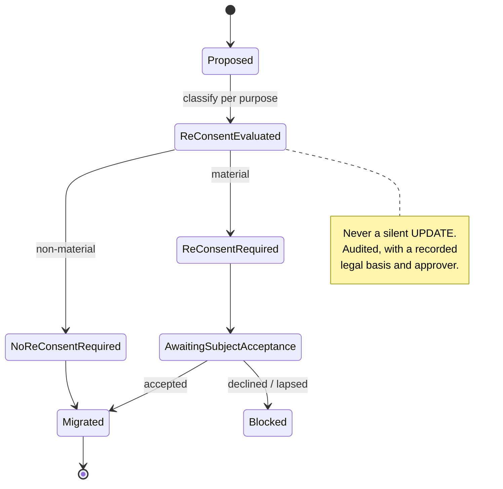
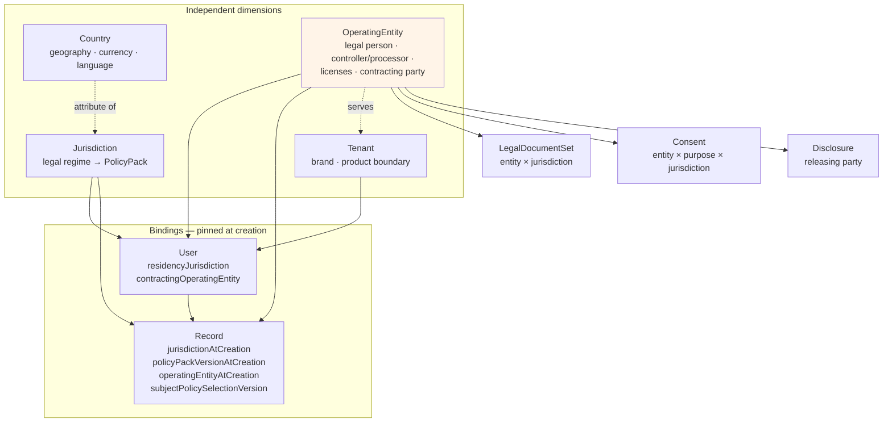

# OperatingEntity — the legal person dimension

**ADR:** 0024 · **Phase:** 3

---

## 1. The question this dimension answers

> **Which legal person provides the service and bears responsibility?**

Not *where* (country), and not *under which legal regime* (jurisdiction). **Who is liable, who contracts, who is the data controller, who holds the licence, and who releases disclosed data.**

Plan v1 left this implicit. Implicit means "Karar" — one entity, forever, everywhere. That assumption survives exactly until the first white-label deal or the first local incorporation.

## 2. Why it cannot be folded into tenant or jurisdiction

Three facts that make it independent:

1. **One entity may serve several jurisdictions.** A Qatari entity contracting cross-border into Saudi Arabia.
2. **One jurisdiction may be served by different entities over time.** Karar restructures, incorporates locally, or is acquired.
3. **A white-label partner contracts through its own entity** — and this **inverts the data-protection roles**: the bank becomes controller and Karar becomes processor.

That third case is the decisive one. The inversion changes legal obligations substantially — who answers a data-subject request, who notifies a breach, who holds the customer relationship, whose privacy notice applies — and it **cannot be represented by tenant or jurisdiction alone**. A tenant is a brand and product boundary; an entity is a legal person.

## 3. The model

```
OperatingEntity
  id · legalName · registrationNumber · registeredJurisdiction
  permittedJurisdictions        — where it may lawfully contract/operate
  dataProtectionRole            — CONTROLLER | JOINT_CONTROLLER | PROCESSOR (per relationship)
  licensesHeld                  — typed references; nothing asserted about any regulator
  contractingCapacity           — may it hold consumer contracts?
  legalDocumentSet              — its ToS / privacy notice versions
  billingProfileRef · dataProtectionContact · status
```

**`dataProtectionRole` is per relationship, not per entity.** The same entity can be controller for its own customers and processor for a partner's. Storing one role on the entity would force a second entity record to express a second relationship.

**`licensesHeld` asserts nothing about any regulator.** It is a typed reference so the capability registry can require one (`requiredOperatingEntityLicenses`). Karar's documentation claims no licence, approval, or clearance anywhere.

## 4. Bindings — pinned, never updated

| Holder | Field | Why pinned |
|---|---|---|
| Tenant | `defaultOperatingEntity` | Which entity serves this tenant |
| User | `contractingOperatingEntity` + version at signup | The contract was made with a **specific legal person** |
| Record | `operatingEntityAtCreation` | Consent, subscription, Amanat record, and disclosure each have a legally responsible party fixed at creation |

> **Consent given to Entity A is not automatically valid for Entity B.**

If Karar restructures, incorporates locally, or is acquired, existing contracts and consents were given to a specific legal person and may require re-consent. Storing the entity at creation makes that **a query rather than an archaeology project**.

## 5. EntityMigration



Historical records keep their original `operatingEntityAtCreation`. **Migration changes the forward binding; it never rewrites history.** A record created under Entity A remains a record created under Entity A, because that is what happened.

## 6. What is keyed on the entity

| Artefact | Key |
|---|---|
| Consent | **The triple** `(operatingEntity, purpose, jurisdiction)` — not purpose alone |
| Legal documents | An `(entity, jurisdiction)` **pair** — not a jurisdiction |
| Disclosure package | Names its **releasing entity** and that entity's legal basis |
| Invoicing and billing profile | The entity |
| Capability availability | Gated on the entity being permitted in the jurisdiction **and** holding required licences |

The consent triple matters more than it looks. Keying consent on purpose alone means an entity change silently inherits consents given to a different legal person — which is the specific failure this dimension exists to prevent.

## 7. Where it sits among the dimensions



## 8. Capability gating

The capability resolver's third gate:

> **Is the operating entity permitted in this jurisdiction, and does it hold the licences this capability requires?**

A capability declaring `requiredOperatingEntityLicenses` is unavailable to an entity lacking them — regardless of PolicyPack clearance, availability rows, or tenant entitlement. Every gate is AND. See [`capability-registry.md`](capability-registry.md).

## 9. White-label — the inversion in practice

For a UAE bank white-label tenant:

| | Value |
|---|---|
| Tenant | `tenant:uae-bank-x` |
| Operating entity | **The bank's own entity** |
| `dataProtectionRole` | Bank = `CONTROLLER`, **Karar = `PROCESSOR`** |
| Legal documents | The bank's set |
| Licences | The bank's |
| Disclosure releasing party | The bank's entity |

**This is configuration, not code.** No module changes, no branch, no fork. See [`white-label.md`](white-label.md) and `../scenarios/c-white-label.md`.

## 10. Super Admin

The **Operating Entities Center** (§10 of the plan) shows: entity, registration, permitted jurisdictions, data-protection role per relationship, licences held, legal document set, tenants served, users contracted, status, and **`EntityMigration` history with re-consent outcomes**.

Every change is versioned, audited, permission-controlled, environment-aware, and must pass staging.

## 11. What this dimension does not do

| | Why |
|---|---|
| Assert that any entity holds any regulatory approval | `licensesHeld` is a typed reference. **Karar claims no licence anywhere** |
| Replace legal advice | The model represents a decision; it does not make one |
| Permit a silent entity change | `EntityMigration` only, audited, with re-consent evaluation |
| Rewrite historical records | Pinned values are immutable |
