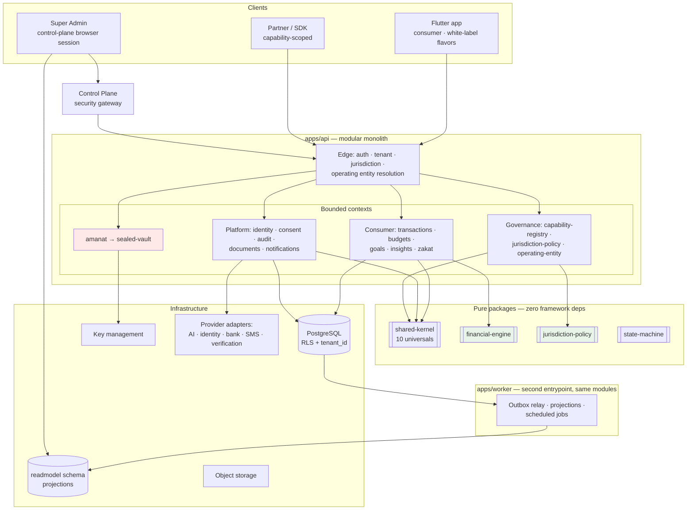

# Karar — Architecture Overview

**Start here.** This document is the entry point to the architecture. Every other document under `docs/architecture/` expands one part of it.

---

## 1. What Karar is

Karar is a **Qatar-first, API-first, extensible capability platform** for personal financial wellbeing, operating across **multiple jurisdictions** through **multiple legal entities**, with a **Flutter client** and a **TypeScript backend**.

Three words in that sentence do the load-bearing work:

**Capability platform** — Karar is not a budgeting app that will later grow features. It is a platform whose unit of extension is a **capability**: a bounded context with an owner, its own vocabulary, its own permissions, its own data classification, and its own jurisdictional availability. Budgeting is one capability. Zakat is another. Amanat is another. Adding one must not require touching the others.

**Multiple jurisdictions** — not multiple countries. Country is geography; jurisdiction is the legal regime that governs a person or a record. They are usually 1:1 and sometimes not. **Jurisdiction is the policy key.** See [`jurisdiction-policy.md`](jurisdiction-policy.md).

**Multiple legal entities** — which legal person provides the service and bears responsibility is a dimension of its own, independent of both country and jurisdiction. A white-label partner contracting through its own entity **inverts the data-protection roles**: the bank becomes controller and Karar becomes processor. See [`operating-entity.md`](operating-entity.md).

## 2. What Karar is not

Stated plainly so nobody infers otherwise from silence.

| | |
|---|---|
| Karar does not custody customer funds | No wallet, no float, no stored value — **Karar does not operate as a payment processor** |
| Billing is orchestrated, never settled, by Karar | Consumer subscriptions flow `Karar → SubscriptionBillingProvider → Apple / Google / web PSP / bank-sponsored entitlement / other approved rail`. The external provider executes settlement; Karar records subscription state, entitlement state, billing-provider references, and verified billing events/receipts |
| **Zakat**: calculation and tracking only | No Zakat payment execution unless a future, separately reviewed capability explicitly introduces an external licensed payment flow |
| **Sadaqah**: tracking only | Under current scope |
| **Amanat**: no payment-provider dependency, direct or transitive | Future repayment/fundraising remains a separate bounded context |
| Karar makes no credit decision | No scoring, no origination, no disbursement |
| Karar gives no investment advice | |
| Karar's AI is never the source of financial truth | It explains figures the engine computed. It never produces one |
| Karar asserts no regulatory approval | No certification, licence, or clearance is claimed anywhere in this documentation |
| Karar asserts no Sharia review | The Zakat work is engineering against a written specification. Nothing more should be inferred from it |

## 3. The five decisions everything else follows from

### 3.1 Clean Architecture, compiler-enforced

Dependencies point inward. Domain knows nothing of application; application knows nothing of infrastructure; nothing inward knows about frameworks. This is enforced by **package boundaries and a framework-free `domain` layer**, not by convention. See [`clean-architecture.md`](clean-architecture.md), ADR-0001.

### 3.2 Modular monolith, with seams that permit extraction

One deployable, many bounded contexts. Each module exposes exactly one legal import surface: its `public-api.ts`. Cross-module imports that bypass it fail CI. The monolith is a deployment choice, not an architectural one — the seams are real, and `sealed-vault` is designed from day one to be extracted into its own security boundary. See ADR-0002, [`extension-pattern.md`](extension-pattern.md).

### 3.3 One authoritative financial engine

All authoritative financial math happens once, in TypeScript, in a pure package with no I/O. **The Flutter client performs no authoritative financial math** — it renders values the platform computed. Money is **BIGINT minor units** with a `Currency` carrying its ISO 4217 exponent. There is no floating point anywhere in the money path. See [`financial-engine.md`](financial-engine.md), ADR-0006, ADR-0007.

### 3.4 Policy is typed code; availability is audited configuration

Rules with business or legal consequence live in **versioned, tested, reviewed code** (`PolicyPack`). Operational availability lives in **audited database configuration** (`JurisdictionSettings`, `CapabilityAvailability`).

The invariant that makes this a control rather than a convention:

> **Database settings may only ever *restrict* what code permits. They can never expand it.**

An operator can disable a capability in a jurisdiction instantly. An operator **cannot enable one** where the PolicyPack has not cleared it — that requires reviewed, tested, deployed code. As implemented in Phase 3.5 the settings type has no field that could express an enablement, so the invariant is structural rather than checked. See [`jurisdiction-policy.md`](jurisdiction-policy.md), ADR-0015.

### 3.5 Deny by default

A capability with no availability row is `DISABLED`. Code existing is never sufficient for exposure. Every gate is AND; every denial carries a machine-readable reason internally, and only actionable reasons reach a client — the rest are omitted rather than explained. See [`capability-registry.md`](capability-registry.md), ADR-0016.

## 4. The shape of the system



## 5. Layer rules in one table

| Layer | May depend on | May **never** depend on |
|---|---|---|
| `domain/` | `shared-kernel` only | Frameworks, ORM, HTTP, other modules' internals, `application/`, `infrastructure/` |
| `application/` | own `domain/`, ports it declares, `shared-kernel` | Frameworks, ORM, HTTP, concrete adapters |
| `infrastructure/` | own `application/` ports, own `domain/`, frameworks | Other modules' internals |
| `presentation/` | own `application/` | Other modules' `domain/` |
| Cross-module | another module's `public-api.ts` — nothing else | Anything below `public-api.ts` |

Enforced by architecture tests in CI. See [`clean-architecture.md`](clean-architecture.md) and `docs/testing/architecture-tests.md`.

## 6. The four dimensions of context

Every request resolves four independent things at the edge, before any use case runs:

| Dimension | Answers | Document |
|---|---|---|
| **Tenant** | Which brand and product boundary? | [`tenancy.md`](tenancy.md) |
| **Jurisdiction** | Which legal regime governs this person or record? | [`jurisdiction-policy.md`](jurisdiction-policy.md) |
| **OperatingEntity** | Which legal person provides the service and bears responsibility? | [`operating-entity.md`](operating-entity.md) |
| **SubjectPolicySelection** | Which elective conventions has this subject chosen, within what the jurisdiction permits? | [`jurisdiction-policy.md`](jurisdiction-policy.md) |

The fourth is an amendment arising from the legacy audit — see [`plan-v2-deltas.md` D1](plan-v2-deltas.md). The selection *mechanism* is platform; the option *content* (e.g. `ZakatMethodologyProfile`) belongs to the owning capability.

### Where it runs is a fifth, separate question

**`DeploymentProfile`** — provider, region, database, storage, keys, AI routing — is an infrastructure concept resolved at the edge, deliberately distinct from all four business dimensions. A jurisdiction does not determine a cloud; a tenant does not determine a deployment; and **no business capability may care which cloud hosts it**. Qatar may run on one provider, the UAE on another, and a partner bank on its own — with the domain identical in every case. See [`infrastructure-portability.md`](infrastructure-portability.md) and [`greenfield-rule.md`](greenfield-rule.md) for the two platform-wide rules made canonical in Phase 0.5.

**Use cases never read a country code and never branch on jurisdiction.** They ask `EffectivePolicy` a question. Country- or jurisdiction-keyed business branching outside `packages/jurisdiction-policy` fails CI.

## 7. Data classification

Six classes. The sixth is not "more confidential" — it is categorically different.

```
PUBLIC · INTERNAL · CONFIDENTIAL · HIGHLY_SENSITIVE_FINANCIAL · SECRET · SEALED
```

`SEALED` is data intentionally inaccessible **to Karar itself** until specific conditions and authorizations are satisfied. It is never projected, never in events, never in logs, never in analytics, never readable by support or admin, and never consumed by AI. Reading it requires a `SealAccessGrant` as a **compiler-required, non-nullable argument**.

See [`sealed-data.md`](sealed-data.md), `../security/data-classification.md`, ADR-0017.

## 8. Disclosure is not access

| | Access | Disclosure |
|---|---|---|
| Actor | The data subject | A third party |
| Basis | Ownership | Legal basis + verified event + policy |
| Scope | Everything owned | A defined package |
| Releasing party | n/a | **A named OperatingEntity** |
| Reversible | n/a | **No** |

See [`disclosure.md`](disclosure.md), ADR-0018.

## 9. How to add things

| I want to add… | Read | Cost |
|---|---|---|
| A capability | [`extension-pattern.md`](extension-pattern.md) | One new module + append-only registrations |
| A country | [`jurisdiction-policy.md`](jurisdiction-policy.md) | One code package + configuration rows + legal clearance |
| An operating entity | [`operating-entity.md`](operating-entity.md) | Configuration + legal decision |
| A white-label partner | [`white-label.md`](white-label.md) | Configuration + client build pipeline |

The four worked scenarios are in `docs/scenarios/`. A reader should be able to reproduce all four from the documentation alone — that is a Phase 0 exit criterion.

## 10. Priority order

When two of these conflict, the higher wins:

1. Financial correctness
2. Security
3. Privacy
4. Clear architecture
5. **Future capability extensibility**
6. **Multi-country adaptability**
7. Maintainability
8. Testability
9. Onboarding
10. Regulatory defensibility
11. Developer experience
12. Operational safety
13. Provider independence
14. Scalability
15. Speed of delivery

Items 5 and 6 rank immediately after clear architecture, and **neither justifies speculative generality.** The test for any seam is *"would retrofitting this be expensive?"* — never *"might we want this?"*

## 11. Document map

| Document | Covers |
|---|---|
| [`clean-architecture.md`](clean-architecture.md) | Layers, the dependency rule, enforcement |
| [`backend.md`](backend.md) | NestJS structure, module anatomy, entrypoints |
| [`flutter.md`](flutter.md) | Client architecture, the startup state machine, capability-aware navigation, RTL, storage, build guards |
| [`data-model.md`](data-model.md) | Schemas, pinning, money, IDs |
| [`tenancy.md`](tenancy.md) | Tenant isolation, RLS, the four layers |
| [`jurisdiction-policy.md`](jurisdiction-policy.md) | PolicyPacks, settings, resolution strategies, subject profiles |
| [`operating-entity.md`](operating-entity.md) | Legal person, controller/processor, entity migration |
| [`capability-registry.md`](capability-registry.md) | Descriptors, availability, deny-by-default |
| [`extension-pattern.md`](extension-pattern.md) | How to add a capability; the seventeen-point checklist |
| [`sealed-data.md`](sealed-data.md) | `SEALED`, the vault, grants, key management |
| [`disclosure.md`](disclosure.md) | Disclosure workflow, approval policy, safety properties |
| [`event-governance.md`](event-governance.md) | Event catalogue, payload rules by classification |
| [`financial-engine.md`](financial-engine.md) | Calculators, rulesets, verified facts |
| [`ai.md`](ai.md) | Provider abstraction, facts-based context, numeric safety |
| [`capability-map.md`](capability-map.md) | Capability × context × owner × availability |
| [`white-label.md`](white-label.md) | Control plane and data plane |
| [`sdk-strategy.md`](sdk-strategy.md) | OpenAPI-first, generated SDKs, capability scoping |
| [`environments.md`](environments.md) | LOCAL → DEV → STAGING → PRODUCTION |
| [`deployment-topology.md`](deployment-topology.md) | The L0–L3 ladder — cloud-neutral, any rung on any approved provider |
| [`infrastructure-portability.md`](infrastructure-portability.md) | DeploymentProfile, provider ports, opaque references, the definition of portable |
| [`database-portability.md`](database-portability.md) | PostgreSQL provider portability — and its honest limit |
| [`country-deployment-matrix.md`](country-deployment-matrix.md) | Which provider serves which jurisdiction — decisions, not assumptions |
| [`greenfield-rule.md`](greenfield-rule.md) | V2 is built from scratch; the legacy is knowledge, never code |
| [`gcp-target.md`](gcp-target.md) | The GCP provider profile — candidate for Qatar, not a domain dependency |
| [`data-residency.md`](data-residency.md) | The open question, and how the architecture keeps it answerable |
| [`plan-v2-deltas.md`](plan-v2-deltas.md) | Amendments arising from the legacy audit |

## 12. Status

Phases 0–4 are complete. Phase 4 is **merged to `main`**; **nothing is deployed, signed, or installed on any device**. **Phase 5 is IN PROGRESS** on `claude/karar-v2-phase-5-financial-foundation`, and **Phase 6 has not started.** What exists is the platform substrate — identity, users, tenancy, operating entities, RBAC, consent, kill switches, PostgreSQL RLS, Country/Jurisdiction with typed PolicyPacks, the capability registry with deny-by-default availability and tenant entitlements, `SubjectPolicySelection`, session tenant binding, and the authenticated client bootstrap surface — plus a Flutter client that consumes it: a startup state machine, a generated Dart API client with contract drift detection, authentication and session flows, secure token storage with single-flight refresh, application lock, tenant selection, jurisdiction self-declaration, capability-aware navigation, the consent surface, and a design system with Arabic and RTL first-class ([`flutter.md`](flutter.md)).

Phase 4 also hardened the contracts the client depends on: a bootstrap resolution failure and a legitimately empty capability set became different types on the wire, the bootstrap response gained a client-safe operating-entity summary enforced by its SELECT, every problem document now leaves through one writer under the declared media type, the seventeen `/auth` operations acquired response schemas, and real server responses are validated against the OpenAPI document rather than only the generated client ([`backend.md` §9](backend.md)).

**Phase 5 has built a financial data platform and the first surface that reaches it.** Six modules — `financial-accounts`, `transactions`, `financial-connections`, `payment-instruments`, `transfer-matching`, `statement-imports` — carry schema, domain, ports, repositories and tests behind migrations `0087`-`0101`, under [ADR-0027](../adr/0027-calendar-day-and-instant.md) and [ADR-0028](../adr/0028-multi-rail-financial-sources.md), both ACCEPTED. A seventh, `provider-capabilities`, holds typed profiles describing what a rail *could* do; it owns no table and executes nothing. **27 operations over 21 `/financial/*` paths** are mounted from the composition root, manual transaction entry writes rows, and CSV statement import runs draft → upload → parse → preview → commit with parsing writing no financial record and only a reviewed commit doing so. The canonical `currentPhase` marker moved to **5** and architecture test 24 (resource limits declared) became ACTIVE in that same commit, because a limits test with no path to scan proves nothing. Not built: any Flutter surface, the automatic categorization pipeline, any provider connector, and — deliberately — account deletion over HTTP, whose cross-module cascade is not atomic and whose reporting contract is unchosen.

**No consumer product capability is implemented.** Every entry in the capability registry is `NOT_IMPLEMENTED` and deployed nowhere, no jurisdiction is approved, no PolicyPack is approved, `qa/v1` clears nothing, and no capability is reachable by any real user — the financial surface included. **A mounted route is not an available capability**, and this is the distinction the registry exists to hold: `IMPLEMENTED` means the code exists as something a deployment *could* expose, and even that gates nothing on its own, because deployment and `declaredJurisdictions` are separate facts and both are still empty. The client renders that state honestly rather than hiding it: its authenticated home is an account and security surface whose services section is a stated empty state.

**No provider connector exists, and no real provider capability is `VERIFIED`.** No issuer named in the catalogue exposes an interface to Karar, no credential of any kind is stored anywhere, there is no scraping and no app automation, and thirteen acquisition rails are named of which only `MANUAL` and `USER_FILE_UPLOAD` may exist — enforced by a database CHECK, not by application code. `provider-capabilities` describes potential in types and executes nothing; a described rail is not an executable one, and a capability may only read `VERIFIED` when evidence is named. Nothing in the product may render "Connected", "Synced" or "Linked" for data a person typed or uploaded. **The financial-data retention question is a legal decision and has not been taken**, so none of this data may reach a deployed environment: the only retention provider that exists is synthetic, labelled `SYNTHETIC_NO_LEGAL_EFFECT`, and **fails closed outside LOCAL and TEST**.

**Nothing is deployed, nothing is signed, and nothing has run on a device.** No environment is provisioned and no endpoint exists — the client's build guards refuse to produce a package for any environment other than `LOCAL`, which is what makes that claim checkable rather than asserted. No signed build exists and no signing material is in the repository; the biometric prompt has been verified statically and against built artifacts, never on hardware. The rest of this document remains largely a set of decisions; the per-document phase headers and the implemented-state notes inside them say which parts have landed, and [`../phases/phase-04.md`](../phases/phase-04.md) is the honest-status source for the client.

The roadmap is in `docs/roadmap.md`. **The critical path to a shippable Qatar B2C v1 is Phases 0–9.** Phases 10–21 are an architectural *option*, not a schedule — the seams are what keep that option cheap.
