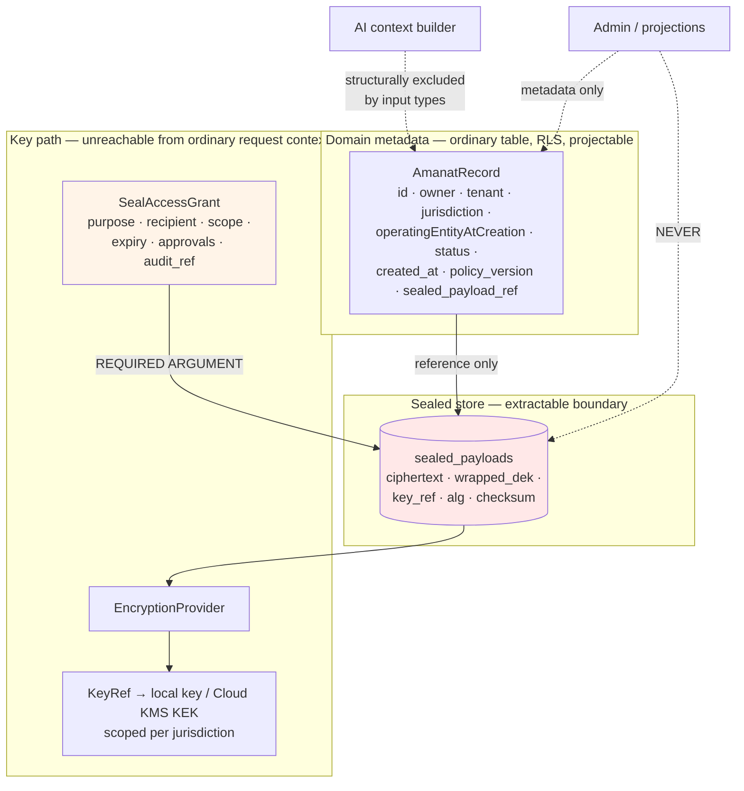
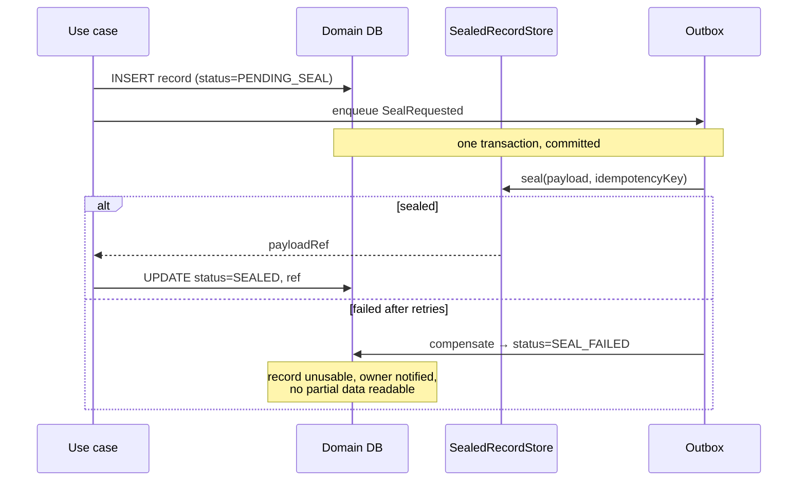

# Sealed Data Architecture

**ADR:** 0017 · **Phase:** 13 (build), 20 (extraction + escrow gate)

---

## 1. `SEALED` is not "more confidential"

It is **categorically different**: data intentionally inaccessible — **to Karar itself** — until specific conditions and authorizations are satisfied.

| | `HIGHLY_SENSITIVE_FINANCIAL` | `SEALED` |
|---|---|---|
| Support may view | With permission + audit | **Never by default** |
| Admin may view | With permission + audit | **Never** |
| AI may consume | Via minimized context | **Never** |
| Analytics | Aggregates only | **Never — not even aggregates** |
| Projections | Yes | **Never** |
| Events | Identifier-only by default | **Identifier-only, mandatory, no exemption** |
| Logs | Redacted | **Never present** |
| Tenant admin (white label) | Per entitlement | **Never automatically** |
| Search / indexing | Yes | **No — a deliberate capability sacrifice** |
| Access requires | Authenticated + authorized | **An explicit `SealAccessGrant`** |
| Encryption | At rest | **Per-record DEK, jurisdiction-scoped KEK** |

The row that costs the most is search. Sealed records cannot be found by content, only by owner and lifecycle state. **That is accepted, not worked around** — a search index over sealed content would be an unsealed copy of it.

## 2. The vault is a platform service, extractable by design

Building this inside Amanat would guarantee a second, divergent implementation for the next sealed capability. `SealedRecordStore` is a **platform service**, designed from day one to be **extracted into a dedicated security boundary** — its own process, database, keys, network segment, and service account.



## 3. The strongest mechanism in the platform

```ts
interface SealedRecordStore {
  read(ref: SealedPayloadRef, grant: SealAccessGrant): Promise<SealedPayload>
  //                          ^^^^^^^^^^^^^^^^^^^^^^ required, non-nullable
}
```

> **There is no overload without a grant.**

Minting a grant is itself an audited, policy-checked, approval-bearing operation. **Compiler-enforced, not policy-enforced** — a developer cannot accidentally read sealed data, because the code does not compile without a grant they had to obtain deliberately.

Contrast with the legacy's admin data access, where *"only the absence of an endpoint prevents the read."* An absence is not a control; a required argument is.

## 4. Metadata / payload split

**Lifecycle is queryable while substance is not.** The platform can answer *"how many records are pending disclosure"* with no capacity to read one.

| Metadata — ordinary, RLS, projectable | Payload — sealed, grant-gated, never projected |
|---|---|
| `record_id`, `owner_user_id`, `tenant_id` | Counterparty identity |
| `jurisdiction_at_creation` | **Obligation amount and currency** |
| `policy_pack_version_at_creation` | Description, circumstances |
| `operating_entity_at_creation` | Evidence document references |
| `status`, `created_at`, `updated_at` | Disclosure instructions |
| `sealed_payload_ref` | |

### The amount is sealed

Tempting to keep amounts in metadata for reporting. **Resist it.** An amount plus a counterparty reference is most of the sensitive content. Operational dashboards show **counts, states, and ages — never sums.**

## 5. Grant types

| Grant | Who | Conditions |
|---|---|---|
| `OWNER` | The data subject, living | Step-up authentication |
| `DISCLOSURE` | A verified recipient | Post-verification, scope-limited, expiring |
| `LEGAL_ORDER` | Break-glass | **Dual approval + security notification** |

**Never `SUPPORT`, `ADMIN`, `ANALYTICS`, or `AI`.** These grant types do not exist — not "exist but are restricted." There is no permission an operator could be granted that would produce one.

## 6. Extractability constraints — binding from the first implementation

Designed in from the start, because a boundary you intend to move later never moves.

1. **The port surface is network-capable** — coarse-grained, serializable request/response, no ORM objects, no lazy loading.
2. **Vault operations never participate in the caller's database transaction.**
3. **All operations are idempotent** with caller-supplied keys.
4. **No shared in-process state, connection pool, or cache.**

### The cost of constraint 2, stated plainly

Metadata and payload writes **cannot be atomic in one transaction**. The write path is therefore a saga:



**This is an accepted cost of a boundary that can actually move.** A `SEAL_FAILED` record holds no readable content — the failure mode is loss of a record, never exposure of one.

**Gate:** the vault must be extracted into a dedicated security boundary **before any production `SEALED` data exists** — a hard prerequisite of Phase 20.

## 7. Key management — and the lesson the legacy paid for

| Layer | Mechanism |
|---|---|
| Per-record | A fresh DEK per sealed record |
| Wrapping | Jurisdiction-scoped KEK via `EncryptionProvider` |
| Storage | Local key file in development; KMS in production; per-tenant KEK at L3 |
| Algorithms | Standard AEAD. **No proprietary cryptography** |

### Why escrow is mandatory here and was merely advisable in the legacy

Legacy finding **ENC-2**: key rotation, escrow, and a second copy are **NOT BUILT**, and the production key *"has already been lost once in production, on 11 August 2026."*

The legacy survived because production held 3 users and 45 transactions, and because encrypted columns sit beside readable metadata that makes loss **visible**.

`SEALED` removes both cushions **by design**:

- **Unrecoverable** — no second copy of the plaintext exists anywhere, by construction.
- **Undetectable** — nothing may read the payload, so nothing can notice a KEK has stopped working.
- **Discovered at the worst possible moment** — after death verification, recipient verification, a waiting period, and human approval, at the point of releasing a record to a bereaved family.

### The three requirements

1. **KEK escrow under split control**, with a documented, rehearsed, timed recovery drill. No single operator can reconstruct a KEK alone.
2. **Sealed-integrity canary** — a synthetic sealed record per jurisdiction-KEK, holding **known plaintext containing no customer data**, decrypted on a schedule. Failure raises a security event. This is the **only** mechanism that can detect key loss without violating the seal.
3. **Rotation designed in from Phase 2**, not retrofitted. The legacy's rotation is entangled with statement fingerprinting — rotating changes every future fingerprint, so a rotation must recompute stored ones or a re-upload imports twice. That entanglement is what retrofitting produces.

**Architecture test:** the canary's plaintext is asserted to contain no customer-derived data, so the detection mechanism cannot itself become a leak.

See [`plan-v2-deltas.md` D2](plan-v2-deltas.md).

## 8. Defense in depth

| Layer | Mechanism |
|---|---|
| Type system | `SealAccessGrant` is a required argument |
| Grant minting | Audited, policy-checked, approval-bearing |
| RLS | `sealed_payloads` policies additionally require a grant GUC — **a SQL-level mistake in application code returns nothing, not ciphertext** |
| Network | Post-extraction: separate segment, separate service account |
| Keys | Separate KMS key ring, jurisdiction-scoped |
| Audit | **Every attempted access, successful or refused** |
| Architecture tests | 13, 14, and the canary test |

## 9. Audit

Every attempt — **successful or refused** — records: actor, grant reference (or its absence), purpose, record reference, releasing entity where applicable, outcome, and timestamp.

Surfaced in Super Admin as **Sealed Access Events**, a first-class security view.

A refused attempt is the more interesting record. A successful one was authorized; a refused one may be the first sign of something wrong.

## 10. What sealed data gives up

Stated so nobody proposes recovering it later without recognising the trade:

| Sacrificed | Why it cannot be recovered |
|---|---|
| Search by content | An index is an unsealed copy |
| Analytics, even aggregates | An aggregate over few records leaks membership |
| Support diagnosis of content | The point of the classification |
| Projection-backed reporting on substance | Projections are unsealed by definition |
| Recovery after key loss without escrow | Hence §7 |

**What is retained:** lifecycle state, counts, ages, owner, tenant, jurisdiction, entity, and every audit record — enough to operate the capability without reading a single obligation.
