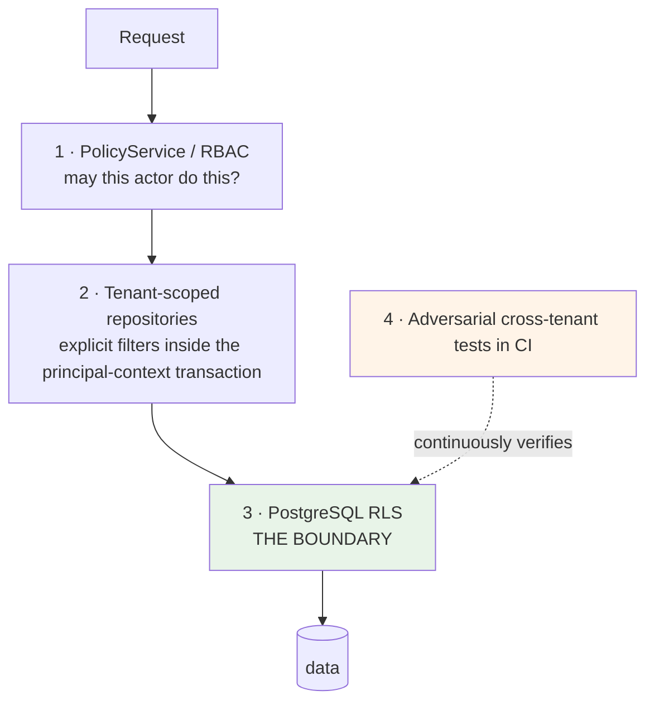
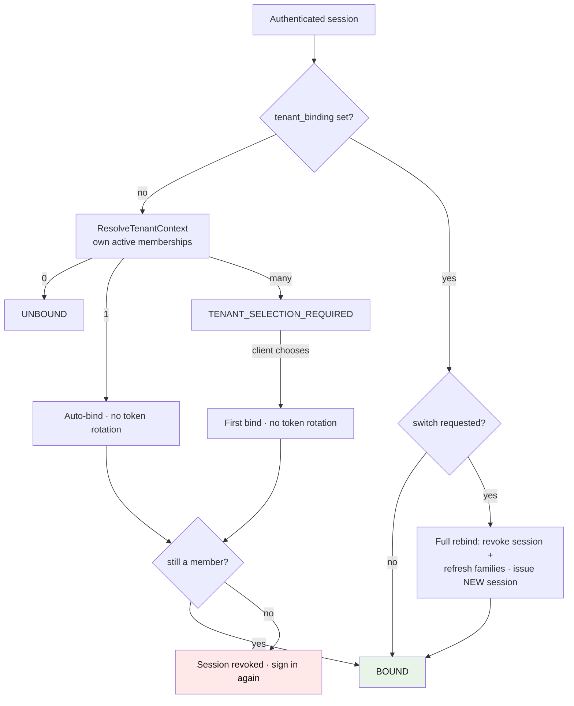

# Multi-Tenancy and Isolation

**ADRs:** 0008, 0022 · **Phase:** 3 (not 11) — isolation implemented in Phase 3, session tenant binding in Phase 3.5; implemented-state notes are marked per section

---

## 1. `tenant_id` from day one

Every tenant-owned table carries `tenant_id` from the first migration. Retrofitting tenancy means touching every table, every query, every index, and every test in a system that already holds data — and the retrofit is never quite complete.

The legacy is the demonstration. It added RLS across three migrations (V9, V30, V40) and, at HEAD, **24 of 69 tables still have no RLS** — 13 correctly public, 5 documented bootstrap exclusions, and **6 unexplained, with `users` among them**. Four tenant tables were passed over by V40 *without comment*: no migration, document, or test states a position either way.

That is the cost of Phase 11. Karar pays it at Phase 3 — and has: every Phase 3 table shipped in its own migration with RLS enabled and FORCEd, or with a written allow-list justification (§4). There was no retrofit because there was nothing to retrofit onto.

## 2. Four layers, none sufficient alone



### Layer 1 — RBAC

Permission checks in the use case. Answers *"may this actor perform this operation?"* — not *"whose data is this?"*

### Layer 2 — tenant-scoped repositories

Application-layer scoping in the repository. Convenient, and it catches honest mistakes early.

> **The repository filter is not the isolation mechanism.** It is convenience on top of RLS, which is the real boundary.

Stated explicitly because it is the most likely thing to be misremembered. An application-layer filter is defeated by any code path that forgets it — and there is always one.

**Implemented in Phase 3** as explicit `where` filters inside each repository's `withPrincipalContext` transaction, not as a Prisma client extension — the extension mechanism was considered and skipped because the transaction wrapper (§3) already forces every tenant-scoped query through one funnel, and a second implicit filter layer would obscure which mechanism a test is actually proving. The layer's status is unchanged: convenience, never the boundary.

### Layer 3 — PostgreSQL RLS

The actual boundary.

```sql
ALTER TABLE transactions ENABLE ROW LEVEL SECURITY;
ALTER TABLE transactions FORCE  ROW LEVEL SECURITY;

CREATE POLICY tenant_isolation ON transactions
  USING (tenant_id = NULLIF(current_setting('app.tenant_id', true), '')::uuid);
```

The predicate form is deliberate (this is the landed Phase 3 pattern): `current_setting(name, true)` returns NULL instead of erroring when the GUC was never set, and `NULLIF(…, '')` treats the empty string — the wrapper's explicit "absent" binding (§3) — the same way. Either way the comparison is against NULL and matches no rows: **a transaction without principal context sees nothing**, rather than depending on which failure mode PostgreSQL happened to take.

| Rule | Why |
|---|---|
| Application role has **no `BYPASSRLS`** | A superuser connection makes every policy decorative |
| `FORCE` as well as `ENABLE` | Without `FORCE`, the table owner bypasses the policy |
| `SET LOCAL app.tenant_id` per transaction | Transaction-scoped; cannot leak across a pooled connection |
| Migrations run as a **separate role** | Migration needs privileges the application must never hold |
| `app.tenant_id` bound **from the caller's own record**, inside the transaction | **Never from client input.** Inherited from the legacy, which got this exactly right |

### Layer 4 — adversarial tests

CI creates two tenants with real data and asserts that tenant A cannot read, update, or delete tenant B's rows through any repository method or endpoint.

**Tests assert on non-empty expected data.** This is not pedantry. The legacy's tenant member roster has no bank-admin policy, so it returns empty for *everyone* — and, as its own audit records, *"an empty roster is indistinguishable from correct isolation, so the isolation claim on that endpoint has never actually been tested."* A test that passes because nothing came back has verified nothing.

**UPDATE and DELETE are exercised, not only SELECT.** The legacy proves isolation for 3 of 45 tables and *"UPDATE has never been exercised at all."*

**Implemented in Phase 3**, twice over: each module carries its own adversarial integration suite (for example `modules/tenancy/__tests__/tenancy-isolation.integration.test.ts`), and a cross-cutting suite at `tests/security/` (`cross-tenant-isolation` and `privilege-abuse`) attacks the module boundaries together on a scratch database. Both follow the same discipline: two tenants seeded with real rows, each tenant's own data proven **non-empty first**, then cross-tenant SELECT/INSERT/UPDATE/DELETE denied at the SQL, repository, and use-case layers — plus the FORCE-vs-owner probe, pooled-connection GUC hygiene across both the pg adapter and the Prisma client, privilege-escalation probes, and append-only ledgers holding even against the migrator role.

## 3. The tenant transaction wrapper

```ts
await withTenant(prisma, tenantId, userId, async (tx) => { /* every tenant-scoped query */ })
```

issuing:

```sql
BEGIN;
SELECT set_config('app.tenant_id', $1, true),  -- SET LOCAL semantics
       set_config('app.user_id',   $2, true), …;
-- queries
COMMIT;
```

> **Documented cost.** Prisma cannot set a session GUC per query outside an interactive transaction. All tenant-scoped queries therefore route through this wrapper, which costs connection overhead and constrains query style.

Accepted and recorded rather than worked around. The alternative is trusting the application layer, which is the failure mode RLS exists to prevent.

**Implemented in Phase 3** as `withPrincipalContext` ([`packages/platform/src/db/principal-context.ts`](../../packages/platform/src/db/principal-context.ts)), with `withTenant` as sugar for the common tenant+user case. The landed mechanism, precisely:

- **Four GUCs, one statement.** The transaction's first statement is a single parameterized `SELECT set_config('app.tenant_id', $1, true), set_config('app.user_id', $2, true), …` also binding `app.session_id` and `app.request_id`. `is_local => true` is `SET LOCAL`: the values die with the transaction, so a pooled connection cannot carry one caller's tenant into the next caller's query. GUC *names* are compile-time constants; *values* always travel as bind parameters.
- **Fail closed before any query.** Every call site declares which context keys it requires (default: `tenantId` and `userId`); a missing or malformed required value throws a typed `PrincipalContextError` before a connection is checked out. There is no fallback context and no partial execution. Call sites that legitimately run narrower (the token-scoped invitation lookup) must say so explicitly.
- **Absent optional keys bind to `''`, never skip.** Binding the empty string locally shadows any stale session-level value left on the pooled connection. Policies read GUCs via `NULLIF(current_setting(name, true), '')`, so an unset or empty GUC compares as NULL and matches **no rows** — unset context fails closed at the policy, not only in code.
- **Both persistence paths.** The wrapper runs over the Prisma handle (interactive transaction) and over the raw `PostgresPersistenceAdapter` identically; identity's account-keyed tables use the same GUCs through `public.karar_current_user_id()`.
- **Guarded by architecture test 9** (tenant scoping): persistence code touching principal-scoped tables must run under the principal context, and `SET SESSION` / `set_config(…, false)` on any `app.*` GUC is forbidden everywhere — a session-scoped binding would survive the transaction and defeat the pooling guarantee.

## 4. RLS coverage guard — architecture test 22

Every table in `public` is RLS-enabled **and** FORCEd, or appears on an explicit allow-list with a stated reason.

The guard detects **three** failure shapes:

| Shape | Legacy instance |
|---|---|
| **No RLS at all** | 24 tables; the legacy's guard did not test for this (RLS-01) |
| **Enabled but no policy** | The only shape the legacy's guard tested |
| **FORCEd but not enabled** | The admin audit log itself (RLS-02) — *"no existing guard detects that shape"* |

A new table shipping with no RLS **fails the build**. The allow-list is the only escape, and it requires a written reason and a reviewer.

**Implemented in Phase 3** — test 22 is active. The allow-list is [`packages/platform/db/rls-allow-list.json`](../../packages/platform/db/rls-allow-list.json): one entry per table with the reason and its compensating controls, and the guard fails on any table that is neither ENABLE+FORCE nor listed. Current coverage (CODE), as architecture test 22 reports it over the tree at `66ad086`: **62 tables** across the `public`, `platform`, and `audit` schemas, created by 51 migrations — **32 RLS-enabled and FORCEd, 37 allow-listed, 7 deliberately both.** Every subject-owned Phase 5 financial table is ENABLE + FORCE; the three catalogue tables outside the tenant boundary (`institutions`, `financial_categories`, `merchant_rules`) are allow-listed with a written reason rather than given a no-op policy. The 7 are identity's bootstrap-armed tables (accounts, credentials, verification/reset codes, refresh-token lineage, the security ledger): authentication begins before a principal exists, so their policies carry an explicit no-principal arm — recorded in the allow-list with justification — while any transaction that *has* a user context stays confined to its own rows. Sessions and MFA tables carry no bootstrap arm at all.

## 5. Tenant kinds

| Kind | Description | Operating entity |
|---|---|---|
| First-party | Karar's own consumer product | Karar's entity — Karar is controller |
| White-label | A partner's branded deployment | **The partner's entity — the partner is controller, Karar is processor** |
| Internal | Demo, test, support | Karar's entity |

The controller/processor inversion is the central legal fact of a white-label deal, and it is **configuration, not code**. See [`operating-entity.md`](operating-entity.md).

## 6. Tenant resolution and session binding

Resolved at the infrastructure edge, before any use case runs, from — in order — the authenticated principal's tenant binding, the API client's tenant binding, or the request host for branded domains.

**Never from a client-supplied header or body field.** A `?tenantId=` parameter is not accepted anywhere, and its absence is asserted by test.

### How a session acquires a tenant

**Implemented in Phase 3.5.** Phase 3 issued every session with `tenant_binding = null` and shipped no mechanism to set it, so the ten tenant-bound endpoints answered 401 for every caller — fail-closed, but dormant (risk KAR-RSK-021). Phase 3.5 supplies the mechanism, and the design constraint that shaped it is worth stating: `sessions.tenant_binding` is the **only** tenant source the fail-closed RLS design permits at the edge, because every tenant table needs `app.tenant_id` bound before it can be read, so membership cannot be discovered from a bare user id. Selecting a tenant therefore needs its own narrow, server-side read path — migration `0080` gives a principal a self-listing arm on `tenant_members`, and `0081` gives it a member arm on `tenants`, so tenant *selection* becomes possible before binding without widening anything else.

`ResolveTenantContext` (`modules/tenancy`) turns the caller's own active memberships into exactly one of three outcomes:

| Usable memberships | Outcome |
|---|---|
| 0 | `UNBOUND` |
| exactly 1 | `AUTO_BIND(tenant)` |
| more than 1 | `TENANT_SELECTION_REQUIRED(choices)` |

A membership is **usable** only when the membership row is active **and** its tenant resolves through the `0081` member arm **and** that tenant's status is `ACTIVE`. A suspended or closed tenant is not a choice, so a principal whose only tenant was disabled resolves `UNBOUND` rather than half-bound. Choices carry safe fields only — tenant id, name, and a role hint — never status internals, operating-entity references, or membership plumbing. Nothing is ever fabricated: the rows are the only source.



### First bind and switch are different doors

**First bind** (`BindSessionTenant`, `null → tenant`) sets the binding on the caller's own live session row with **no token rotation**. There is nothing to invalidate: the session gains context it never had, existing tokens keep working, and per-request server-side re-reads pick the binding up on the next request. Only a `null → value` transition succeeds; a bound session is refused and takes the other door.

**Switch** (`RebindSessionTenant`, `A → B`) is the dangerous operation and rotates everything. One transaction atomically revokes the current session **and** its refresh-token families, then issues a brand-new session with a new session id and a new refresh family carrying the new binding. Old access tokens die with the revoked sid at their next per-request re-validation; old refresh tokens die with the family. The response carries the new tokens, and no interleaving can observe a principal holding two live sessions or one session with a half-switched binding.

> **A switch must not leave a usable token pointing at the previous tenant.** That is why the switch path rebuilds the session instead of updating a column.

`SwitchTenant` verifies server-side before and after: the target must be the caller's own active membership in an active tenant; the identity seam performs the rebind; then membership is verified **again**, and if it vanished in the race window the replacement session is revoked and the denial is audited. Membership denials are uniform — an unknown tenant, a revoked membership, an expired membership, a disabled tenant, and a malformed id all answer identically, so the endpoint is not a membership oracle.

`GrantFirstPartyMembership` exists as its own explicit, audited use case rather than as a hidden insert inside registration. Creating a membership is a tenancy decision; burying it in another module's flow would put a grant where nobody reviews it.

### Binding is routing; per-request checks stay authoritative

> **The binding selects context. It does not confer authority.**

A bound session says *which* tenant's data the request is about. Whether the caller may perform the operation is still decided per request by membership verification and the `PolicyService`, and which rows they can touch is still decided by RLS under `withPrincipalContext` (§3). The verify-act-re-verify-compensate sequence narrows the race window; it does not replace the guarantee beneath it, and it is not asked to. The residual window between a re-verification and a later revocation is covered by exactly that standing rule.

The same principle makes stale bindings safe to report rather than dangerous to hold: a session bound to a tenant that has since been disabled, or whose membership was revoked, resolves as `UNBOUND` or `TENANT_SELECTION_REQUIRED` — the reported state reflects binding **validity**, never a tenant that would not work.

### The first-party tenant comes from configuration

The first-party tenant id is typed configuration (`KARAR_FIRST_PARTY_TENANT_ID`), **required outside `local`** so a non-local boot without one fails clearly at startup. Local development defaults to a documented synthetic UUID that `scripts/db/seed-local-first-party.mjs` creates. **No magic UUID appears in domain code**: the value reaches use cases through the typed config and nowhere else. Tenant provisioning itself has no runtime path this phase — migration `0041` grants `karar_app` `SELECT` only on `public.tenants` — so the seed writes as the bootstrap superuser, exactly as the tenancy test fixtures do, and real environments provision through the control plane.

## 7. Cross-tenant operations

Some operations legitimately span tenants: platform metrics, capability availability management, projections.

They run through the **control plane**, against **projections**, under an explicitly elevated context that is audited and never available to a consumer request path. Elevation is scoped to the narrowest set of reads required — not the whole transaction.

The legacy's counter-example: its invitation redemption *"elevates the whole transaction to administrator authority rather than the three reads that need it"* (RLS-04).

## 8. Staff access — two layers, not one

The legacy's finding, quoted because it is the clearest statement of the problem:

> There is no endpoint that returns one customer's transactions to a staff member. **The database, however, grants a platform administrator session SELECT on every consumer financial table; only the absence of an endpoint prevents the read.** That is one layer, not two.

**Karar:**

- RLS plus revoked grants make the database the **second** layer. An admin session that reaches the database cannot read consumer financial rows.
- Admin data comes from **projections** in `readmodel`, which carry aggregates and operational state — never `SEALED` data, and never raw financial detail beyond what the role's permission grants.
- **Every staff read of a customer record is audited**, including reads that return nothing.
- For sealed data the rule is absolute: **no admin role holds a content-read permission at any level.**

## 9. The topology ladder does not change the domain

| Rung | Isolation |
|---|---|
| **L0** | Shared database, `tenant_id` + RLS |
| **L1** | Dedicated database, shared platform |
| **L2** | Dedicated deployment |
| **L3** | Dedicated cloud account/project/subscription, own KMS, IdP, connectors |

**Domain code is identical at every rung — on any approved cloud provider**, because it never names a database, provider, region, or key. A tenant maps to a `DeploymentProfile`; movement between rungs or providers is infrastructure resolution and Terraform. See [`deployment-topology.md`](deployment-topology.md) and [`infrastructure-portability.md`](infrastructure-portability.md).

## 10. What tenancy does not do

| | Why |
|---|---|
| Give a tenant admin access to consumer financial detail | Per-entitlement only, audited, never `SEALED` |
| Allow a tenant to enable a capability | Availability is platform-controlled and restrict-only |
| Allow a client to assert its own tenant | Resolved from the principal, at the edge |
| Let a session bind to a tenant the caller does not belong to | The target is verified server-side against the caller's own memberships, twice (§6) |
| Make RLS optional in development | The same policies run locally. A control tested only in production is a control tested in production |

## 11. The client bootstrap surface

**Implemented in Phase 3.5** ([`modules/bootstrap`](../../modules/bootstrap/MODULE.md)), and extended by one route in Phase 4. All three are authored OpenAPI-first — the first two in `packages/api-contracts/openapi/paths/platform.yaml`, the third in `tenancy.yaml` — and all three are session-scoped self-service: the caller reads and mutates only their own session's context, and tenant selection is authorized by **membership**, not by a permission:

| Route | Does |
|---|---|
| `GET /platform/bootstrap` | Returns who the caller is, their binding state, and the client-safe jurisdiction / operating-entity / PolicyPack / capability view |
| `POST /platform/tenant-binding` | First bind (no rotation) or switch (full rotation, new tokens in the response) |
| `GET /tenancy/memberships` | **Phase 4.** The caller's own active memberships, so an unbound session can present a choice. Deliberately **tenantless** — mounted through its own module whose principal source drops the tenant id, so it cannot be handed the tenant-bound principal by wiring accident |

The GET carries **one documented side effect**: an unbound session with exactly one usable membership is auto-bound to it, without token rotation, verified again afterwards, and compensated by revoking the session if the membership vanished in the race window. Both outcomes are audited, and the side effect is declared in the OpenAPI contract rather than discovered.

This module owns **no persistent data**. It composes views over state owned by identity, tenancy, and the Phase 3.5 jurisdiction and capability modules, and every read its use cases trigger runs through those modules' repositories under `withPrincipalContext` — RLS stays the boundary beneath the surface.

### What it must never return

The response serializer emits a **closed field set**: each field is picked by name, so anything extra an upstream port attaches is dropped at the edge rather than shipped. Hidden capabilities, unimplemented or pending-legal capabilities, Amanat's existence, internal licence detail, full PolicyPack content (version and status only), raw consent evidence, and internal audit or configuration data are all outside that set. Capability output passes through the capability module's **client-safe** resolver unenriched — bootstrap never re-filters ids, so the filter cannot drift into two implementations ([`capability-registry.md` §5](capability-registry.md)). A leak-regression suite drives fakes that try to leak through every port and asserts the serialized output carries exactly the declared fields.

Enrichment ports may legitimately return null while a dimension is unresolved; the response carries explicit nulls rather than fabricated defaults, and the jurisdiction state is the typed three-arm value whose `NONE` arm is the fail-closed case.

### Phase 4: unresolved and unavailable became different answers

In Phase 3.5 the enrichment ports returned bare values and **could not express failure at all**, so a store fault and a user with no services produced the same response. Phase 4 made each port return a tagged outcome, and the two response sections that a client acts on became discriminated shapes:

- `capabilities` is `{state, items}`. `RESOLVED` with an empty list is an answer; an unavailable resolution is a `503 BOOTSTRAP_UNAVAILABLE` carrying a retryable flag and no detail. **Both changes are breaking** for a client written against Phase 3.5.
- `operatingEntity` is `{state, entity}` with `ASSIGNED` / `UNASSIGNED` / `UNAVAILABLE`, and `entity` is explicitly `null` rather than omitted in the latter two. Unassigned is a legitimate state, not an error.

The operating-entity summary is new in Phase 4 and is client-safe **by its SELECT**: the reader fetches four columns, so licence evidence, contract references, registration internals, role assignments and administrative metadata never enter the process. Authorization is resolution-scoped — a caller cannot name an entity or enumerate the register, only receive the one derived from their own binding ([`operating-entity.md` §8a](operating-entity.md)).
