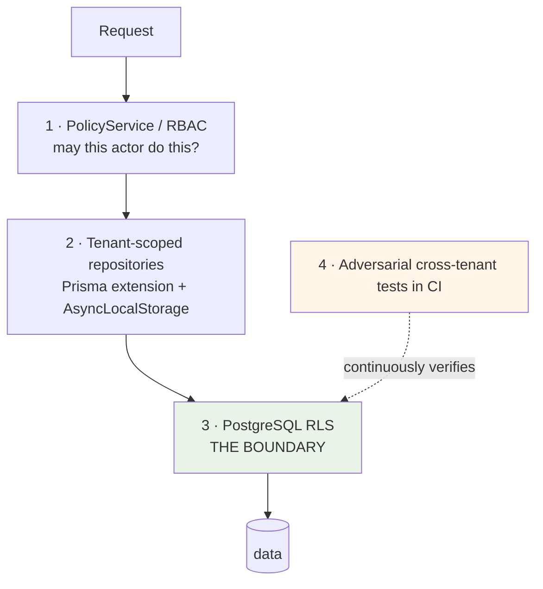

# Multi-Tenancy and Isolation

**ADRs:** 0008, 0022 · **Phase:** 3 (not 11)

---

## 1. `tenant_id` from day one

Every tenant-owned table carries `tenant_id` from the first migration. Retrofitting tenancy means touching every table, every query, every index, and every test in a system that already holds data — and the retrofit is never quite complete.

The legacy is the demonstration. It added RLS across three migrations (V9, V30, V40) and, at HEAD, **24 of 69 tables still have no RLS** — 13 correctly public, 5 documented bootstrap exclusions, and **6 unexplained, with `users` among them**. Four tenant tables were passed over by V40 *without comment*: no migration, document, or test states a position either way.

That is the cost of Phase 11. Karar pays it at Phase 3.

## 2. Four layers, none sufficient alone



### Layer 1 — RBAC

Permission checks in the use case. Answers *"may this actor perform this operation?"* — not *"whose data is this?"*

### Layer 2 — tenant-scoped repositories

A Prisma client extension plus `AsyncLocalStorage` context. Convenient, and it catches honest mistakes early.

> **The Prisma extension is not the isolation mechanism.** It is convenience on top of RLS, which is the real boundary.

Stated explicitly because it is the most likely thing to be misremembered. An application-layer filter is defeated by any code path that forgets it — and there is always one.

### Layer 3 — PostgreSQL RLS

The actual boundary.

```sql
ALTER TABLE transactions ENABLE ROW LEVEL SECURITY;
ALTER TABLE transactions FORCE  ROW LEVEL SECURITY;

CREATE POLICY tenant_isolation ON transactions
  USING (tenant_id = current_setting('app.tenant_id')::uuid);
```

| Rule | Why |
|---|---|
| Application role has **no `BYPASSRLS`** | A superuser connection makes every policy decorative |
| `FORCE` as well as `ENABLE` | Without `FORCE`, the table owner bypasses the policy |
| `SET LOCAL app.tenant_id` per transaction | Transaction-scoped; cannot leak across a pooled connection |
| Migrations run as a **separate role** | Migration needs privileges the application must never hold |
| `app.tenant_id` bound **from the caller's own record**, inside the transaction | **Never from client input.** Inherited from the legacy, which got this exactly right |

### Layer 4 — adversarial tests

CI creates two tenants with real data and asserts that tenant A cannot read, update, or delete tenant B's rows through any repository method or endpoint.

**Tests assert on non-empty expected data.** This is not pedantry. The legacy's tenant member roster has no bank-admin policy, so it returns empty for *everyone* — and, as its own audit records, *"an empty roster is indistinguishable from correct isolation, so the isolation claim on that endpoint has never actually been tested."* A test that passes because nothing came back has verified nothing.

**UPDATE and DELETE are exercised, not only SELECT.** The legacy proves isolation for 3 of 45 tables and *"UPDATE has never been exercised at all."*

## 3. The tenant transaction wrapper

```ts
await withTenant(ctx, async (tx) => { /* every tenant-scoped query */ })
```

issuing:

```sql
BEGIN;
SET LOCAL app.tenant_id = $1;
-- queries
COMMIT;
```

> **Documented cost.** Prisma cannot set a session GUC per query outside an interactive transaction. All tenant-scoped queries therefore route through this wrapper, which costs connection overhead and constrains query style.

Accepted and recorded rather than worked around. The alternative is trusting the application layer, which is the failure mode RLS exists to prevent.

## 4. RLS coverage guard — architecture test 22

Every table in `public` is RLS-enabled **and** FORCEd, or appears on an explicit allow-list with a stated reason.

The guard detects **three** failure shapes:

| Shape | Legacy instance |
|---|---|
| **No RLS at all** | 24 tables; the legacy's guard did not test for this (RLS-01) |
| **Enabled but no policy** | The only shape the legacy's guard tested |
| **FORCEd but not enabled** | The admin audit log itself (RLS-02) — *"no existing guard detects that shape"* |

A new table shipping with no RLS **fails the build**. The allow-list is the only escape, and it requires a written reason and a reviewer.

## 5. Tenant kinds

| Kind | Description | Operating entity |
|---|---|---|
| First-party | Karar's own consumer product | Karar's entity — Karar is controller |
| White-label | A partner's branded deployment | **The partner's entity — the partner is controller, Karar is processor** |
| Internal | Demo, test, support | Karar's entity |

The controller/processor inversion is the central legal fact of a white-label deal, and it is **configuration, not code**. See [`operating-entity.md`](operating-entity.md).

## 6. Tenant resolution

Resolved at the infrastructure edge, before any use case runs, from — in order — the authenticated principal's tenant binding, the API client's tenant binding, or the request host for branded domains.

**Never from a client-supplied header or body field.** A `?tenantId=` parameter is not accepted anywhere, and its absence is asserted by test.

## 7. Cross-tenant operations

Some operations legitimately span tenants: platform metrics, capability availability management, projections.

They run through the **control plane**, against **projections**, under an explicitly elevated context that is audited and never available to a consumer request path. Elevation is scoped to the narrowest set of reads required — not the whole transaction.

The legacy's counter-example: its invitation redemption *"elevates the whole transaction to administrator authority rather than the three reads that need it"* (RLS-04).

## 8. Staff access — two layers, not one

The legacy's finding, quoted because it is the clearest statement of the problem:

> There is no endpoint that returns one customer's transactions to a staff member. **The database, however, grants a platform administrator session SELECT on every consumer financial table; only the absence of an endpoint prevents the read.** That is one layer, not two.

**Karar:**

- RLS plus revoked grants make the database the **second** layer. An admin session that reaches the database cannot read consumer financial rows.
- Admin data comes from **projections** in `readmodel`, which carry aggregates and operational state — never `SEALED` data, and never raw financial detail beyond what the role's permission grants.
- **Every staff read of a customer record is audited**, including reads that return nothing.
- For sealed data the rule is absolute: **no admin role holds a content-read permission at any level.**

## 9. The topology ladder does not change the domain

| Rung | Isolation |
|---|---|
| **L0** | Shared database, `tenant_id` + RLS |
| **L1** | Dedicated database, shared platform |
| **L2** | Dedicated deployment |
| **L3** | Dedicated project, own KMS, IdP, connectors |

**Domain code is identical at every rung**, because it never names a database, provider, region, or key. Movement between rungs is infrastructure resolution and Terraform. See [`deployment-topology.md`](deployment-topology.md).

## 10. What tenancy does not do

| | Why |
|---|---|
| Give a tenant admin access to consumer financial detail | Per-entitlement only, audited, never `SEALED` |
| Allow a tenant to enable a capability | Availability is platform-controlled and restrict-only |
| Allow a client to assert its own tenant | Resolved from the principal, at the edge |
| Make RLS optional in development | The same policies run locally. A control tested only in production is a control tested in production |
