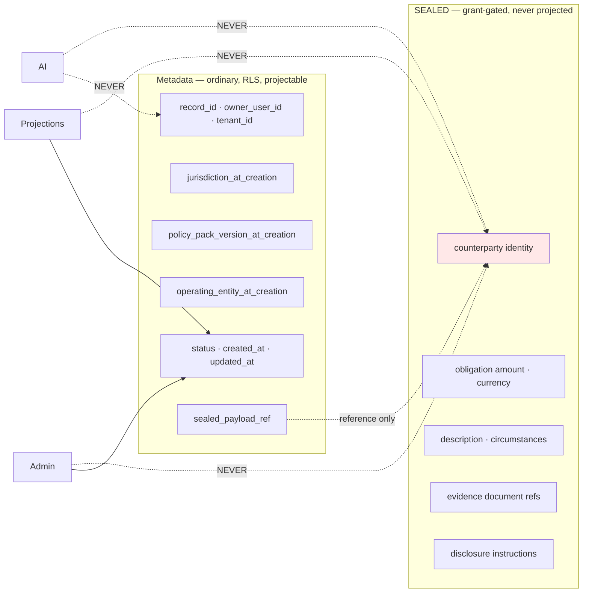

# Scenario B — Add Amanat

**Question:** can a capability unlike anything else in the platform be added without touching what exists?
**Answer:** yes, and this is the acceptance test for the whole extension design.

> Amanat is a **confidential obligation-recording capability with post-mortem conditional disclosure.** Terminology is provisional pending domain and legal review.

---

## 1. Why Amanat is the forcing function

It demands, all at once:

- Data sensitivity above ordinary financial data → `SEALED`
- A disclosure workflow that is **not a data-access flow**
- Jurisdiction-dependent legality
- An identified **legal releasing party**
- Its own bounded context

And it must be addable **without touching transactions, budgets, the financial engine, the Flutter shell, tenancy, or the control-plane core.**

## 2. The bounded context

```mermaid
graph TB
    subgraph "modules/amanat — NEW"
        subgraph domain
            D1[AmanatRecord ◆]
            D2[PrivateObligation]
            D3[CounterpartyReference]
            D4[DisclosureInstruction]
            D5[DisclosureCase ◆]
            D6[AuthorizedRecipient]
            D7[DeathVerification]
        end
        subgraph application
            A1[RecordObligation]
            A2[AmendObligation]
            A3[RevokeInstruction]
            A4[ReportDeath]
            A5[VerifyRecipient]
            A6[EvaluateDisclosure]
            A7[AuthorizeDisclosure]
            A8[GeneratePackage]
        end
        subgraph infrastructure
            I1[Prisma repos — metadata only]
            I2[SealedRecordStore client]
            I3[Verification provider adapters]
        end
        subgraph presentation
            P1[/api/v1/amanat/*]
            P2[/api/v1/admin/amanat/*]
        end
    end
    subgraph "CONSUMED — unmodified platform services"
        S1[identity · consent · audit]
        S2[documents · notifications]
        S3[SealedVault · Encryption]
        S4[Jurisdiction policy · OperatingEntity]
        S5[Capability registry]
        S6[EventBus · outbox]
    end
    subgraph "UNTOUCHED"
        X1[transactions · budgets · goals · zakat]
        X2[financial-engine]
        X3[Flutter shell · tenancy · control-plane core]
    end
    domain --> S3
    application --> S1
    application --> S4
    X1 -.zero changes.-> domain
```

## 3. The sealed boundary



**The amount is sealed.** Tempting to keep it in metadata for reporting; resist it. An amount plus a counterparty reference is most of the sensitive content. Operational dashboards show **counts, states, and ages — never sums.**

## 4. The seventeen-point checklist

| # | Item | Answer |
|---|---|---|
| 1 | Bounded context | `modules/amanat` |
| 2 | Domain ownership | Amanat domain; own vocabulary; declared in `MODULE.md` |
| 3 | Permissions | `amanat.record.*` (user); `amanat.case.review` / `.approve` (operator); **no `amanat.content.read` for any admin role** |
| 4 | Capability registration | `CapabilityId.AMANAT`; `declaredJurisdictions` initially **`[]`** until legal clearance |
| 5 | Country availability | QA `PENDING_LEGAL_REVIEW`; SA/AE/OM `DISABLED`. **Nothing enabled by default** |
| 6 | Country policy | `EstateDisclosurePolicy` + `ApprovalPolicy` clause per pack; **absent ⇒ capability unavailable** |
| 7 | Data classification | Metadata `CONFIDENTIAL`; payload **`SEALED`** |
| 8 | Encryption | Per-record DEK, jurisdiction-scoped KEK, via `EncryptionProvider`; **extractable vault; KEK escrow + canary** |
| 9 | API | `/api/v1/amanat/*`, `/api/v1/admin/amanat/*` (**cases only, never content**) |
| 10 | Flutter | `features/amanat/` — new folder, **zero shell changes**; hidden entirely when unavailable |
| 11 | Admin | Cases, states, approvals, audit. **Never content** |
| 12 | Events | Identifiers and statuses only — **mandatory for `SEALED`, no exemption** |
| 13 | Projections | `amanat_case_operational` — counts, states, ages. **No amounts, no parties** |
| 14 | Tests | Domain, state machine, policy resolution, **existence non-disclosure**, grant-required-to-read, no-sealed-in-events, no-sealed-in-projections, cross-tenant, admin-cannot-read, approval-policy-required, **canary-holds-no-customer-data** |
| 15 | Audit | Every record/amend/revoke/report/verify/approve/generate/release; **every attempted sealed access, successful or not**; releasing entity recorded |
| 16 | SDK exposure | **No.** Not in the public SDK until legal and partner model are settled |
| 17 | White-label entitlement | **No by default.** Per-tenant opt-in requiring explicit legal sign-off |

## 5. Registered seams — append-only

| Seam | Change |
|---|---|
| `CapabilityId` union | **+1 member** |
| PolicyPack | **+1 capability clause** per pack |
| `CapabilityAvailability` | **+rows** (or none ⇒ `DISABLED`) |
| Admin navigation | **+1 entry** |
| Root NestJS module | **+1 import** |
| GoRouter | **+1 route** |

**Nothing existing is modified.**

## 6. Untouched modules

`transactions` · `budgets` · `goals` · `zakat` · `insights` · `financial-accounts` · `financial-engine` · Flutter shell · tenancy core · control-plane core.

> **If this list shortens during implementation, the seam is wrong and gets fixed before Amanat proceeds.**

```bash
git diff --name-only main... | grep -E 'modules/(transactions|budgets|goals|insights|zakat)/|packages/financial-engine/|app/lib/app/'
```

Empty output, or stop.

## 7. Disclosure

Via the platform workflow in [`../architecture/disclosure.md`](../architecture/disclosure.md), with **Amanat defaulting to mandatory human review**. Safety properties — mandatory waiting period, owner supremacy while living, **existence non-disclosure**, irreversibility of `Released`, and rate limiting on death reports — are platform properties, tested here.

## 8. Fundraising — no coupling

Amanat emits `EligibleRepaymentSupportRequested` carrying **identifiers, jurisdiction, and status — never obligation contents.**

**Amanat has no payment-provider dependency, direct or transitive.** Karar is not designed to hold funds. Any future fundraising capability integrates a licensed provider through adapters, and its legality is unverified in every named market and is not assumed.

## 9. Gates before Amanat ships to production

| Gate | |
|---|---|
| Legal clearance **per jurisdiction** | Before Phase 14 |
| Domain terminology review | Before Phase 14 |
| **Sealed vault extracted** to its own boundary | Phase 20 |
| **KEK escrow + rehearsed, timed recovery drill** | Phase 20 |
| **Sealed-integrity canary running** | Phase 20 |
| Per-capability policy-resolution strategy selection | **Legal, not engineering** — before Phase 13 |
