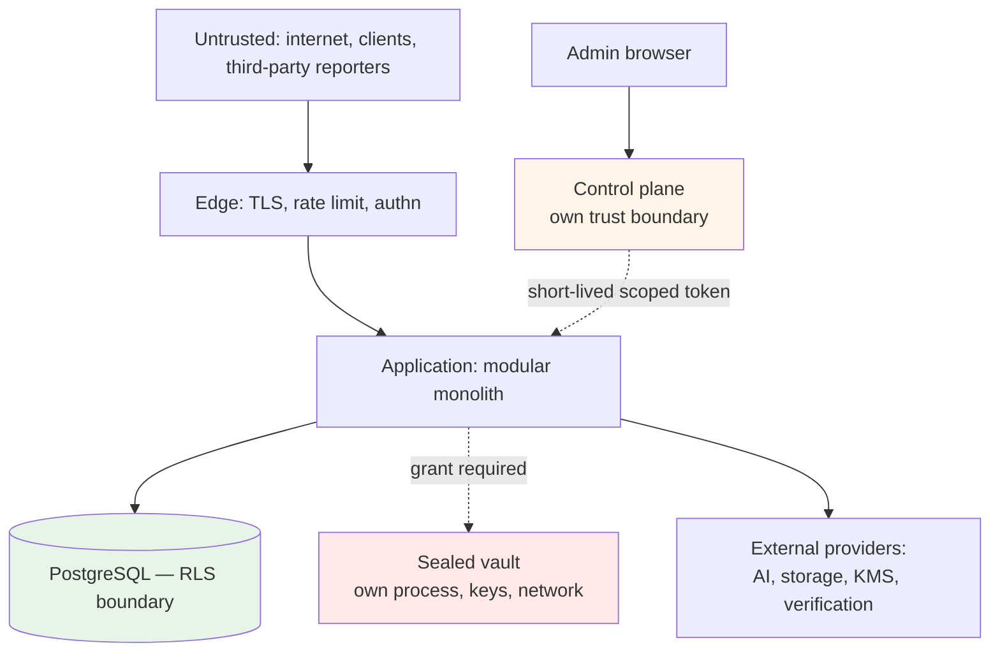

# Threat Model

**Status:** Phase 0 — design-stage model. **No system exists, no data is held, no penetration test has been performed.**
**Basis:** Karar's architecture as documented, plus 128 findings from the legacy audit of `MoayadAlobaidi/Qarar`.

---

## 1. Assets, ranked

| # | Asset | Why ranked here |
|---|---|---|
| 1 | **Sealed obligation payloads** | Confidential by promise, unreadable by Karar, irrecoverable if keys are lost |
| 2 | **Encryption keys (KEK/DEK)** | Compromise exposes everything; loss destroys sealed data permanently |
| 3 | **Customer financial data** | Transactions, balances, statements — the product's core sensitive holding |
| 4 | **Authentication credentials and sessions** | Gateway to 1 and 3 |
| 5 | **Administrative access** | Cross-tenant reach; production capability |
| 6 | **Consent and legal-acceptance records** | The legal basis for processing; evidentiary |
| 7 | **Audit records** | Establish what happened; must resist tampering |
| 8 | **Capability availability configuration** | Controls what is lawfully exposed where |

## 2. Trust boundaries

**Four boundaries that matter:** the edge, the database (RLS), the sealed vault, and the control plane. Each is designed so that compromise of the layer above does not automatically breach it.

## 3. Threats and controls

### T1 — Cross-tenant data access

**Vector:** a missing filter, a missing RLS policy, a forgotten tenant scope, or a `?tenantId=` parameter.

| Control | |
|---|---|
| RLS enabled **and** FORCEd on every table, or explicitly allow-listed with a reason | ADR-0022 |
| Application role has **no `BYPASSRLS`** | |
| `app.tenant_id` bound from the caller's record **inside** the transaction, never client input | |
| Architecture test 22 detects *no RLS*, *enabled-without-policy*, **and** *FORCEd-without-enabled* | |
| Adversarial cross-tenant tests **asserting non-empty expected data**, exercising SELECT, UPDATE, DELETE | |

**Legacy evidence:** 24 of 69 tables without RLS, 6 unexplained; `tenant_invitations` holding bearer codes with no RLS; isolation proved for 3 of 45 tables with UPDATE never exercised.

### T2 — Sealed data exposure

**Vector:** a projection, an event, a log line, an AI prompt, an admin endpoint, a support escalation, or a SQL-level mistake.

| Control | |
|---|---|
| `SealAccessGrant` is a **required, non-nullable argument** — compiler-enforced | ADR-0017 |
| RLS on `sealed_payloads` additionally requires a grant GUC | |
| `AiContext` input types **structurally cannot hold** sealed data | |
| No `SUPPORT`/`ADMIN`/`ANALYTICS`/`AI` grant type exists | |
| No admin role holds `amanat.content.read` at any level | |
| Event rule is mandatory with **no exemption mechanism** | ADR-0025 |
| Architecture tests 13, 14 | |
| **Every attempted access audited, successful or refused** | |

### T3 — Key compromise or key loss

**Loss is the under-weighted half**, and the legacy proves it: **ENC-2 — the production key "has already been lost once."**

| Control | |
|---|---|
| KMS-held KEKs, jurisdiction-scoped; per-record DEKs | |
| **Approved `KeyCustodyStrategy`** (ADR-0017) — recovery/continuity tested; drill rehearsed where technically applicable | Phase 20 gate |
| **Sealed-integrity canary** — synthetic sealed record per KEK, known non-customer plaintext, decrypted on a schedule | Phase 20 gate |
| Rotation designed in from Phase 2, not retrofitted | |
| Startup refuses to boot without a key, or when existing data cannot be decrypted | |
| Separate keys per environment — **never reuse production's anywhere** | |

For sealed data, loss is **unrecoverable and undetectable**, discovered at the worst possible moment. The canary is the only mechanism that detects it without violating the seal.

### T4 — Authentication and session attacks

| Vector | Control |
|---|---|
| Credential stuffing, brute force | Lockout that **does not reset the counter on lock** (legacy AUTHN-11), distributed rate limiting |
| **Rate-limit bypass via client-supplied headers** | Client IP from a **configured trusted-proxy allow-list**. Legacy AUTHN-04, HIGH — assessed as total bypass |
| **Rate-limit bypass via path encoding** | Policy selected from the **normalised, decoded** path. Legacy API-01, HIGH — `/api/v1/ai/%63hat` |
| Token theft | Short-lived access tokens; rotating refresh; **server-side revocation for all sessions, admin first** (legacy AUTHN-07) |
| Stale authorization | Roles re-derived from the database per request — **carried forward from the legacy, which got this right** |
| Recovery-code brute force | Attempt counter and lock (legacy has neither) |
| Password reset flooding | Per-account cooldown |

### T5 — Privileged insider or compromised admin

| Control | |
|---|---|
| Control plane mints short-lived, single-environment, purpose-scoped tokens; **browser holds no environment credential** | ADR-0021 |
| Production gateway: reason capture, optional second approval, reauthentication, network restriction | |
| Admin data from **projections**, not domain tables | ADR-0020 |
| **Every staff read of a customer record audited, including reads returning nothing** | Legacy AZ5 |
| Append-only audit: revoked grants **and** a trigger raising on UPDATE/DELETE even for the owner | |
| **Restrict-only settings** — an operator cannot enable a capability code has not cleared | ADR-0015 |
| Sealed data unreachable at any privilege level | |

The restrict-only invariant is specifically an anti-insider control: **a compromised admin account cannot expose a capability where it has no legal basis.**

### T6 — AI-specific threats

| Vector | Control |
|---|---|
| Model states a wrong figure | **The model never writes a number** — ADR-0019 |
| Prompt injection via merchant narratives | Injection controls **built and executed**, not merely written (legacy AI-1, AI-9) |
| Sensitive data in prompts | Facts-only context; unconditional redaction of machine identifiers; sealed structurally excluded |
| Cross-border transfer without basis | `AIProcessingPolicy` typed clause; consent gate **fails closed** (legacy AI-5 fails open) |
| Bypassing controls via a direct provider call | One orchestrator; architecture test 10 (legacy AI-4) |
| Cost exhaustion | Per-user and per-tenant metering and caps; kill switch **tested**, not decorative |

### T7 — Ingestion and rendering resource exhaustion

| Vector | Control |
|---|---|
| Unbounded parsed rows | **Explicit row cap.** Legacy FILES-2, HIGH — a 10 MB CSV carrying ~1M rows into one transaction on a pool of 10 |
| Malicious PDF | Page, memory, and wall-clock ceilings; magic-byte validation (legacy FILES-3) |
| Rendering abuse | **No caller-supplied HTML**; explicit budgets. Legacy FILES-7 |
| Disclosure package generation | Same limits — a rendering path handling sealed data |

**Rule: every ingestion and rendering path declares explicit limits and rejects rather than degrades.** Architecture test 24.

### T8 — The published document contradicts the system

**The legacy's most consequential finding, and not a code defect.**

> **P1** — the AI notice stated merchant names and notes were redacted; they were not. *"The code is defensible; the consent text is wrong, and that text is the legal basis for a cross-border transfer of customer financial data."*

Related: **P4** (privacy policy promises in-app export; no screen calls it), **P12** (republication asks nobody to re-accept), **C4** (a compulsory document promises per-item deletion the code does not provide).

| Control | |
|---|---|
| Consent gates **fail closed** | |
| Republication triggers **re-consent evaluation**, material/non-material, **neither defaulted** | ADR-0024 |
| Capability promises reconcile with legal documents | Architecture test 26 |
| `MODULE.md` names the legal documents a capability's promises appear in | |

### T9 — Existence disclosure via the death-report endpoint

**Vector:** an unauthenticated third party files a death report and infers, from response content or timing, whether the subject had sealed records.

**Control:** identical responses **and identical timings** whether records exist or not, until authorization completes. Asserted by test, including timing equivalence. Rate limiting and abuse detection on reports.

**This is a privacy breach requiring no data release at all** — for a capability whose premise is confidentiality, the failure that matters most.

### T10 — Supply chain and secrets

| Control | |
|---|---|
| Dependency and secret scanning in CI, **blocking the merge, not just the run** | Legacy INFRA-07 |
| Flutter client built, analysed, and tested in CI | Legacy INFRA-10 — mobile is never checked |
| Secrets never in the repository, logs, or error messages | |
| Lockfiles committed; dependency updates reviewed | |

## Phase 2 platform threats

Threats introduced by the Phase 2 platform foundation (configuration, database
roles and migrations, events/outbox/jobs, audit, observability, key-custody
design), mapped to their controls. Evidence refs `EV-201..EV-213` are
placeholders the compliance workstream registers in the evidence index; test
paths under `packages/platform/src/outbox` and `packages/platform/src/jobs`
are workstream D's, named here by agreed location.

| Threat | Preventive control | Detective control | Test reference | Evidence | Residual risk | Owner |
|---|---|---|---|---|---|---|
| Migration abuse (elevated DDL, edited history) | Runner connects as `karar_migrator`, never superuser; forward-only; every file needs a `-- rollback:` block | sha256 checksum drift and missing/renamed applied files hard-fail `migrate` and `verify` | `packages/platform/src/db/contract.test.ts` | EV-201 | A hostile migration inside the range still runs with migrator rights; review is the control | Platform |
| Excess DB privilege | Grant convention: per-table minimal DML; no `GRANT ALL`, no PUBLIC, DDL only via migrator; roles carry no SUPER/BYPASSRLS/CREATEDB/CREATEROLE | Contract tests probe denials (42501) and role attributes live | `packages/platform/src/db/contract.test.ts` | EV-202 | Convention enforced by review + tests until an automated grant linter exists | Platform |
| Event loss / duplication | Transactional outbox: state and event commit in one transaction; at-least-once with idempotent consumers keyed on event id | Outbox lag/backlog metrics; relay retry accounting | `packages/platform/src/outbox` tests (D) | EV-203 | At-least-once means duplicates by design; a non-idempotent consumer is a defect class tests must catch per consumer | Platform |
| Poisoned event payload | Catalogue payload rules by classification (tests 8/15); `assertEventPayloadAllowed` at call sites; consumers validate against catalogue schema | CI catalogue checks; dead-lettering of unparseable events alerts | `scripts/checks/architecture.mjs#checkEventCatalogue`; `packages/platform/src/classification/classification.test.ts` | EV-204 | Semantic poisoning inside a valid shape remains; schema versioning discipline is the mitigation | Platform |
| Job replay / double execution | Jobs are idempotent with caller-supplied keys; single-claim leasing in the job store | Job run outcomes recorded; duplicate-claim metrics | `packages/platform/src/jobs` tests (D) | EV-205 | Crash between side effect and completion mark still replays; handlers must tolerate it | Platform |
| Dead-letter leakage | DLQ rows carry envelope + classification-redacted payload per catalogue rules; access via `SECURITY` review only | Dead-lettered events alert; DLQ depth monitored | `packages/platform/src/outbox` DLQ tests (D) | EV-206 | A payload legitimately carried under exemption sits in the DLQ for its retention; retention policy bounds exposure | Platform |
| Audit tampering | Append-only twice over: `karar_app` holds INSERT+SELECT only, and `audit_events_immutable` raises on UPDATE/DELETE/TRUNCATE even for the owner | Live denial tests both paths (42501 and P0001); audit gaps surface as `Result.err`, never swallowed | `modules/audit/__tests__/audit-append-only.integration.test.ts` | EV-207 | A superuser at the cluster level can drop the trigger; cluster access control and (later) off-host audit shipping bound it | Platform |
| Log leakage of classified data | Classification module is the one redaction vocabulary: `isLoggable` false for SECRET/SEALED, `[redacted:*]` markers; logger consumes it; audit metadata guard rejects/redacts | SEALED-at-log-site warn-once signal; test 13 deepens the static scan at Phase 13 | `packages/platform/src/classification/classification.test.ts`; `packages/platform/src/observability/logger.test.ts` | EV-208 | Free-text log messages can still embed data manually; review + future static scan cover that path | Platform |
| Config / secret leakage | `SecretValue` opaque holder (redacted on inspect/JSON); refs (`karar-ref:*`) instead of provider resource names; no direct env access outside config | `no-direct-env-access` test; profile-secrecy tests assert nothing prints | `packages/platform/src/config/config.test.ts`; `packages/platform/src/db/contract.test.ts` | EV-209 | Process-level compromise reads memory regardless; scope is leak-via-logs/serialization | Platform |
| Clock manipulation | Domain time arrives via `Clock` port only (test 11 bans ambient reads); audit rows carry caller `occurred_at` plus DB-defaulted `recorded_at` as an independent witness | Skew between occurred_at and recorded_at is queryable; monitoring hooks at Phase 3+ | `scripts/checks/architecture.mjs#checkDeterministicDomain`; `modules/audit/__tests__/audit-append-only.integration.test.ts` | EV-210 | Host NTP compromise moves both clocks; infrastructure hardening owns that layer | Platform |
| Key-version loss | Provenance is structural: every encrypt/wrap result carries `KeyVersionRef`; rotation keeps prior versions decryptable; destruction safeguards in `KeyRotationPolicy` | Sealed-integrity canary decrypts on schedule and alerts (Phase 13 operational; contract pinned now) | `packages/platform/src/keys/keys.test.ts` | EV-211 | Until the canary runs in production, loss detection is test-time only — accepted with the Phase 13/20 gates | Platform |
| Unbounded queues | Bounded retry with backoff then dead-letter; job and outbox backlogs capped/paged, never unbounded scans | Backlog depth + DLQ alerts; queue-age metrics | `packages/platform/src/outbox` / `packages/platform/src/jobs` tests (D) | EV-212 | A poison generator can still fill the DLQ inside limits; alerting is the mitigation | Platform |
| Portability drift (provider lock-in) | One `PostgresPersistenceAdapter`; profiles vary, adapter does not; refs never resource names; no cloud SDK outside `infrastructure/providers` (test 10) | Architecture test 10 scans every build; fresh-database-from-zero contract test | `scripts/checks/architecture.mjs#checkProviderBoundary`; `packages/platform/src/db/contract.test.ts` | EV-213 | SQL dialect creep inside migrations is not machine-checked; README convention + review own it | Platform |

## Phase 3 identity, tenancy, and access-control threats

Threats introduced by the Phase 3 surface (registration, login and lockout,
sessions with rotating refresh tokens, MFA foundation, invitations, RBAC and
the PolicyService, operating entities, consent, kill switches, RLS with
transaction-local principal context), mapped to their controls. Evidence refs
`EV-301..EV-313` are placeholders the compliance workstream registers in the
evidence index. Test paths name the suites that exist on this branch; none of
this section claims a control is operating in any deployed environment —
Phase 3 has no deployment.

| Threat | Preventive control | Detective control | Test reference | Evidence | Residual risk | Owner |
|---|---|---|---|---|---|---|
| Credential stuffing / brute force at login | Lockout derived by COUNT over the append-only `authentication_security_events` ledger per (account, IP digest) — engaging the lock writes an event and erases nothing, so the counter cannot reset on lock (legacy AUTHN-11); distributed per-key rate limits in front of every pre-auth entry point; argon2id via `modules/identity/infrastructure/crypto/argon2-password-hasher.ts` | Ledger rows for `login_failed`/`login_locked` are queryable evidence; generic responses deny enumeration signal | `modules/identity/__tests__/login-lockout.integration.test.ts` | EV-301 | Rate limits fail open to a documented in-process fallback if the distributed limiter is down; lockout is per (account, IP digest), so a wide botnet rotating addresses degrades to the per-account distributed limit | Identity |
| Account enumeration via pre-auth flows | Same generic error for unknown address, wrong password, and disabled account; verification/reset codes stored as HMAC digests with attempt caps and cooldowns | Pre-auth mutations recorded to `authentication_security_events` and audited | `modules/identity/__tests__/login-lockout.integration.test.ts`, `registration-verification.integration.test.ts`, `password-recovery.integration.test.ts` | EV-302 | Timing differences between code paths are not asserted in Phase 3 (response-content equivalence is); timing assertions arrive with the death-report discipline (T9) | Identity |
| Refresh-token theft and replay | One-time rotation is atomic in SQL (`UPDATE … WHERE used_at IS NULL … RETURNING`, migration 0031); reuse of a rotated token revokes the family AND its session and records `refresh_reuse_detected`; tokens at rest are SHA-256 of 32-byte randoms | Reuse detection notifies the account and lands in the security-event ledger | `modules/identity/__tests__/sessions-refresh.integration.test.ts` (including the concurrent-presentation test) | EV-303 | A stolen not-yet-used token is valid until rotation or expiry; detection fires on the SECOND presentation, not the first | Identity |
| Session fixation / stale authority | Server-side session rows, revocable individually and in bulk; `token_version` on the account rejects stale access tokens after password change, disable, or global revocation; roles re-derived from the database per request | Session lifecycle recorded; revocations audited | `modules/identity/__tests__/sessions-refresh.integration.test.ts` | EV-304 | None beyond store availability at composition: every mounted request path re-authenticates server-side per request (`AuthenticateRequest` re-checks account status, `token_version`, and session liveness — through `AccessTokenGuard` on identity routes and the enrichment guard everywhere else), so a bumped version or revoked session takes effect on the next request, not at token expiry | Identity |
| MFA secret exposure | TOTP secrets encrypted at rest through the platform `EncryptionProvider` with `KeyVersionRef` provenance (ADR-0017, migration 0032); plaintext exists only in the enrol response and inside one verification; recovery codes stored as SHA-256 hashes, one-time, attempt-limited | Secret-leak regression suite asserts secrets never serialize outward | `modules/identity/__tests__/mfa.integration.test.ts`, `secret-leak-regression.integration.test.ts` | EV-305 | Local development runs `LocalDevEncryptionProvider` (AES-GCM under a dev key) — acceptable only because it refuses to construct outside `KARAR_ENV=local`; real KMS custody is a later-phase deliverable | Identity |
| Invitation abuse (bearer-token theft, cross-tenant redemption, enumeration) | Only sha256(token) at rest (migration 0043); redemption binds the presented token's hash into a transaction-local GUC exposing exactly ONE row (migration 0044 — no elevation, the RLS-04 lesson); membership INSERT is database-bound to the authenticated redeemer; attempt caps kill guessing per invitation | Redemption failures counted on the row; invitation lifecycle audited | `modules/tenancy/__tests__/invitation-redemption.integration.test.ts`, `tenancy-isolation.integration.test.ts` | EV-306 | The raw token is a bearer capability while in flight (email transport is out of scope in Phase 3 — the local mail sink never sends); the invited-email match happens in the use case, not the database | Tenancy |
| Cross-tenant data access via a missing filter or forged tenant claim | RLS ENABLE + FORCE on every tenant-scoped table with per-command policies reading GUCs via `NULLIF(current_setting(…, true), '')` — unset fails closed; `withPrincipalContext` (`packages/platform/src/db/principal-context.ts`) binds GUCs transaction-locally from server-side records, never client input, and throws before any query on missing keys; architecture tests 9/22 (`checkTenantScoping`, `checkRlsCoverage`) block the merge on unscoped query paths and uncovered tables | Adversarial suites assert on NON-EMPTY data first, then SELECT/UPDATE/DELETE denials, wrong and missing GUCs, FORCE-vs-owner, and pooled-connection hygiene | `tests/security/__tests__/cross-tenant-isolation.integration.test.ts`; per-module isolation suites; `scripts/checks/architecture.mjs` | EV-307 | RLS is per-row, not per-column; a policy bug inside one tenant's rows is invisible to cross-tenant tests (the same-tenant self-write probes cover part); allow-listed global tables rely on compensating grants, recorded per table in `packages/platform/db/rls-allow-list.json` | Platform |
| Pooled-connection principal leakage | GUCs are bound with `set_config(…, is_local => true)` (SET LOCAL semantics) inside one transaction, and absent optional keys are bound to `''` to shadow stale session values; architecture test 9 fails any session-scoped bind (`set_config(…, false)`, `SET app.*`) | Hygiene probes issue a context-free query on the SAME pool after tenant work and assert empty GUCs and zero visible rows | `tests/security/__tests__/cross-tenant-isolation.integration.test.ts` (adapter and Prisma pools) | EV-308 | A driver or pooler that replays session state outside the platform adapter would bypass the discipline; only the two sanctioned pools exist in Phase 3 | Platform |
| RBAC privilege escalation and delegation abuse | Deny-by-default against a closed, migration-seeded catalogue (no wildcards, structurally — CHECK grammar in migration 0050); `authorization.role.assign` is PLATFORM_ADMIN-only with the peer-delegation rule enforced in the AssignRole use case; assignment writes are RLS-bound to the transaction's target principal (migration 0052), so a compromised path cannot scatter grants across users; revoked assignments immutable by trigger even for the owner | Grants and revocations audited with actor and reason; catalogue drift blocked by the DB-seed == code-catalogue test | `modules/authorization/__tests__/authorization.integration.test.ts`, `role-use-cases.test.ts`; `tests/security/__tests__/privilege-abuse.integration.test.ts` | EV-309 | No HTTP surface for role administration exists in Phase 3, so abuse requires code execution — and equally, no operator can grant or revoke over HTTP until the control plane arrives; a tenant-scope/role-scope mismatch smuggled past the use case never authorizes cross-scope (resolver applies scope at read time) but is not database-rejected | Authorization |
| Kill-switch abuse (operational denial or unauthorized restriction) | Restrict-only by construction: a switch can only DENY an operation, never enable one; closed id registry (CHECK, no INSERT grant); every UPDATE must increment `version` by exactly one and auto-appends the append-only history ledger via a SECURITY DEFINER trigger (migration 0053); operate is gated on `controlplane.killswitch.operate` through the PolicyService and audited | History ledger is the tamper-evident record of every state that ever held; store outage on guarded reads fails CLOSED (503), never silently open | `modules/control-plane/__tests__/kill-switch.integration.test.ts`; `tests/security/__tests__/privilege-abuse.integration.test.ts` | EV-310 | Guards are mounted: registration/login/refresh carry identity's `RequireOperationAllowed` and invitation issue/redeem carry tenancy's, both consumer-declared gates bound to the one `CheckKillSwitch` (`modules/identity/__tests__/kill-switch-mounts.test.ts`, the restriction case in `modules/tenancy/__tests__/tenancy.controller.test.ts`, and the composed 503 problem-document proof in `apps/api/src/errors/error-boundary.composed.test.ts`); remaining residuals: no kill-switch HTTP operate surface exists this phase (runbooks call the use case), and denial visibility depends on the api's error boundary translating the guard exception (pinned by the composed test) | Control plane |
| Consent evidence tampering or unclassified republication | Grants are immutable evidence: pinned entity/jurisdiction/version columns never move, transitions limited by trigger to ACTIVE→WITHDRAWN and ACTIVE→SUPERSEDED, no DELETE grant (migration 0065); publication is impossible without a reviewed classification (CHECK constraints in migration 0064 — no default, either way); published versions immutable even for the owner; re-consent evaluation is a recorded decision per version and purpose, never a default | Consent status resolution reads the immutable rows; architecture test 21 (`checkPinning`) blocks the merge on missing pins | `modules/consent/__tests__/consent.integration.test.ts`; `tests/security/__tests__/privilege-abuse.integration.test.ts` | EV-311 | PolicyPack version and SubjectPolicySelection pins are deferred to Phase 3.5 with a gate that fails the build when 3.5 arrives without the columns (fabricating values now would be worse); which purposes legally REQUIRE consent per jurisdiction resolves in 3.5 — until then the basis-reference table fails closed | Consent |
| Privileged insider with database credentials | `karar_app` holds NOBYPASSRLS and minimal per-table DML (no DELETE on evidence tables, SELECT-only on catalogues, pinned by explicit REVOKEs in 0034/0054); `karar_migrator` owns the schema but FORCE keeps it inside RLS policies, and append-only/immutability triggers raise even for the owner; `SET ROLE`, DDL in `public`, trigger disabling, and `session_replication_role` all refuse for the app role | Live probes of `pg_roles` attributes and denial paths in the adversarial suites | `tests/security/__tests__/privilege-abuse.integration.test.ts`; `packages/platform/src/db/contract.test.ts` | EV-312 | A cluster superuser can drop any trigger — compose-local only in Phase 3; cluster access control and off-host audit shipping are later-phase controls (same residual as the Phase 2 audit row) | Platform |
| Silent capability loss outside local (mail, encryption) | Fail-closed constructors: `LocalDevEncryptionProvider` (`packages/platform/src/keys/local-dev-encryption-provider.ts`) and `LocalMailSink` (`packages/platform/src/notifications/local-mail-sink.ts`) THROW outside `KARAR_ENV=local`, so a non-local deployment cannot silently swallow customer mail or encrypt under a dev key | Boot fails loudly; nothing to detect at runtime because construction refuses | `packages/platform/src/keys/keys.test.ts`, `packages/platform/src/notifications/local-mail-sink.test.ts` | EV-313 | The flip side is availability: no real mail or KMS provider exists yet, so identity flows that need them cannot run outside local until those providers land | Platform |

Phase 3 permissions deliberately absent, restated here because absence is the
control: `identity.account.disable` / `identity.account.enable` are documented
in `modules/identity/MODULE.md` but have **no invoking surface and are NOT
seeded** in migration 0050 — deny-by-default means their absence denies; they
arrive by forward migration together with the surface that calls them. No
permission returns credential material; no role holds a cross-tenant consumer
read; `amanat.content.read` does not exist for any role.

Tenant-binding residual, stated once here for the security reader: sessions
are issued with `tenant_binding = null` and no binding mechanism exists in
Phase 3, so every tenant-bound endpoint answers 401 for every caller — the
fail-closed posture is the point (an unbound session can reach nothing
tenant-scoped), but it also means the tenant-bound surface is dormant, not
merely guarded. The full statement, endpoint list, and ownership live in the
Phase 3 report's Known limitations and risk KAR-RSK-021.

## 4. Accepted risks

Recorded with owners, per the legacy's missing risk-acceptance register (its worklist item M10).

| Risk | Rationale | Owner |
|---|---|---|
| **No certificate pinning in v1** | Challenge C11, retained from Plan v1. The legacy has none either | Platform |
| **Single AI provider at Phase 7** | Port exists; second provider is configuration | Platform |
| **In-process control plane before Phase 20** | Gateway contract in place; separate deployment is a hard production gate | Platform |
| **No penetration test until Phase 20** | No system exists to test | Platform |
| **Read-only offline cache with no mutation queue** | An offline financial mutation queue is a correctness hazard | Product |

## 5. What this model does not establish

| | |
|---|---|
| That Karar is secure | No system exists |
| That the controls work | None are implemented |
| Any regulatory position | No approval, licence, or certification is claimed |
| Residency risk | Open question — see `../architecture/data-residency.md` |

**An independent security assessment by a party that did not build the system is a Phase 20 gate**, and nothing produced in-house substitutes for it.
