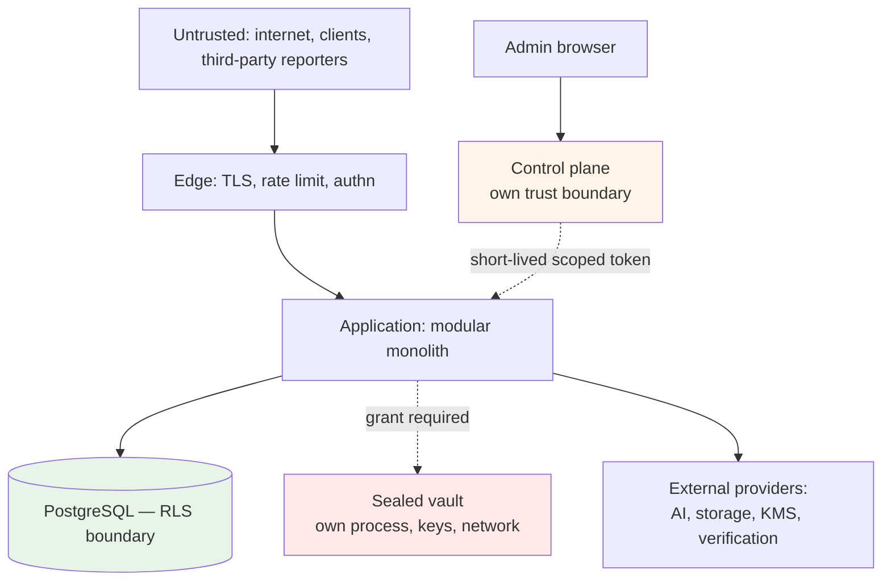

# Threat Model

**Status:** Phase 0 — design-stage model. **No system exists, no data is held, no penetration test has been performed.**
**Basis:** Karar's architecture as documented, plus 128 findings from the legacy audit of `MoayadAlobaidi/Qarar`.

---

## 1. Assets, ranked

| # | Asset | Why ranked here |
|---|---|---|
| 1 | **Sealed obligation payloads** | Confidential by promise, unreadable by Karar, irrecoverable if keys are lost |
| 2 | **Encryption keys (KEK/DEK)** | Compromise exposes everything; loss destroys sealed data permanently |
| 3 | **Customer financial data** | Transactions, balances, statements — the product's core sensitive holding |
| 4 | **Authentication credentials and sessions** | Gateway to 1 and 3 |
| 5 | **Administrative access** | Cross-tenant reach; production capability |
| 6 | **Consent and legal-acceptance records** | The legal basis for processing; evidentiary |
| 7 | **Audit records** | Establish what happened; must resist tampering |
| 8 | **Capability availability configuration** | Controls what is lawfully exposed where |

## 2. Trust boundaries

**Four boundaries that matter:** the edge, the database (RLS), the sealed vault, and the control plane. Each is designed so that compromise of the layer above does not automatically breach it.

## 3. Threats and controls

### T1 — Cross-tenant data access

**Vector:** a missing filter, a missing RLS policy, a forgotten tenant scope, or a `?tenantId=` parameter.

| Control | |
|---|---|
| RLS enabled **and** FORCEd on every table, or explicitly allow-listed with a reason | ADR-0022 |
| Application role has **no `BYPASSRLS`** | |
| `app.tenant_id` bound from the caller's record **inside** the transaction, never client input | |
| Architecture test 22 detects *no RLS*, *enabled-without-policy*, **and** *FORCEd-without-enabled* | |
| Adversarial cross-tenant tests **asserting non-empty expected data**, exercising SELECT, UPDATE, DELETE | |

**Legacy evidence:** 24 of 69 tables without RLS, 6 unexplained; `tenant_invitations` holding bearer codes with no RLS; isolation proved for 3 of 45 tables with UPDATE never exercised.

### T2 — Sealed data exposure

**Vector:** a projection, an event, a log line, an AI prompt, an admin endpoint, a support escalation, or a SQL-level mistake.

| Control | |
|---|---|
| `SealAccessGrant` is a **required, non-nullable argument** — compiler-enforced | ADR-0017 |
| RLS on `sealed_payloads` additionally requires a grant GUC | |
| `AiContext` input types **structurally cannot hold** sealed data | |
| No `SUPPORT`/`ADMIN`/`ANALYTICS`/`AI` grant type exists | |
| No admin role holds `amanat.content.read` at any level | |
| Event rule is mandatory with **no exemption mechanism** | ADR-0025 |
| Architecture tests 13, 14 | |
| **Every attempted access audited, successful or refused** | |

### T3 — Key compromise or key loss

**Loss is the under-weighted half**, and the legacy proves it: **ENC-2 — the production key "has already been lost once."**

| Control | |
|---|---|
| KMS-held KEKs, jurisdiction-scoped; per-record DEKs | |
| **KEK escrow under split control**, with a rehearsed, timed recovery drill | Phase 20 gate |
| **Sealed-integrity canary** — synthetic sealed record per KEK, known non-customer plaintext, decrypted on a schedule | Phase 20 gate |
| Rotation designed in from Phase 2, not retrofitted | |
| Startup refuses to boot without a key, or when existing data cannot be decrypted | |
| Separate keys per environment — **never reuse production's anywhere** | |

For sealed data, loss is **unrecoverable and undetectable**, discovered at the worst possible moment. The canary is the only mechanism that detects it without violating the seal.

### T4 — Authentication and session attacks

| Vector | Control |
|---|---|
| Credential stuffing, brute force | Lockout that **does not reset the counter on lock** (legacy AUTHN-11), distributed rate limiting |
| **Rate-limit bypass via client-supplied headers** | Client IP from a **configured trusted-proxy allow-list**. Legacy AUTHN-04, HIGH — assessed as total bypass |
| **Rate-limit bypass via path encoding** | Policy selected from the **normalised, decoded** path. Legacy API-01, HIGH — `/api/v1/ai/%63hat` |
| Token theft | Short-lived access tokens; rotating refresh; **server-side revocation for all sessions, admin first** (legacy AUTHN-07) |
| Stale authorization | Roles re-derived from the database per request — **carried forward from the legacy, which got this right** |
| Recovery-code brute force | Attempt counter and lock (legacy has neither) |
| Password reset flooding | Per-account cooldown |

### T5 — Privileged insider or compromised admin

| Control | |
|---|---|
| Control plane mints short-lived, single-environment, purpose-scoped tokens; **browser holds no environment credential** | ADR-0021 |
| Production gateway: reason capture, optional second approval, reauthentication, network restriction | |
| Admin data from **projections**, not domain tables | ADR-0020 |
| **Every staff read of a customer record audited, including reads returning nothing** | Legacy AZ5 |
| Append-only audit: revoked grants **and** a trigger raising on UPDATE/DELETE even for the owner | |
| **Restrict-only settings** — an operator cannot enable a capability code has not cleared | ADR-0015 |
| Sealed data unreachable at any privilege level | |

The restrict-only invariant is specifically an anti-insider control: **a compromised admin account cannot expose a capability where it has no legal basis.**

### T6 — AI-specific threats

| Vector | Control |
|---|---|
| Model states a wrong figure | **The model never writes a number** — ADR-0019 |
| Prompt injection via merchant narratives | Injection controls **built and executed**, not merely written (legacy AI-1, AI-9) |
| Sensitive data in prompts | Facts-only context; unconditional redaction of machine identifiers; sealed structurally excluded |
| Cross-border transfer without basis | `AIProcessingPolicy` typed clause; consent gate **fails closed** (legacy AI-5 fails open) |
| Bypassing controls via a direct provider call | One orchestrator; architecture test 10 (legacy AI-4) |
| Cost exhaustion | Per-user and per-tenant metering and caps; kill switch **tested**, not decorative |

### T7 — Ingestion and rendering resource exhaustion

| Vector | Control |
|---|---|
| Unbounded parsed rows | **Explicit row cap.** Legacy FILES-2, HIGH — a 10 MB CSV carrying ~1M rows into one transaction on a pool of 10 |
| Malicious PDF | Page, memory, and wall-clock ceilings; magic-byte validation (legacy FILES-3) |
| Rendering abuse | **No caller-supplied HTML**; explicit budgets. Legacy FILES-7 |
| Disclosure package generation | Same limits — a rendering path handling sealed data |

**Rule: every ingestion and rendering path declares explicit limits and rejects rather than degrades.** Architecture test 24.

### T8 — The published document contradicts the system

**The legacy's most consequential finding, and not a code defect.**

> **P1** — the AI notice stated merchant names and notes were redacted; they were not. *"The code is defensible; the consent text is wrong, and that text is the legal basis for a cross-border transfer of customer financial data."*

Related: **P4** (privacy policy promises in-app export; no screen calls it), **P12** (republication asks nobody to re-accept), **C4** (a compulsory document promises per-item deletion the code does not provide).

| Control | |
|---|---|
| Consent gates **fail closed** | |
| Republication triggers **re-consent evaluation**, material/non-material, **neither defaulted** | ADR-0024 |
| Capability promises reconcile with legal documents | Architecture test 26 |
| `MODULE.md` names the legal documents a capability's promises appear in | |

### T9 — Existence disclosure via the death-report endpoint

**Vector:** an unauthenticated third party files a death report and infers, from response content or timing, whether the subject had sealed records.

**Control:** identical responses **and identical timings** whether records exist or not, until authorization completes. Asserted by test, including timing equivalence. Rate limiting and abuse detection on reports.

**This is a privacy breach requiring no data release at all** — for a capability whose premise is confidentiality, the failure that matters most.

### T10 — Supply chain and secrets

| Control | |
|---|---|
| Dependency and secret scanning in CI, **blocking the merge, not just the run** | Legacy INFRA-07 |
| Flutter client built, analysed, and tested in CI | Legacy INFRA-10 — mobile is never checked |
| Secrets never in the repository, logs, or error messages | |
| Lockfiles committed; dependency updates reviewed | |

## 4. Accepted risks

Recorded with owners, per the legacy's missing risk-acceptance register (its worklist item M10).

| Risk | Rationale | Owner |
|---|---|---|
| **No certificate pinning in v1** | Challenge C11, retained from Plan v1. The legacy has none either | Platform |
| **Single AI provider at Phase 7** | Port exists; second provider is configuration | Platform |
| **In-process control plane before Phase 20** | Gateway contract in place; separate deployment is a hard production gate | Platform |
| **No penetration test until Phase 20** | No system exists to test | Platform |
| **Read-only offline cache with no mutation queue** | An offline financial mutation queue is a correctness hazard | Product |

## 5. What this model does not establish

| | |
|---|---|
| That Karar is secure | No system exists |
| That the controls work | None are implemented |
| Any regulatory position | No approval, licence, or certification is claimed |
| Residency risk | Open question — see `../architecture/data-residency.md` |

**An independent security assessment by a party that did not build the system is a Phase 20 gate**, and nothing produced in-house substitutes for it.
