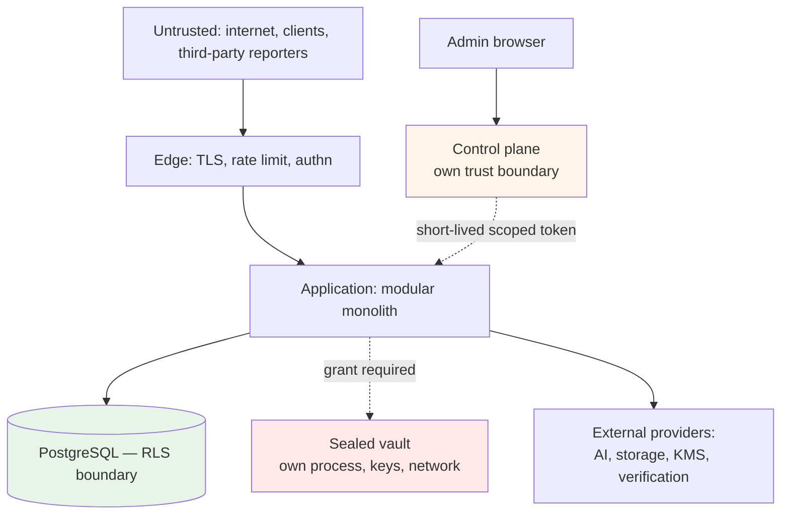

# Threat Model

**Status:** Design-stage model, extended per phase — **current through Phase 4 (IN PROGRESS); Phase 5 NOT STARTED.** **No system is deployed in any environment, no data is held, no capability is available anywhere, no signed mobile build exists, and no penetration test has been performed.** Sections 1–4 remain the Phase 0 design-stage model; the per-phase threat tables below are added as each phase's surface lands and describe mechanisms that exist in-repo with passing tests, never mechanisms in service. Phase 4 adds a device-side surface, where the distinction between "the mechanism exists" and "it was observed to work" is widest — the Phase 4 table below marks which of its controls have been exercised only statically or against a build artifact.
**Basis:** Karar's architecture as documented, plus 128 findings from the legacy audit of `MoayadAlobaidi/Qarar`.

---

## 1. Assets, ranked

| # | Asset | Why ranked here |
|---|---|---|
| 1 | **Sealed obligation payloads** | Confidential by promise, unreadable by Karar, irrecoverable if keys are lost |
| 2 | **Encryption keys (KEK/DEK)** | Compromise exposes everything; loss destroys sealed data permanently |
| 3 | **Customer financial data** | Transactions, balances, statements — the product's core sensitive holding |
| 4 | **Authentication credentials and sessions** | Gateway to 1 and 3 |
| 5 | **Administrative access** | Cross-tenant reach; production capability |
| 6 | **Consent and legal-acceptance records** | The legal basis for processing; evidentiary |
| 7 | **Audit records** | Establish what happened; must resist tampering |
| 8 | **Capability availability configuration** | Controls what is lawfully exposed where |

## 2. Trust boundaries

**Four boundaries that matter:** the edge, the database (RLS), the sealed vault, and the control plane. Each is designed so that compromise of the layer above does not automatically breach it.

## 3. Threats and controls

### T1 — Cross-tenant data access

**Vector:** a missing filter, a missing RLS policy, a forgotten tenant scope, or a `?tenantId=` parameter.

| Control | |
|---|---|
| RLS enabled **and** FORCEd on every table, or explicitly allow-listed with a reason | ADR-0022 |
| Application role has **no `BYPASSRLS`** | |
| `app.tenant_id` bound from the caller's record **inside** the transaction, never client input | |
| Architecture test 22 detects *no RLS*, *enabled-without-policy*, **and** *FORCEd-without-enabled* | |
| Adversarial cross-tenant tests **asserting non-empty expected data**, exercising SELECT, UPDATE, DELETE | |

**Legacy evidence:** 24 of 69 tables without RLS, 6 unexplained; `tenant_invitations` holding bearer codes with no RLS; isolation proved for 3 of 45 tables with UPDATE never exercised.

### T2 — Sealed data exposure

**Vector:** a projection, an event, a log line, an AI prompt, an admin endpoint, a support escalation, or a SQL-level mistake.

| Control | |
|---|---|
| `SealAccessGrant` is a **required, non-nullable argument** — compiler-enforced | ADR-0017 |
| RLS on `sealed_payloads` additionally requires a grant GUC | |
| `AiContext` input types **structurally cannot hold** sealed data | |
| No `SUPPORT`/`ADMIN`/`ANALYTICS`/`AI` grant type exists | |
| No admin role holds `amanat.content.read` at any level | |
| Event rule is mandatory with **no exemption mechanism** | ADR-0025 |
| Architecture tests 13, 14 | |
| **Every attempted access audited, successful or refused** | |

### T3 — Key compromise or key loss

**Loss is the under-weighted half**, and the legacy proves it: **ENC-2 — the production key "has already been lost once."**

| Control | |
|---|---|
| KMS-held KEKs, jurisdiction-scoped; per-record DEKs | |
| **Approved `KeyCustodyStrategy`** (ADR-0017) — recovery/continuity tested; drill rehearsed where technically applicable | Phase 20 gate |
| **Sealed-integrity canary** — synthetic sealed record per KEK, known non-customer plaintext, decrypted on a schedule | Phase 20 gate |
| Rotation designed in from Phase 2, not retrofitted | |
| Startup refuses to boot without a key, or when existing data cannot be decrypted | |
| Separate keys per environment — **never reuse production's anywhere** | |

For sealed data, loss is **unrecoverable and undetectable**, discovered at the worst possible moment. The canary is the only mechanism that detects it without violating the seal.

### T4 — Authentication and session attacks

| Vector | Control |
|---|---|
| Credential stuffing, brute force | Lockout that **does not reset the counter on lock** (legacy AUTHN-11), distributed rate limiting |
| **Rate-limit bypass via client-supplied headers** | Client IP from a **configured trusted-proxy allow-list**. Legacy AUTHN-04, HIGH — assessed as total bypass |
| **Rate-limit bypass via path encoding** | Policy selected from the **normalised, decoded** path. Legacy API-01, HIGH — `/api/v1/ai/%63hat` |
| Token theft | Short-lived access tokens; rotating refresh; **server-side revocation for all sessions, admin first** (legacy AUTHN-07) |
| Stale authorization | Roles re-derived from the database per request — **carried forward from the legacy, which got this right** |
| Recovery-code brute force | Attempt counter and lock (legacy has neither) |
| Password reset flooding | Per-account cooldown |

### T5 — Privileged insider or compromised admin

| Control | |
|---|---|
| Control plane mints short-lived, single-environment, purpose-scoped tokens; **browser holds no environment credential** | ADR-0021 |
| Production gateway: reason capture, optional second approval, reauthentication, network restriction | |
| Admin data from **projections**, not domain tables | ADR-0020 |
| **Every staff read of a customer record audited, including reads returning nothing** | Legacy AZ5 |
| Append-only audit: revoked grants **and** a trigger raising on UPDATE/DELETE even for the owner | |
| **Restrict-only settings** — an operator cannot enable a capability code has not cleared | ADR-0015 |
| Sealed data unreachable at any privilege level | |

The restrict-only invariant is specifically an anti-insider control: **a compromised admin account cannot expose a capability where it has no legal basis.**

### T6 — AI-specific threats

| Vector | Control |
|---|---|
| Model states a wrong figure | **The model never writes a number** — ADR-0019 |
| Prompt injection via merchant narratives | Injection controls **built and executed**, not merely written (legacy AI-1, AI-9) |
| Sensitive data in prompts | Facts-only context; unconditional redaction of machine identifiers; sealed structurally excluded |
| Cross-border transfer without basis | `AIProcessingPolicy` typed clause; consent gate **fails closed** (legacy AI-5 fails open) |
| Bypassing controls via a direct provider call | One orchestrator; architecture test 10 (legacy AI-4) |
| Cost exhaustion | Per-user and per-tenant metering and caps; kill switch **tested**, not decorative |

### T7 — Ingestion and rendering resource exhaustion

| Vector | Control |
|---|---|
| Unbounded parsed rows | **Explicit row cap.** Legacy FILES-2, HIGH — a 10 MB CSV carrying ~1M rows into one transaction on a pool of 10 |
| Malicious PDF | Page, memory, and wall-clock ceilings; magic-byte validation (legacy FILES-3) |
| Rendering abuse | **No caller-supplied HTML**; explicit budgets. Legacy FILES-7 |
| Disclosure package generation | Same limits — a rendering path handling sealed data |

**Rule: every ingestion and rendering path declares explicit limits and rejects rather than degrades.** Architecture test 24.

### T8 — The published document contradicts the system

**The legacy's most consequential finding, and not a code defect.**

> **P1** — the AI notice stated merchant names and notes were redacted; they were not. *"The code is defensible; the consent text is wrong, and that text is the legal basis for a cross-border transfer of customer financial data."*

Related: **P4** (privacy policy promises in-app export; no screen calls it), **P12** (republication asks nobody to re-accept), **C4** (a compulsory document promises per-item deletion the code does not provide).

| Control | |
|---|---|
| Consent gates **fail closed** | |
| Republication triggers **re-consent evaluation**, material/non-material, **neither defaulted** | ADR-0024 |
| Capability promises reconcile with legal documents | Architecture test 26 |
| `MODULE.md` names the legal documents a capability's promises appear in | |

### T9 — Existence disclosure via the death-report endpoint

**Vector:** an unauthenticated third party files a death report and infers, from response content or timing, whether the subject had sealed records.

**Control:** identical responses **and identical timings** whether records exist or not, until authorization completes. Asserted by test, including timing equivalence. Rate limiting and abuse detection on reports.

**This is a privacy breach requiring no data release at all** — for a capability whose premise is confidentiality, the failure that matters most.

### T10 — Supply chain and secrets

| Control | |
|---|---|
| Dependency and secret scanning in CI, **blocking the merge, not just the run** | Legacy INFRA-07 |
| Flutter client built, analysed, and tested in CI | Legacy INFRA-10 — mobile is never checked |
| Secrets never in the repository, logs, or error messages | |
| Lockfiles committed; dependency updates reviewed | |

## Phase 2 platform threats

Threats introduced by the Phase 2 platform foundation (configuration, database
roles and migrations, events/outbox/jobs, audit, observability, key-custody
design), mapped to their controls. Evidence refs `EV-201..EV-213` are
placeholders the compliance workstream registers in the evidence index; test
paths under `packages/platform/src/outbox` and `packages/platform/src/jobs`
are workstream D's, named here by agreed location.

| Threat | Preventive control | Detective control | Test reference | Evidence | Residual risk | Owner |
|---|---|---|---|---|---|---|
| Migration abuse (elevated DDL, edited history) | Runner connects as `karar_migrator`, never superuser; forward-only; every file needs a `-- rollback:` block | sha256 checksum drift and missing/renamed applied files hard-fail `migrate` and `verify` | `packages/platform/src/db/contract.test.ts` | EV-201 | A hostile migration inside the range still runs with migrator rights; review is the control | Platform |
| Excess DB privilege | Grant convention: per-table minimal DML; no `GRANT ALL`, no PUBLIC, DDL only via migrator; roles carry no SUPER/BYPASSRLS/CREATEDB/CREATEROLE | Contract tests probe denials (42501) and role attributes live | `packages/platform/src/db/contract.test.ts` | EV-202 | Convention enforced by review + tests until an automated grant linter exists | Platform |
| Event loss / duplication | Transactional outbox: state and event commit in one transaction; at-least-once with idempotent consumers keyed on event id | Outbox lag/backlog metrics; relay retry accounting | `packages/platform/src/outbox` tests (D) | EV-203 | At-least-once means duplicates by design; a non-idempotent consumer is a defect class tests must catch per consumer | Platform |
| Poisoned event payload | Catalogue payload rules by classification (tests 8/15); `assertEventPayloadAllowed` at call sites; consumers validate against catalogue schema | CI catalogue checks; dead-lettering of unparseable events alerts | `scripts/checks/architecture.mjs#checkEventCatalogue`; `packages/platform/src/classification/classification.test.ts` | EV-204 | Semantic poisoning inside a valid shape remains; schema versioning discipline is the mitigation | Platform |
| Job replay / double execution | Jobs are idempotent with caller-supplied keys; single-claim leasing in the job store | Job run outcomes recorded; duplicate-claim metrics | `packages/platform/src/jobs` tests (D) | EV-205 | Crash between side effect and completion mark still replays; handlers must tolerate it | Platform |
| Dead-letter leakage | DLQ rows carry envelope + classification-redacted payload per catalogue rules; access via `SECURITY` review only | Dead-lettered events alert; DLQ depth monitored | `packages/platform/src/outbox` DLQ tests (D) | EV-206 | A payload legitimately carried under exemption sits in the DLQ for its retention; retention policy bounds exposure | Platform |
| Audit tampering | Append-only twice over: `karar_app` holds INSERT+SELECT only, and `audit_events_immutable` raises on UPDATE/DELETE/TRUNCATE even for the owner | Live denial tests both paths (42501 and P0001); audit gaps surface as `Result.err`, never swallowed | `modules/audit/__tests__/audit-append-only.integration.test.ts` | EV-207 | A superuser at the cluster level can drop the trigger; cluster access control and (later) off-host audit shipping bound it | Platform |
| Log leakage of classified data | Classification module is the one redaction vocabulary: `isLoggable` false for SECRET/SEALED, `[redacted:*]` markers; logger consumes it; audit metadata guard rejects/redacts | SEALED-at-log-site warn-once signal; test 13 deepens the static scan at Phase 13 | `packages/platform/src/classification/classification.test.ts`; `packages/platform/src/observability/logger.test.ts` | EV-208 | Free-text log messages can still embed data manually; review + future static scan cover that path | Platform |
| Config / secret leakage | `SecretValue` opaque holder (redacted on inspect/JSON); refs (`karar-ref:*`) instead of provider resource names; no direct env access outside config | `no-direct-env-access` test; profile-secrecy tests assert nothing prints | `packages/platform/src/config/config.test.ts`; `packages/platform/src/db/contract.test.ts` | EV-209 | Process-level compromise reads memory regardless; scope is leak-via-logs/serialization | Platform |
| Clock manipulation | Domain time arrives via `Clock` port only (test 11 bans ambient reads); audit rows carry caller `occurred_at` plus DB-defaulted `recorded_at` as an independent witness | Skew between occurred_at and recorded_at is queryable; monitoring hooks at Phase 3+ | `scripts/checks/architecture.mjs#checkDeterministicDomain`; `modules/audit/__tests__/audit-append-only.integration.test.ts` | EV-210 | Host NTP compromise moves both clocks; infrastructure hardening owns that layer | Platform |
| Key-version loss | Provenance is structural: every encrypt/wrap result carries `KeyVersionRef`; rotation keeps prior versions decryptable; destruction safeguards in `KeyRotationPolicy` | Sealed-integrity canary decrypts on schedule and alerts (Phase 13 operational; contract pinned now) | `packages/platform/src/keys/keys.test.ts` | EV-211 | Until the canary runs in production, loss detection is test-time only — accepted with the Phase 13/20 gates | Platform |
| Unbounded queues | Bounded retry with backoff then dead-letter; job and outbox backlogs capped/paged, never unbounded scans | Backlog depth + DLQ alerts; queue-age metrics | `packages/platform/src/outbox` / `packages/platform/src/jobs` tests (D) | EV-212 | A poison generator can still fill the DLQ inside limits; alerting is the mitigation | Platform |
| Portability drift (provider lock-in) | One `PostgresPersistenceAdapter`; profiles vary, adapter does not; refs never resource names; no cloud SDK outside `infrastructure/providers` (test 10) | Architecture test 10 scans every build; fresh-database-from-zero contract test | `scripts/checks/architecture.mjs#checkProviderBoundary`; `packages/platform/src/db/contract.test.ts` | EV-213 | SQL dialect creep inside migrations is not machine-checked; README convention + review own it | Platform |

## Phase 3 identity, tenancy, and access-control threats

Threats introduced by the Phase 3 surface (registration, login and lockout,
sessions with rotating refresh tokens, MFA foundation, invitations, RBAC and
the PolicyService, operating entities, consent, kill switches, RLS with
transaction-local principal context), mapped to their controls. Evidence refs
`EV-301..EV-313` are placeholders the compliance workstream registers in the
evidence index. Test paths name the suites that exist on this branch; none of
this section claims a control is operating in any deployed environment —
Phase 3 has no deployment.

| Threat | Preventive control | Detective control | Test reference | Evidence | Residual risk | Owner |
|---|---|---|---|---|---|---|
| Credential stuffing / brute force at login | Lockout derived by COUNT over the append-only `authentication_security_events` ledger per (account, IP digest) — engaging the lock writes an event and erases nothing, so the counter cannot reset on lock (legacy AUTHN-11); distributed per-key rate limits in front of every pre-auth entry point; argon2id via `modules/identity/infrastructure/crypto/argon2-password-hasher.ts` | Ledger rows for `login_failed`/`login_locked` are queryable evidence; generic responses deny enumeration signal | `modules/identity/__tests__/login-lockout.integration.test.ts` | EV-301 | Rate limits fail open to a documented in-process fallback if the distributed limiter is down; lockout is per (account, IP digest), so a wide botnet rotating addresses degrades to the per-account distributed limit | Identity |
| Account enumeration via pre-auth flows | Same generic error for unknown address, wrong password, and disabled account; verification/reset codes stored as HMAC digests with attempt caps and cooldowns | Pre-auth mutations recorded to `authentication_security_events` and audited | `modules/identity/__tests__/login-lockout.integration.test.ts`, `registration-verification.integration.test.ts`, `password-recovery.integration.test.ts` | EV-302 | Timing differences between code paths are not asserted in Phase 3 (response-content equivalence is); timing assertions arrive with the death-report discipline (T9) | Identity |
| Refresh-token theft and replay | One-time rotation is atomic in SQL (`UPDATE … WHERE used_at IS NULL … RETURNING`, migration 0031); reuse of a rotated token revokes the family AND its session and records `refresh_reuse_detected`; tokens at rest are SHA-256 of 32-byte randoms | Reuse detection notifies the account and lands in the security-event ledger | `modules/identity/__tests__/sessions-refresh.integration.test.ts` (including the concurrent-presentation test) | EV-303 | A stolen not-yet-used token is valid until rotation or expiry; detection fires on the SECOND presentation, not the first | Identity |
| Session fixation / stale authority | Server-side session rows, revocable individually and in bulk; `token_version` on the account rejects stale access tokens after password change, disable, or global revocation; roles re-derived from the database per request | Session lifecycle recorded; revocations audited | `modules/identity/__tests__/sessions-refresh.integration.test.ts` | EV-304 | None beyond store availability at composition: every mounted request path re-authenticates server-side per request (`AuthenticateRequest` re-checks account status, `token_version`, and session liveness — through `AccessTokenGuard` on identity routes and the enrichment guard everywhere else), so a bumped version or revoked session takes effect on the next request, not at token expiry | Identity |
| MFA secret exposure | TOTP secrets encrypted at rest through the platform `EncryptionProvider` with `KeyVersionRef` provenance (ADR-0017, migration 0032); plaintext exists only in the enrol response and inside one verification; recovery codes stored as SHA-256 hashes, one-time, attempt-limited | Secret-leak regression suite asserts secrets never serialize outward | `modules/identity/__tests__/mfa.integration.test.ts`, `secret-leak-regression.integration.test.ts` | EV-305 | Local development runs `LocalDevEncryptionProvider` (AES-GCM under a dev key) — acceptable only because it refuses to construct outside `KARAR_ENV=local`; real KMS custody is a later-phase deliverable | Identity |
| Invitation abuse (bearer-token theft, cross-tenant redemption, enumeration) | Only sha256(token) at rest (migration 0043); redemption binds the presented token's hash into a transaction-local GUC exposing exactly ONE row (migration 0044 — no elevation, the RLS-04 lesson); membership INSERT is database-bound to the authenticated redeemer; attempt caps kill guessing per invitation | Redemption failures counted on the row; invitation lifecycle audited | `modules/tenancy/__tests__/invitation-redemption.integration.test.ts`, `tenancy-isolation.integration.test.ts` | EV-306 | The raw token is a bearer capability while in flight (email transport is out of scope in Phase 3 — the local mail sink never sends); the invited-email match happens in the use case, not the database | Tenancy |
| Cross-tenant data access via a missing filter or forged tenant claim | RLS ENABLE + FORCE on every tenant-scoped table with per-command policies reading GUCs via `NULLIF(current_setting(…, true), '')` — unset fails closed; `withPrincipalContext` (`packages/platform/src/db/principal-context.ts`) binds GUCs transaction-locally from server-side records, never client input, and throws before any query on missing keys; architecture tests 9/22 (`checkTenantScoping`, `checkRlsCoverage`) block the merge on unscoped query paths and uncovered tables | Adversarial suites assert on NON-EMPTY data first, then SELECT/UPDATE/DELETE denials, wrong and missing GUCs, FORCE-vs-owner, and pooled-connection hygiene | `tests/security/__tests__/cross-tenant-isolation.integration.test.ts`; per-module isolation suites; `scripts/checks/architecture.mjs` | EV-307 | RLS is per-row, not per-column; a policy bug inside one tenant's rows is invisible to cross-tenant tests (the same-tenant self-write probes cover part); allow-listed global tables rely on compensating grants, recorded per table in `packages/platform/db/rls-allow-list.json` | Platform |
| Pooled-connection principal leakage | GUCs are bound with `set_config(…, is_local => true)` (SET LOCAL semantics) inside one transaction, and absent optional keys are bound to `''` to shadow stale session values; architecture test 9 fails any session-scoped bind (`set_config(…, false)`, `SET app.*`) | Hygiene probes issue a context-free query on the SAME pool after tenant work and assert empty GUCs and zero visible rows | `tests/security/__tests__/cross-tenant-isolation.integration.test.ts` (adapter and Prisma pools) | EV-308 | A driver or pooler that replays session state outside the platform adapter would bypass the discipline; only the two sanctioned pools exist in Phase 3 | Platform |
| RBAC privilege escalation and delegation abuse | Deny-by-default against a closed, migration-seeded catalogue (no wildcards, structurally — CHECK grammar in migration 0050); `authorization.role.assign` is PLATFORM_ADMIN-only with the peer-delegation rule enforced in the AssignRole use case; assignment writes are RLS-bound to the transaction's target principal (migration 0052), so a compromised path cannot scatter grants across users; revoked assignments immutable by trigger even for the owner | Grants and revocations audited with actor and reason; catalogue drift blocked by the DB-seed == code-catalogue test | `modules/authorization/__tests__/authorization.integration.test.ts`, `role-use-cases.test.ts`; `tests/security/__tests__/privilege-abuse.integration.test.ts` | EV-309 | No HTTP surface for role administration exists in Phase 3, so abuse requires code execution — and equally, no operator can grant or revoke over HTTP until the control plane arrives; a tenant-scope/role-scope mismatch smuggled past the use case never authorizes cross-scope (resolver applies scope at read time) but is not database-rejected | Authorization |
| Kill-switch abuse (operational denial or unauthorized restriction) | Restrict-only by construction: a switch can only DENY an operation, never enable one; closed id registry (CHECK, no INSERT grant); every UPDATE must increment `version` by exactly one and auto-appends the append-only history ledger via a SECURITY DEFINER trigger (migration 0053); operate is gated on `controlplane.killswitch.operate` through the PolicyService and audited | History ledger is the tamper-evident record of every state that ever held; store outage on guarded reads fails CLOSED (503), never silently open | `modules/control-plane/__tests__/kill-switch.integration.test.ts`; `tests/security/__tests__/privilege-abuse.integration.test.ts` | EV-310 | Guards are mounted: registration/login/refresh carry identity's `RequireOperationAllowed` and invitation issue/redeem carry tenancy's, both consumer-declared gates bound to the one `CheckKillSwitch` (`modules/identity/__tests__/kill-switch-mounts.test.ts`, the restriction case in `modules/tenancy/__tests__/tenancy.controller.test.ts`, and the composed 503 problem-document proof in `apps/api/src/errors/error-boundary.composed.test.ts`); remaining residuals: no kill-switch HTTP operate surface exists this phase (runbooks call the use case), and denial visibility depends on the api's error boundary translating the guard exception (pinned by the composed test) | Control plane |
| Consent evidence tampering or unclassified republication | Grants are immutable evidence: pinned entity/jurisdiction/version columns never move, transitions limited by trigger to ACTIVE→WITHDRAWN and ACTIVE→SUPERSEDED, no DELETE grant (migration 0065); publication is impossible without a reviewed classification (CHECK constraints in migration 0064 — no default, either way); published versions immutable even for the owner; re-consent evaluation is a recorded decision per version and purpose, never a default | Consent status resolution reads the immutable rows; architecture test 21 (`checkPinning`) blocks the merge on missing pins | `modules/consent/__tests__/consent.integration.test.ts`; `tests/security/__tests__/privilege-abuse.integration.test.ts` | EV-311 | **Resolved and re-stated at the Phase 3.5 close:** the PolicyPack-version and SubjectPolicySelection pins landed as migration `0086`, and architecture test 21 now enforces them rather than gating on their arrival (KAR-CTL-084). The *mechanism* for "which purposes legally require consent per jurisdiction" also landed — but **no pack decides any of it**: `qa/v1` carries every consent and processing-basis slot as an explicit `PENDING_LEGAL_REVIEW`, so the basis-reference table **still fails closed**. A further consequence, recorded rather than smoothed over: **`POST /consent/acceptances` now answers 503 `DEPENDENCY_UNAVAILABLE` for every caller, including in `local`** — a valid grant must pin jurisdiction, active pack version, operating entity, and legal-document version, and no runtime write path exists for the jurisdiction assignment or the pack activation. Refusing is correct (a grant whose provenance nobody resolved must not be written, and the schema refuses it independently), but consent acceptance is **unreachable**, not merely gated. Phase 4 owns restoring it | Consent |
| Privileged insider with database credentials | `karar_app` holds NOBYPASSRLS and minimal per-table DML (no DELETE on evidence tables, SELECT-only on catalogues, pinned by explicit REVOKEs in 0034/0054); `karar_migrator` owns the schema but FORCE keeps it inside RLS policies, and append-only/immutability triggers raise even for the owner; `SET ROLE`, DDL in `public`, trigger disabling, and `session_replication_role` all refuse for the app role | Live probes of `pg_roles` attributes and denial paths in the adversarial suites | `tests/security/__tests__/privilege-abuse.integration.test.ts`; `packages/platform/src/db/contract.test.ts` | EV-312 | A cluster superuser can drop any trigger — compose-local only in Phase 3; cluster access control and off-host audit shipping are later-phase controls (same residual as the Phase 2 audit row) | Platform |
| Silent capability loss outside local (mail, encryption) | Fail-closed constructors: `LocalDevEncryptionProvider` (`packages/platform/src/keys/local-dev-encryption-provider.ts`) and `LocalMailSink` (`packages/platform/src/notifications/local-mail-sink.ts`) THROW outside `KARAR_ENV=local`, so a non-local deployment cannot silently swallow customer mail or encrypt under a dev key | Boot fails loudly; nothing to detect at runtime because construction refuses | `packages/platform/src/keys/keys.test.ts`, `packages/platform/src/notifications/local-mail-sink.test.ts` | EV-313 | The flip side is availability: no real mail or KMS provider exists yet, so identity flows that need them cannot run outside local until those providers land | Platform |

Phase 3 permissions deliberately absent, restated here because absence is the
control: `identity.account.disable` / `identity.account.enable` are documented
in `modules/identity/MODULE.md` but have **no invoking surface and are NOT
seeded** in migration 0050 — deny-by-default means their absence denies; they
arrive by forward migration together with the surface that calls them. No
permission returns credential material; no role holds a cross-tenant consumer
read; `amanat.content.read` does not exist for any role.

Tenant-binding residual **as it stood in Phase 3, and how Phase 3.5 changed
it** — kept here because the Phase 3 posture explains why the Phase 3.5
mechanism is shaped the way it is. Through Phase 3, sessions were issued with
`tenant_binding = null` and no binding mechanism existed, so every
tenant-bound endpoint answered 401 for every caller: fail-closed was the point
(an unbound session could reach nothing tenant-scoped), but the surface was
dormant rather than merely guarded, and that dormancy was carried as
KAR-RSK-021.

**Phase 3.5 delivered the binding mechanism and KAR-RSK-021 is CLOSED**
(confirmed at the Phase 3.5 gate). A session's tenant binding now moves
null → value only from a **server-side membership read, never from the
request**; membership is re-verified at bind time; a switch atomically revokes
the old session **and its refresh family** before issuing the new bound one.
The tenant-bound surface is therefore **live and guarded, no longer dormant**
— reachable once a session carries a binding, with no route contract changed
to make that true. The residual the mechanism does **not** remove is that
**RLS cannot re-check membership**: once a transaction binds `app.tenant_id`
from a session row, it sees that tenant's rows for the life of the
transaction, so the window between a membership revocation and the next
resolution is real. It is bounded by re-verification on every bootstrap read
and by revocation on detection, not by the database, and it is carried as its
own risk, KAR-RSK-030, rather than folded into the closure. See the
Phase 3.5 rows below and KAR-CTL-091.

## Phase 3.5 jurisdiction, capability, and tenant-binding threats

Threats introduced by the Phase 3.5 surface (country and jurisdiction
reference data, user and tenant jurisdiction assignments with verification
states, typed PolicyPacks with a lifecycle and an activation ledger,
restrict-only jurisdiction settings, the compile-time capability registry with
deny-by-default availability resolution, tenant capability entitlements,
subject policy selections, session tenant binding and switching, and the
authenticated bootstrap surface), mapped to their controls. Evidence refs
`EV-401..EV-414` were placeholders at drafting and are now **defined rows in
the [evidence register](../compliance/evidence-register.md)**, one per threat
row below, all `COLLECTED`. Test paths name suites that exist on this branch;
none of this section claims a control is operating in any deployed
environment — **Phase 3.5 is COMPLETE and has no deployment, no capability in
the registry is built, and no capability resolves available anywhere.**

| Threat | Preventive control | Detective control | Test reference | Evidence | Residual risk | Owner |
|---|---|---|---|---|---|---|
| Jurisdiction assignment forged, or an unverified assignment treated as verified | Assignment rows carry source and verification as separate typed axes (migration 0072/0073); resolution exposes the verification state rather than collapsing it, so a capability that requires verification fails closed on `UNVERIFIED` and on `NONE`; assignments are end-only history — a guard trigger refuses edits and deletes even for the owner; user assignments are RLS ENABLED+FORCEd on both principal GUCs | Supersede-on-assign leaves the prior row readable; every assignment and ending is audited | `modules/jurisdiction/__tests__/jurisdiction.integration.test.ts`; `modules/jurisdiction/__tests__/jurisdiction-domain.test.ts` | EV-401 | Verification is a recorded claim, not an executed check — no identity-verification provider exists this phase, so `VERIFIED` means an operator asserted it; the strength of the assertion is a Phase 8 control-plane question | Jurisdiction |
| A `DRAFT` or unapproved PolicyPack becomes operative outside a local environment | Activation runs a pure predicate before any write (`packages/jurisdiction-policy/src/lifecycle.ts`): a pack that is not `APPROVED`, or claims `APPROVED` with no approval reference, activates only in `local`; the activation use case validates the pack structurally first and refuses on any finding (`modules/jurisdiction/application/use-cases/pack-activation.ts`); the ledger stores activation METADATA only, so no database write can alter what a pack says | Every activation and retirement is audited; denials leave the ledger at zero rows | `modules/jurisdiction/__tests__/jurisdiction.integration.test.ts` (§46 matrix); `packages/jurisdiction-policy/src/lifecycle.test.ts` | EV-402 | The environment the predicate reads is the process's own configuration; a deployment mislabelled `local` would defeat it, which is why environment identity is a boot-time typed value (`packages/platform/src/config`) rather than a request input | Jurisdiction |
| Pack activation ledger tampered to fabricate which version was in force | Append-only by BOTH mechanisms (data-model.md §10): `karar_app` holds SELECT+INSERT only, and the immutability trigger raises on UPDATE/DELETE/TRUNCATE even for the table owner, FOR EACH STATEMENT so a zero-row update raises too (migration 0075); writes are reachable only through the permission-gated use cases | The ledger is the tamper-evident record; history is queryable per (jurisdiction, environment) | `modules/jurisdiction/__tests__/jurisdiction.integration.test.ts`; `tests/security/__tests__/phase-3-5-policy-surface.integration.test.ts` | EV-403 | A cluster superuser can drop the trigger — the same residual as every append-only table (T5, EV-207, EV-312); off-host shipping of the ledger is a later-phase control | Jurisdiction |
| Runtime settings used to EXPAND a jurisdiction's ceiling rather than restrict it | The control is the SHAPE, not a rule: `jurisdiction_settings` has no column that can express an enablement — every column narrows what the code pack permits (disable list, AI suspension), an absent row restricts nothing, and the resolver's merge is subtractive (migration 0074); `karar_app` is SELECT-only on the table this phase, so the write path is a reviewed migration | Restrict-only is asserted as a property over randomized inputs, not by example | `modules/capability/__tests__/restrict-only.property.test.ts`; `modules/jurisdiction/__tests__/jurisdiction.integration.test.ts`; `tests/security/__tests__/phase-3-5-policy-surface.integration.test.ts` | EV-404 | The shape argument holds only while the table keeps that shape; a future column with enabling semantics would defeat it silently, so the settings table is named explicitly in the Phase 8 review that opens its write path | Jurisdiction |
| Configuration used to make unimplemented or undeployed code available | The first resolution gate reads the compile-time descriptor ONLY: `implementation === 'IMPLEMENTED'` and `deployment[env] === 'DEPLOYED'` are required before any row, pack, or entitlement is consulted (`modules/capability/application/use-cases/resolve-capability-availability.ts`), and the registry is a closed union changed by reviewed code, never configuration; the operator use case refuses an allowing state for a `NOT_IMPLEMENTED` capability and audits the attempt as `DENIED` | Attempted expansion above the ceiling is audited as a denial rather than ignored | `modules/capability/__tests__/resolver.test.ts`; `modules/capability/__tests__/manage.test.ts`; `tests/security/__tests__/phase-3-5-policy-surface.integration.test.ts` | EV-405 | Every production capability is `NOT_IMPLEMENTED` this phase, so gate 1 denies everything and the later gates are exercised only against synthetic registries; the gates' behaviour on a genuinely built capability is proven by construction and by test, not by production traffic | Capability |
| An absent or ambiguous configuration row read as permission | Deny-by-default at every gate: a missing availability row is `DISABLED`, a missing entitlement denies, a missing processing basis denies, an unresolved option set denies, and a store outage denies rather than defaulting; a jurisdiction-specific row takes precedence over an environment-wide one, so the narrower record cannot be widened by the broader one | Denial reasons are typed and distinguishable in audit; the resolver never returns an untyped allow | `modules/capability/__tests__/resolver.test.ts`; `modules/capability/__tests__/capability.integration.test.ts` | EV-406 | Deny-by-default converts a configuration outage into unavailability; the operational consequence (a capability silently off) is a monitoring question the later phases own | Capability |
| Entitlement forged, read after revocation, or its expiry window manipulated | `tenant_capability_entitlements` is RLS ENABLED+FORCEd on the tenant GUC with an append-only history ledger (migration 0077); revocation is a status, never a deleted row; every UPDATE must increment `version` by exactly one; the resolver validates the window temporally at read time rather than trusting a stored status, so a lapsed window denies even while the row still says `ACTIVE` | History ledger records every state the entitlement ever held; grants and revocations are audited | `modules/capability/__tests__/capability.integration.test.ts`; `modules/capability/__tests__/resolver.test.ts`; `tests/security/__tests__/phase-3-5-policy-surface.integration.test.ts` | EV-407 | Temporal validation depends on the caller's clock reaching the use case as an injected instant; a wrong host clock moves every window together (the same residual as T3's clock note) | Capability |
| A hidden capability or a non-actionable denial reason reaches a client | Client output is a separate projection, not a filtered internal result: a `HIDDEN` capability is omitted in EVERY state including a fabricated `ALLOWED`, and only four denial reasons are ever surfaceable — legal, jurisdictional, entity, licence, and provider grounds are omitted entirely rather than rendered as `available: false` (`modules/capability/domain/client-view.ts`); the bootstrap serializer emits only declared safe fields and passes capability output through unenriched | Leak-regression suites assert the serialized document contains none of the forbidden values anywhere, including a hostile port attaching extra fields at the edge | `modules/capability/__tests__/client-view.test.ts`; `modules/bootstrap/__tests__/leak-regression.test.ts`; `tests/security/__tests__/phase-3-5-policy-surface.integration.test.ts` | EV-408 | Omission hides the reason, not the fact that a request took a different path; response-timing equivalence for hidden capabilities is not asserted this phase (the T9 discipline, deferred with it) | Capability |
| Subject policy selection read or written across subject or tenant boundaries | `subject_policy_selections` is RLS ENABLED+FORCEd on BOTH principal GUCs (migration 0083), so a same-tenant different-user read returns nothing and a forged-identity INSERT is refused by `WITH CHECK`; selections are immutable evidence with trigger-bounded transitions, and re-election inserts a new row rather than editing one | Cross-principal reads return zero rows and cross-principal writes raise; audits carry references and pins only, never option content | `modules/subject-policy/__tests__/subject-policy.integration.test.ts`; `tests/security/__tests__/phase-3-5-policy-surface.integration.test.ts` | EV-409 | Option CONTENT lives in the owning capability's bounded context; this table's isolation says nothing about that content's own protection, which arrives with the capability that owns it | Subject policy |
| A selection recorded outside the pack's permitted set, or replayed after expiry | The pack bounds the electable set and a selection can never expand it: recording validates the option against the pack-permitted set and refuses `OPTION_NOT_PERMITTED`, an unresolved option set fails closed, and a pack version that changes between validation and pin is detected as `PACK_VERSION_MISMATCH` with nothing written; reads validate the window temporally rather than trusting the stored status, so an expired selection denies | The race is detected at pin time and at resolution time, each with its own typed outcome | `modules/subject-policy/__tests__/subject-policy.test.ts`; `modules/subject-policy/__tests__/subject-policy.integration.test.ts` | EV-410 | The permitted set is only as narrow as the pack that declares it; `qa/v1` declares none, so every positive path is exercised against synthetic packs | Subject policy |
| A session bound to a tenant the principal is not a member of | Binding is null → value only and comes from a server-side membership read, never from the request (`modules/identity/application/use-cases/session-tenant-binding.ts`, `modules/tenancy/application/use-cases/switch-tenant.ts`); membership is re-verified at bind time, and a switch atomically revokes the old session AND its refresh family before issuing the new bound session; arbitrary, revoked, expired-window, and disabled-tenant targets are denied uniformly without reaching the rebind seam | Every denial is audited; the concurrent-revocation race revokes the replacement session rather than leaving it bound | `modules/identity/__tests__/session-tenant-binding.integration.test.ts`; `modules/tenancy/__tests__/tenant-context.integration.test.ts`; `modules/bootstrap/__tests__/bootstrap-binding.integration.test.ts` | EV-411 | The binding is trusted by RLS for the life of the transaction that reads it; the membership check is at bind time and at resolution time, not at every statement | Tenancy |
| A bound session outliving the membership that justified it | Resolution re-verifies membership on every bootstrap read and revokes the session when it has gone (`modules/bootstrap/application/use-cases/get-bootstrap.ts`), and a bound session whose tenant is no longer a usable choice reports the need to reselect rather than a working tenant; membership removal is a status transition the roster policy reads, not a deleted row | The adversarial suite proves the raw data-reach fact directly: what a still-bound context can read after revocation, and what the platform does about it | `modules/bootstrap/__tests__/bootstrap-use-cases.test.ts`; `tests/security/__tests__/phase-3-5-policy-surface.integration.test.ts` | EV-412 | **Stated plainly: RLS cannot re-check membership.** A transaction that binds `app.tenant_id` from a session row still sees that tenant's rows until the session is revoked, so the window between revocation and the next resolution is real. It is bounded by re-verification at every bootstrap read and by revocation on detection, not by the database | Tenancy |
| Principal context leaking across pooled connections after a bind or a switch | Principal GUCs are transaction-local (`set_config(…, is_local => true)`) and absent keys are bound to `''` to shadow stale values; architecture test 9 fails any session-scoped bind anywhere in non-test code; binding and switching go through the same `withPrincipalContext` path as every other write | Hygiene probes issue a context-free query on the SAME pool after bind and switch work and assert empty GUCs and zero visible rows | `modules/bootstrap/__tests__/bootstrap-binding.integration.test.ts`; `modules/tenancy/__tests__/tenant-context.integration.test.ts`; `tests/security/__tests__/phase-3-5-policy-surface.integration.test.ts` | EV-413 | Unchanged from EV-308: a driver or pooler replaying session state outside the platform adapter would bypass the discipline | Platform |
| Legal-consequence evidence written without the policy that produced it | The pinning block is enforced by the schema, not by convention: migration 0086 adds `policy_pack_version` and `subject_policy_selection_version` to `consent_grants` and the pack version to `data_protection_role_assignments`, each paired with a NOT NULL state column, a CHECK tying the pinned state to a non-null value, and a creation-cutoff CHECK that refuses the historical "predates the machinery" state for any new row; the guard triggers cover the pin columns, so a pin cannot be rewritten; the writing use cases take the version as input and neither module resolves policy itself | Architecture test 21 blocks the merge on any missing or unjustified pin, including a nullable pin with no state column to explain it | `scripts/checks/architecture.mjs#checkPinning`; `modules/consent/__tests__/consent.integration.test.ts`; `modules/operating-entity/__tests__/operating-entity.integration.test.ts` | EV-414 | `created_at` is settable by the writing transaction, so a caller supplying a pre-cutoff timestamp could dodge the cutoff arm; the compensating controls are the guard triggers, the absent DELETE grant, and the required use-case input. `subject_policy_selections` carries no operating-entity pin — whether an election survives an entity migration is an open question recorded for the owning module, not answered here | Platform |

Phase 3.5 permissions deliberately absent, restated because absence is the
control: `capability.availability.manage`, `capability.entitlement.grant`,
`capability.entitlement.revoke`, and `jurisdiction.pack.activate` are declared
by their modules and **NOT seeded** — deny-by-default means their absence
denies, so no operator surface exists this phase and every write path through
them refuses. `jurisdiction_settings`, `countries`, and `jurisdictions` carry
no `karar_app` write grant at all: they change by reviewed migration only.

The approval-policy rule, stated once for the security reader: a pack that
clears a disclosure-bearing capability without a `DECIDED` `ApprovalPolicy` is
refused by the validator AND by architecture test 19, which reads pack source
directly and additionally fails any call site that omits
`disclosureBearingCapabilityIds` — the option that silently disarms the rule.
No composition root binds those ids yet, because no operator surface activates
packs this phase; the check is what keeps that from being forgotten when one
does.

## Phase 4 client and mobile-artifact threats

Threats introduced by the Phase 4 surface (a Flutter client holding session
tokens on a device, a generated API client, a build and packaging pipeline for
two platforms, and four new client-facing read surfaces), mapped to their
controls. Evidence refs are registered by the compliance workstream in the
[evidence register](../compliance/evidence-register.md).

**Read the evidence column carefully.** `CODE` means the mechanism exists with
passing tests. `ARTIFACT` means an assertion read a real build output — a
merged manifest, an unzipped APK, a packaged iOS bundle — which is stronger
than source inspection and still weaker than a device. **No row in this table
is `RUNTIME` on a real device**, because no build has been installed on one.

| Threat | Preventive control | Detective control | Evidence class | Residual risk | Owner |
|---|---|---|---|---|---|
| A deployed-environment package built against a developer-machine endpoint | The build **fails at configuration time** on both platforms for any environment other than `LOCAL` unless given an HTTPS endpoint with no credentials whose host is not loopback, private-alias, IPv6 loopback in either notation, or a `.local`/`.localhost`/`.internal`/`.test` suffix; on iOS the check is the Runner target's last build phase, before code signing | CI drives real Gradle through nine refusal cases and asserts each fails **for the stated reason**; iOS builds LOCAL, STAGING and PRODUCTION and verifies each packaged bundle | ARTIFACT | The **Dart runtime loader's** loopback rule is narrower than the build-time rule — `localhost.`, expanded IPv6, `0.0.0.0`, `.internal` and `.test` pass it. Bounded by the build guard refusing such a package at all | Security |
| A guard that is present in source but never executes | Host extraction unwraps bracketed IPv6 literals and strips trailing dots, so every rule below it is reachable | The behavioural proof moved into CI against real Gradle. The source-presence test now states in its own header that it once certified a rule (`::1`) that did not hold | ARTIFACT | A presence check can only ever prove a rule is written. Any new rule needs a CI case, not a new assertion in the presence test | Security |
| A shipped artifact carrying a transport exception | The iOS localhost ATS exception is **added** to a packaged bundle only when the configuration is Debug **and** the compiled environment is LOCAL, after validating the fragment against an exact expected value; every other configuration has any exception removed and the plist **re-read to confirm** | Three CI lanes verify the packaged bundle across LOCAL, STAGING and PRODUCTION; the build fails if arbitrary loads are permitted in any form | ARTIFACT | An absent environment is refused the exception rather than defaulted to LOCAL, so the failure mode is a Debug build without the exception, not a release build with one | Security |
| An unreviewed permission reaching a device through a dependency | The merged manifest's platform-permission set is compared **exactly** — not as a subset, so a permission disappearing is also a finding — and the application-defined `signature`-level permission androidx contributes is matched by shape because its name carries the environment suffix | The assertion reads a real build and is gated so a **missing artifact fails rather than skips**; before that gate existed it silently skipped on a lane that builds nothing | ARTIFACT | The check runs on the Android build lane, which is not currently a required check | Security |
| Session data leaving the device by backup or device-to-device transfer | `allowBackup="false"` is necessary and **not sufficient** at targetSdk 31+, where it disables cloud backup only; all three attributes are set and the data-extraction rules declare every mode and exclude every documented domain from each — an omitted mode section is *fully enabled*, not off | The rules resource, its packaging into the APK, and all nine exclusions are asserted against a real build | ARTIFACT | Tokens are Keystore-wrapped, so a transferred copy would be ciphertext — but that is a weaker claim than "no copy left", and only the second is the control | Security |
| Token theft from device storage | One secure entry exists (tokens, expiries, session id); iOS/macOS accessibility is `first_unlock_this_device`, keeping it out of iCloud Keychain and off restored backups; Android resets on key-material error so undecryptable ciphertext forces re-authentication | A store failure is a typed failure the application treats as "no credential", never as an empty store; only the key name is logged, never the value or the platform error message | CODE | A rooted or jailbroken device defeats platform storage. **Root/jailbreak detection is deliberately not attempted** — it is defeated by the same access it would detect | Security |
| Refresh-token storm, or a stolen token replayed by the client's own retry | Single-flight refresh: concurrent callers share one in-flight future, an already-replaced token short-circuits with no call, and an expired refresh chain terminates **without any network request**. The refresh call is issued over a **separate raw transport** with no session manager, no coordinator and no retry policy, so a refresh cannot trigger a refresh | Terminal failures end the session and wipe the credential; transient ones leave it intact. A 401 is replayed **once**, and an unsafe request with no idempotency key is not replayed at all | CODE | Detection of refresh reuse remains server-side (EV-303); the client's contribution is not amplifying it | Identity |
| Sensitive material captured into a committed image or a task-switcher snapshot | Goldens are **banned under `test/features`** by a scan, because a golden is a committed image of whatever was on screen and the MFA setup key, recovery codes and session list must never be in one; the sensitive-screen wrapper covers its subtree and removes it from the semantics tree whenever the application is not resumed | The ban is a source scan over the whole feature tree, not a convention | CODE | **`FLAG_SECURE` and its iOS equivalent are not implemented**, so screenshots and screen recording are not prevented. Stated in the source rather than implied | Client |
| A fabricated or misleading figure rendered to a person | No financial value exists in any layer — not in a screen, a fixture, or a test. The capability navigation set is a compile-time **allowlist**, so an id the server omits produces no destination, no count, and no state the presentation layer can read; there is deliberately no collection of unrecognised ids, which would itself disclose them | A dedicated suite asserts no fabricated value appears in any state, including while loading; an omitted capability is asserted to leave no trace | CODE | The allowlist is empty, so the non-empty path is exercised only against synthetic fixtures — the same discipline the resolver's positive paths follow | Client |
| A client leaking credentials or personal data through logs | `print` is banned by the analyzer; the redacting logger is the only sink; URIs are logged with every query **value** replaced; generated DTOs print their type name only, so a PII-bearing DTO cannot leak through string interpolation; server-authored `title` and `detail` are parsed and never logged or branched on | A test asserts no log record produced by the transport contains a credential, header, or body | CODE | A free-text log message can still embed data by hand — the same residual as EV-208 on the server | Client |
| A secret compiled into a public artifact | A compile-time define whose **name** looks credential-shaped is a configuration violation, reported by key name and never by value; signing material comes from environment variables or an ignored file | The built APK is unzipped and scanned for credential material in CI; the mobile secret scan in the Security workflow runs **before Flutter is installed**; the absence of an iOS development team and provisioning profile is asserted by test | ARTIFACT | An artifact is public by nature; the control is that nothing secret is put in one, not that one can be protected | Security |
| A device-local biometric unlock mistaken for authentication | The adapter receives, stores and transmits no biometric representation, performs no custom biometric cryptography, and **an unlock grants no session**. The failure mapping is fail-closed including its default arm, because the plugin's error list is explicitly open | The mapping is unit-tested against scripted outcomes; the biometric permissions in the merged manifest and the Face ID purpose string in the packaged bundle are asserted against real builds | CODE + ARTIFACT | **Not exercised on any device.** The API 24–27 AppCompat path in particular is proven by source scan and by build, never by a prompt appearing | Security |
| A client and a contract drifting apart unnoticed | The Dart client is generated and never hand-edited; `--check` regenerates in memory, needs no working tree, and runs as its own CI step ahead of the suite; the generator refuses rather than guesses on a missing response schema, ambiguous 2xx responses, an undeclared union discriminator, or a wire value that cannot become a distinct identifier | A companion test asserts the generated files still declare themselves generated, carry matching digests, and still document the `--check` command — so the CI step cannot quietly stop proving anything. Separately, a runtime suite (`tests/conformance/`) drives the composed application and validates **real serialized responses and their `Content-Type`** against the OpenAPI document. Both former deviation ledgers now assert empty as an exact `toEqual([])` — zero operation/status pairs returning an RFC 7807 body under `application/json` where the contract declares `application/problem+json`, and zero prose-only operations — so a new deviation is a failing test rather than a silent ledger entry. A source scan (`apps/api/src/errors/problem-media-type-exclusivity.test.ts`) additionally holds the problem media type to a **single writer**, which covers the pairs the runtime ledger does not reach | CODE | **Corrected 2026-08-18: this cell used to read "nothing binds server to contract", and that is no longer true — but what replaced it is narrower than the sentence it replaced, and the narrowing is the honest part.** Runtime conformance validates **82 of the 128 declared operation/status pairs**: the mobile-consumed surface the suite was scoped to. The remaining **46 are not covered** — most are outside that surface and the suite's own header enumerates them; three inside the `/auth` fragment are **unreachable in process rather than skipped**, and say so where they are declared. The suite is **infrastructure-gated** and skips entirely when PostgreSQL and Redis are unreachable, so these are claims about a run with infrastructure present rather than properties a bare checkout demonstrates. **The residual is the original sentence, correctly narrowed rather than deleted: a response on one of the 46 uncovered pairs can still drift from its contract, and would surface as a client failure rather than as a gate** | Backend |
| A legal-document catalogue used as an existence oracle | An unknown document and another entity's document receive **byte-identical** answers; the caller never names a version, and retrieved content whose SHA-256 does not match the published version is a 503 with nothing served | Integration tests assert the two answers are identical and that a hash mismatch serves nothing | CODE | Response-timing equivalence is not asserted — the same deferral as T9 | Consent |
| A local security store that will not open, or that has been tampered with, read as "no lock was ever set and no session was ever abandoned" | The two flags that decide whether protected content renders were moved out of the ordinary preference store. That store swallows a failed write and substitutes an **in-memory** one when the platform will not open — correct for a dismissed hint, and for a lock flag it composes into a fail-open: unopenable reads as absent, absent reads as `false`, and `false` reads as *the user never turned the lock on*. `LocalSecurityStateStore` answers every operation with a sealed outcome keeping a value, a genuine absence, an unavailable store and a corrupt one apart; **there is no in-memory fallback**, so a store that will not open reports unavailable for the life of the process; and the key space is a closed enum of two booleans, so no credential-shaped key is expressible at all. Startup routes an unavailable store to `LOCAL_SECURITY_STATE_UNAVAILABLE`, which reaches no protected content and offers an explicit retry | Nineteen tests drive real platform faults through a registered fake platform, including the cold-launch path. Diagnostics name the flag and **never the stored value** — a log line printing one would tell a reader of the device's logs whether the lock is on | CODE | The flags record intent and satisfy no lock: a device owner who can open the store can change them, and **the store is not tamper-evident**. The port's guarantee is that a failure is never mistaken for an answer, which is a smaller thing than integrity. **The adapter carried no test at all until this phase, and two fail-open reintroductions survived the entire suite** before the coverage existed (CI-009) | Security |
| The application lock bypassed, or an enable that never durably landed | Enabling applies **only on a confirmed durable write**; it previously set the controller state regardless, so a platform refusal produced a switch that read as on for the rest of the process and was off again at the next cold start — the one moment the lock is supposed to matter. Disabling is deliberately asymmetric: a disable that cannot be confirmed **retains the enabled state**, because the safe end of that failure is a lock the user must open rather than one that silently stopped existing. The lock is evaluated before any protected route resolves, and the single redirect maps `APP_LOCKED` to the lock route and returns every other location to it | Cold-launch tests assert the lock holds across a process restart; the password-fallback test presses the button and asserts the stored session is gone | CODE | **The lock is a local gate, not an authentication step.** It grants no session, revokes nothing server-side, and delays a device-local attacker rather than stopping anyone who has already extracted the credential. Its own worst defect was invisible to unit testing: the fallback button rendered, responded, and returned the person to the lock, **trapping anyone whose authenticator had stopped working**, while every unit assertion passed and the widget test asserted only that the button existed. Never exercised on a device | Security |
| Data moved to a counterpart application identity — another platform's build, or another environment's | Both platforms now issue **four identifiers, one per environment** (`…app.local`, `.dev`, `.staging`, `com.kararfinance.app`), derived from one rule; a build told nothing about its environment is **refused** rather than defaulted to production; the iOS build phase refuses a `PRODUCT_BUNDLE_IDENTIFIER` outside the four issued values, narrows the packaged plist when the configuration default and the compiled environment disagree, and **re-reads to confirm on every branch**. The Android data-extraction rules name the iOS counterpart by bundle identifier, so the transfer destination is the same environment's application rather than a different one. **Every iOS artifact carried the production identifier until this phase**, whatever it was compiled for | The Android lane publishes its merged manifest, the iOS lane fetches it, and the comparison runs there **against two real artifacts** rather than against a rule and itself | ARTIFACT | **The artifact-to-artifact comparison covers one environment pair, not four** — the two lanes do not build the same set, so per-environment iOS identity is verified against the shared rule and the rule is asserted character-for-character equal to the Gradle table. The chain holds transitively; only one pair is checked directly. Naming the **owner** of these identifiers requires a real Apple Team ID, which does not exist, is not invented, and is not committed. **No supported-device export or import has ever been run** | Security |
| A malicious, substituted, or silently updated dependency reaching the artifact | Exact versions with no caret and no range on every direct non-SDK mobile dependency, with the committed lockfile beside them and `--enforce-lockfile` on every Flutter step in both workflows. The pinning test fails on any inexact constraint; on a nested-block (`git:`/`path:`/`hosted:`) bypass an exact-version regex alone would miss; on the **removal** of a named security-critical package, so deleting one is also a failure; on any `dependency_overrides` section; and on a lockfile that does not record a **single host** with per-package checksums — it opens with a guard that the parser found dependencies at all, so a parsing regression cannot make the rest vacuous. One workspace override exists and is pinned exact: `deepmerge-ts` 8.0.1, forcing `@prisma/config`'s transitive dependency off the line carrying GHSA-ggr8-5vv4-36mx / CVE-2026-40345 | The mobile supply-chain job's **secret scan runs before Flutter is installed**, so it cannot be affected by what a package resolution pulled in; the built APK is unzipped and scanned for credential material | CODE + ARTIFACT | **None of the seven mobile suppliers has had a security review** (CI-005). Pinning proves that what builds is what was read; it says nothing about whether what was read is safe, and two of the seven are the token store and the authenticator. Both prior failures here were failures of *assertion* rather than of intent: `local_auth` had drifted to a caret range with nothing failing, and the lockfile check asserted that pub.dev **appeared** rather than that it was the only host, so a redirect to a private mirror left the suite green. **The supply-chain lane does not gate a merge** | Engineering |
| Transport downgraded, or terminated by something other than the intended origin | Arbitrary loads are permitted in **no** iOS configuration and the build fails if they are; the localhost transport exception exists only in a Debug bundle whose compiled environment is LOCAL, is validated against an exact expected value before being merged, and is removed-then-re-read everywhere else; the Android network security configuration is read out of the **built artifact** with `aapt2` rather than from source; and a deployed-environment package cannot be built at all against a non-HTTPS, credential-bearing, loopback, private-alias, or `.local`/`.localhost`/`.internal`/`.test` endpoint | Three CI lanes verify the packaged bundle across LOCAL, STAGING and PRODUCTION; nine endpoint refusal cases run through real Gradle, each asserting the **stated reason** | ARTIFACT | **Certificate pinning is deliberately absent** (accepted risk C11), so transport trust is the platform trust store's and a device carrying an attacker-installed root defeats every control in this row. **The Dart runtime loader's loopback rule is narrower than the build-time rule** and was not widened with it — `localhost.`, the expanded IPv6 form, `0.0.0.0`, `.internal` and `.test` all pass it — and the loader is the layer that runs on a device. Bounded today by the build guard refusing such a package at all, and by there being **no endpoint for any environment**, so none of this has ever carried traffic | Security |

Phase 4 introduced **no new permission, no new table, and no new operator
surface**. The four new operations are all self-scoped reads or a
self-declaration that grants nothing: the memberships surface answers only
from the caller's own principal and is deliberately mounted without a tenant,
the entity summary is resolution-scoped so the register can be neither named
into nor enumerated, and a jurisdiction self-declaration is `USER_DECLARED` /
`UNVERIFIED` by module constant and by schema CHECK, cannot supersede a
verified assignment, and changes only which denial the subject sees.

## Phase 5 financial data foundation threats

**These controls exist in the schema and in five modules; none of them has ever been exercised by a request, because no route reaches this data.** They are recorded now so that the gap between "implemented" and "exercised" is visible rather than discovered at the phase gate.

| Threat | Preventive control | Detective control | Test reference | Evidence | Residual risk | Owner |
|---|---|---|---|---|---|---|
| Holder-sensitive account data readable from a database dump or a mis-scoped query | `display_name`, `user_supplied_institution_label` and `mask` have **no plaintext column**: each is a ciphertext/nonce/auth\_tag triple with `hsf_algorithm` and `hsf_key_version`, written through `HsfFieldEncryptionPort` (AES-256-GCM). The AAD binds tenant, user, table, row and field, so a ciphertext moved into another row or column fails to open rather than decrypting as another subject's data | Schema test asserts no plaintext column survives; AAD-mismatch tests assert failure rather than a wrong plaintext | `modules/financial-accounts/__tests__/financial-accounts-hsf-encryption.test.ts`, `financial-accounts-schema.integration.test.ts` | at phase gate | **Local-only key custody.** The only encryption provider outside production key management is the local development one, which refuses to construct outside `KARAR_ENV=local` (KAR-CTL-078). Real KMS custody is a later-phase deliverable, so this control is not yet deployable | Security |
| A transaction written against an account the caller does not own, or in the wrong tenant | Every write resolves the target through `FinancialAccountAccessPort` before it is accepted; the currency must equal the resolved account's currency. Absent, not-yours and wrong-tenant return **one indistinguishable outcome**, so a probing caller cannot tell which it hit | Write-gate tests assert the three cases are indistinguishable and that a currency mismatch is refused | `modules/transactions/__tests__/write-gates.test.ts`, `write-gates.integration.test.ts` | at phase gate | The gate is enforced in the application layer over RLS, and has never run behind a real controller because none exists | Financial |
| Unbounded duplicate rows via self-chosen occurrence ordinals | Dedup fingerprints are keyed, versioned and **content-only** (the occurrence ordinal was removed from the fingerprint, which had made every repeat unique and defeated the mechanism). A genuine repeat must claim `max(surviving) + 1`, enforced by a database trigger **and** by the repository — a caller that picks its own ordinal cannot write an unlimited number of identical rows | Integration tests assert the trigger refuses a skipped or reused ordinal even when the repository is bypassed | `modules/transactions/__tests__/dedup-occurrence.integration.test.ts` | at phase gate | The fingerprint is content-only, so two genuinely identical transactions on one day are indistinguishable by construction and are separated by the ordinal, not by content | Financial |
| Financial records surviving an erasure request, or an account changing currency while records exist | `modules/financial-accounts` declares both facts as ports and `modules/transactions` implements them, one direction only. Erasure reports a typed outcome with exact per-kind counts, so a partial erasure is distinguishable from "there was nothing to erase" | Integration tests assert the cascade removes every kind and that a partial result reports what did go | `modules/transactions/__tests__/financial-record-lifecycle.integration.test.ts`, `modules/financial-accounts/__tests__/financial-accounts-erasure.integration.test.ts` | at phase gate | **Retention is unresolved.** No legal retention period is asserted anywhere; the only provider is synthetic, labelled `SYNTHETIC_NO_LEGAL_EFFECT`, and refuses to construct outside LOCAL and TEST. DEV, STAGING and PRODUCTION receive a typed failure rather than a default period, so this data **cannot be deployed to a real environment** until a retention decision with an approval reference exists | Legal / Data Protection |
| Ingestion resource exhaustion (T7) reaching a path with no declared bound | `IngestionLimitPolicy` has no optional members and no way to express "unlimited"; the validator rejects non-finite, zero, negative and non-integer bounds and any policy whose buffered bounds exceed its total bounds. A supplementary architecture check **fails a tree that mounts an ingestion controller or use case while `currentPhase < 5`** | Architecture test 24 (phase-deferred) plus the pre-activation guard, both self-tested | `packages/platform/src/ingestion/limits.test.ts`, `scripts/checks/architecture.mjs` | at phase gate | The policies are **declared and unenforced**: nothing ingests anything yet, so no limit has ever rejected a real input | Platform |
| A stored credential for a bank, wallet or aggregator — the highest-value target this product could ever hold | **There is no column one could live in.** No username, password, mPIN, OTP, recovery code, security answer, cookie, session token, access or refresh token, client secret, certificate, device binding, scraping state or synchronisation cursor exists anywhere in the financial modules, and no free-text or JSON column one could be hidden inside. `domain/refs.ts` carries the rule at the type level: there is no reference type for a secret either, because a reference to a credential is still a design with a credential in it | A `CHECK` cannot assert an absence, so the test reads `information_schema.columns` and compares against an **EXHAUSTIVE** expected list — any column added, credential-shaped or not, fails until someone edits the list deliberately — plus a second assertion refusing any column name matching the credential vocabulary | `modules/financial-connections/__tests__/no-credential-columns.integration.test.ts` | at phase gate | The guarantee is structural for what exists today. It does not survive a future rail that genuinely needs a token; that rail must arrive with its own custody design and its own ADR, not by widening this table | Security |
| An unimplemented acquisition rail written by direct SQL, a backfill, or an ingestion path written by someone who never read the module | `financial_connections_rail_implemented_check` refuses every rail but `MANUAL` and `USER_FILE_UPLOAD` **at the database**, so the row does not exist even for `karar_app`. The vocabulary CHECK (thirteen named rails) and the gate CHECK (the two writable ones) are deliberately **separate**, so implementing a rail widens the gate and leaves the vocabulary untouched — "we can describe this rail" and "this rail works" never become one edit | Insert probes as `karar_app` for each refused rail; status CHECKs assert `ACTIVE` cannot be claimed outside the implemented set, named independently of the gate so widening one does not widen the other | `modules/financial-connections/__tests__` schema and rail suites | at phase gate | Thirteen names exist for rails nobody has built. That is deliberate — a vocabulary invented later has to be retrofitted onto rows already written — but it means the schema describes more than the product does, and a reader must consult the gate rather than the vocabulary | Financial |
| A surface claiming a bank connection that does not exist — the legacy's single most misleading screen, which inserted a fabricated account with an invented masked number and a Synced badge | No status in either vocabulary means connected: there is no `CONNECTED`, `SYNCED`, `LINKED`, `AUTHORIZED`, `PAIRED`, `PROVISIONED` or `TOKENIZED` value, and none may be added. `impliesLiveInstitutionLink` and `impliesLiveIssuerLink` are **functions** answering `false` for every permitted value, rather than sentences in a document, so the claim is checkable and a value added later has nowhere to be handled. `provider_access_status` is `NOT_IMPLEMENTED` on every market row, and `AVAILABLE` is refused by CHECK unless regulatory evidence is named | The database refuses each forbidden word outright, proved by inserting each as `karar_app`; the predicate functions are asserted exhaustively over their vocabularies | `modules/financial-connections` and `modules/payment-instruments` status suites | at phase gate | The guarantee stops at the data model. Nothing prevents a future screen writing the word "Connected" in a label over honest data; that is a client review obligation, and it is recorded as one rather than assumed away | Product |
| A PAN, IBAN or wallet phone number stored where a mask belongs | Three independent mechanisms, because each alone is defeatable. The mask ciphertext is bounded at **eight bytes** and AES-256-GCM is length-preserving, so no 13-to-19-digit PAN fits; the domain refuses a 12-to-19-digit run as `looks_like_a_card_number` **before a key is used**, refuses any run of eight or more digits, and requires a positive match on `^[*xX#•]{0,4}[0-9]{2,4}$`; and no column exists that a credential could live in — no expiry, no CVV, no track data, no network token | Column-set and column-type scans against the live catalogue; a use-case test asserts that a caller supplying a real PAN is refused before the account port is even consulted | `modules/payment-instruments/__tests__/no-instrument-balance-columns.integration.test.ts`, `use-cases.test.ts` | at phase gate | `expires_on` is deliberately absent because holding two of the three card-not-present fields is the cheap part of a breach rather than two-thirds of one. `TOKENIZED_CARD` names a token existing in the world, never one stored here | Security |
| An external account reference used as a confirmation oracle, or as a cross-subject join key | The reference exists only as ciphertext, and equality runs on a **keyed, per-subject, versioned fingerprint** rather than a plain hash. Keyed, because `sha256(reference)` over a real account number is a definitive yes to a guess. Per subject, because a single platform key would make the same reference under two people produce the same digest — a cross-subject join key inside a shared table, derivable without decrypting anything. Versioned, because the normalisation ruleset will change and the version participates in the unique constraint | Non-correlation is **proven**: one reference is fingerprinted under three principals — two members of one tenant and one in another — and all three values are asserted different, while the same principal and reference is asserted stable. The same-tenant pair is the load-bearing case; a tenant-only derivation would pass a cross-tenant check and fail the household one | `modules/financial-connections/__tests__/source-account-fingerprint.test.ts`, `protected-values-never-exposed.test.ts` | at phase gate | The ciphertext is retained deliberately, so a version bump stays recomputable and "which source account is this?" stays answerable to an operator under due process. Retaining it is a judgement, not an oversight | Security |
| An account reported as deleted while the cards that spent from it, the links that fed it, or the records it anchored survive | `DeleteOwnAccount` erases across three modules through three inward ports — source links, then instruments, then records, then the account row — and **every one of those erasers is a REQUIRED constructor argument.** The do-nothing default that used to sit on the instrument eraser has been deleted: it could not distinguish a deployment with no instruments from one that had them and forgot a line of wiring, and in the second case it erased nothing and reported success. Visibility and version are checked **before** anything is erased, so a stale-version refusal never destroys data to answer "try again" | Integration suites delete an account and count survivors **as the bootstrap superuser with RLS bypassed**, so what is proved is *gone* rather than *hidden*. Every partial outcome has its own error kind carrying the counts of what really did go | `modules/financial-accounts/__tests__/financial-accounts-erasure.integration.test.ts`, `modules/payment-instruments/__tests__/account-deletion-erasure.integration.test.ts`, `modules/financial-connections/__tests__/account-erasure.integration.test.ts` | at phase gate | **Cross-module deletion is not atomic**, and no ordering makes it so — each eraser runs in its own module's transaction and nothing spans all four. The window is narrowed by ordering, closed on retry (every eraser is idempotent by contract) and reported honestly, never as success. There is still no composition root in this repository to bind the ports, and the required arguments are what make its absence a compile error rather than a silent omission | Financial |
| A time-bounded window read as still open after it should have closed, because the database session was not UTC | **Every session is pinned to UTC by a connection STARTUP parameter**, so a pool cannot hand out a session that missed it and no per-checkout round trip is needed. Both pools share one session configuration; the Prisma factory previously set none of the raw adapter's defaults, and Prisma returned `timestamptz` shifted by the server's offset while the `pg` driver returned it correctly — from the same row, in the same transaction | Readiness pings with `SHOW TimeZone` rather than `SELECT 1`, so a session that would misreport time reads as `postgres: down` rather than as healthy. Mutation-checked: removing the startup parameter fails four of the seven regression tests, including the one comparing a `pg` read and a Prisma read of one instant | `packages/platform` connection and readiness suites | at phase gate | Verified on **PostgreSQL 17.10 with the server default deliberately left at `Asia/Qatar`** — the eleven tests that failed under exactly those conditions now pass, 116 of 116. CI runs `postgres:17-alpine`, which is UTC and would have agreed with the bug rather than found it; the adversarial environment is local, and that asymmetry is the residual | Platform |

## 4. Accepted risks

Recorded with owners, per the legacy's missing risk-acceptance register (its worklist item M10).

| Risk | Rationale | Owner |
|---|---|---|
| **No certificate pinning in v1** | Challenge C11, retained from Plan v1. The legacy has none either | Platform |
| **Single AI provider at Phase 7** | Port exists; second provider is configuration | Platform |
| **In-process control plane before Phase 20** | Gateway contract in place; separate deployment is a hard production gate | Platform |
| **No penetration test until Phase 20** | No system exists to test | Platform |
| **Read-only offline cache with no mutation queue** | An offline financial mutation queue is a correctness hazard. No cache exists yet at all | Product |
| **No root or jailbreak detection** | Defeated by the same access it would detect, and its presence invites treating a compromised device as trustworthy | Security |
| **No screen-capture prevention** | `FLAG_SECURE` and its iOS equivalent are unimplemented; the sensitive-screen wrapper covers backgrounding only, and says so in its own source | Client |
| **Biometric behaviour unproven on hardware** | Static, compile-time and artifact verification only; no build has been installed on a device, on either platform | Security |
| **No signed build; store distribution untested** | No signing material exists in the repository, deliberately | Engineering |
| **Runtime response conformance covers 82 of 128 declared operation/status pairs** | The suite was scoped to the mobile-consumed surface, and its header enumerates what it does not reach. Outside those 82 pairs nothing binds a response to its contract; the deferral is to Phase 5, alongside the first substantial response surface | Backend |
| **The Dart runtime loopback rule is narrower than the build-time rule** | The two layers disagree and the narrower one runs on the device. Bounded by the build guard refusing such a package for any deployed environment; closing it is a loader change plus the matching cases | Security |
| **The mobile artifact and supply-chain CI lanes do not gate a merge** | They run, and they can fail without stopping anything. Recorded rather than inferred, because an ungated lane is how the artifact assertions came to be skipping silently in the first place | Engineering |
| **No security review of any mobile dependency** | Seven suppliers entered a customer-facing artifact before anyone reviewed one, under a register rule that requires the review first. Exact pinning is the compensating control and it proves a different thing (CI-005) | Compliance |

## 5. What this model does not establish

| | |
|---|---|
| That Karar is secure | No system is deployed in any environment |
| That the controls work | `IMPLEMENTED` means **the mechanism exists in-repo with passing tests**, nothing more. **No control is `OPERATING` or `EVIDENCED`**, none has an operating history, and none has been exercised by production traffic, because there is none. The current counts live in the [control matrix](../compliance/control-matrix.md), which the compliance workstream maintains; at the Phase 3.5 close they stood at 62 of 93 `IMPLEMENTED`. Phase 4 adds a device-side surface where several controls are proven against a **build artifact** rather than a running system, and none against a real device |
| Any regulatory position | No approval, licence, or certification is claimed. No SOC 2 report exists and no examination has been performed; no ISO certification is held or sought at this stage |
| Residency risk | Open question — see `../architecture/data-residency.md` |

**An independent security assessment by a party that did not build the system is a Phase 20 gate**, and nothing produced in-house substitutes for it.
